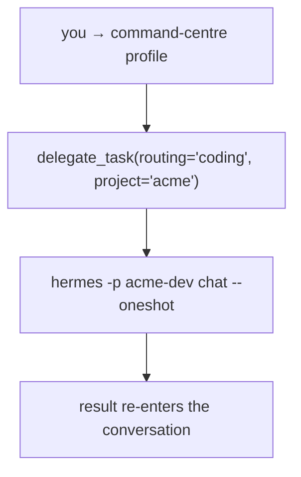

# Profile-pool delegation

`delegate_task` normally spawns an **in-process clone** of the calling agent: same model, same
toolset, no profile identity. *Profile-pool delegation* changes where the work lands — each task
runs inside the Hermes profile that owns it, as its own session, with that profile's skills,
tools, memory and project files.



## Why one orchestrator and profile subagents

Clone subagents are right for splitting one task into parallel pieces, and they stay available. But
they start from zero every time: no memory, no project files, no skill that improved last week, and
whatever they learn dies with the run. They also inherit the caller's model and toolset, so a code
review, an ad-creative QA pass and a refund audit all get the same brain.

Routing to profiles changes what a subagent *is*:

- **One orchestrator stays in the loop.** Your default profile holds intent, decisions and the
  thread. It dispatches and reads results; it does not hold the raw tool traffic of the work. Its
  context stays small, so a long continuous conversation keeps its footing instead of compacting
  itself into vagueness.
- **Subagents are standing assets.** Each routed task runs in a profile with its own model, skills,
  tools, plugins, memory and project files. A profile that does QA for weeks is a better QA agent
  than one spawned this morning, and you can read what it learned.
- **Results are real-time and observable.** The dispatch handle returns at once; the consolidated
  result re-enters the conversation as a message when the batch finishes; children appear in
  `delegate_task(action="list")` and the TUI/desktop agent view; live transcripts stream to disk
  while they work; `delegation_router_status` shows the pool and recent runs.
- **Nothing is lost off-context.** Only the summary crosses the boundary, but every run keeps a full
  transcript on disk and stays resumable (`hermes -p <profile> --resume <session_id>`), so the
  detail is reachable without replaying it in the main thread.
- **It composes.** A routed profile is a full agent and may route its own sub-work one level down
  (`max_depth`), after which delegation falls back to stock clones.

The feature is the bundled `delegation-router` plugin. It is opt-in per profile:

```bash
hermes plugins enable delegation-router
```

## Why route to profiles

| | stock subagent | routed profile run |
|---|---|---|
| model | the caller's `delegation.model` | the profile's own model |
| skills | caller's toolset, no profile skills | the profile's skills, preloadable per role |
| tools / plugins | caller's | the profile's (browser profile, MCP servers, …) |
| memory + context files | caller's | the profile's own |
| durable session | no | yes — `hermes -p <profile> --resume <session_id>` |
| visible in `/agents` | yes | yes (registered as a subagent of the caller) |

Route when the work needs a specialist's context (a project repo, an ad account, a QA harness).
Leave it stock when the task is generic and cheap, or when you deliberately want a clone.

## The routing table

`$HERMES_HOME/plugins/delegation-router/routing.yaml` (the plugin ships
`plugins/delegation_router/routing.yaml.example`). One task resolves in this order:

1. `task.profile` — explicit profile name (must exist on disk);
2. `task.routing` — a bucket name;
3. `task.project` — project key, combined with the bucket's `role` → `<project>-<role>`;
4. keyword match on the goal text;
5. `default_profile` — `""` hands the task to stock delegation.

```yaml
version: 1
enabled: true
default_profile: ""
max_runtime_seconds: 3600
max_turns: 800
max_depth: 1          # 1 = only the top agent routes; 2 = a routed profile may route one level
lease_policy: warn    # warn | skip | ignore — when the target profile holds a live turn lease

projects:
  acme:
    dev: acme-dev
    growth: acme-growth

buckets:
  coding:
    role: dev
    persona: software-implementation
    candidates: [acme-dev, coder]
    keywords: [code, bug, fix, refactor, api, migration, stack trace]
```

`candidates` is tried in order and the first profile that exists on disk wins, so candidates that
do not exist are harmless. The table is re-read on every call; the tool description the model sees
is baked at plugin load, so restart Hermes after adding a bucket.

## What the model sees

| arg | meaning |
|---|---|
| `routing` | bucket to route into |
| `project` | project key for project-scoped profiles |
| `profile` | explicit profile, overriding both |

Anything unresolvable — unknown profile, no matching bucket, or `action=list/steer/stop` — goes to
the stock path unchanged, so routing never silently swallows a task.

## Results and visibility

- The tool returns a dispatch handle immediately; the consolidated result re-enters the
  conversation as one message when the last task of the batch finishes.
- Each task reports `status`, `profile`, `bucket`, `persona`, `session_id`, `summary`,
  `skills_preloaded`, `skills_ambiguous_not_preloaded`, `skills_unavailable`, and
  `resume_hint` (`hermes -p <profile> --resume <session_id>`).
- Routed runs register as subagents of the calling session: `delegate_task(action="list")`, the
  TUI/desktop agent view, and `action="stop"` with a `subagent_id` all work.
  `action="steer"` cannot reach a running profile session mid-turn; the text is saved and the
  result says so.
- Transcripts: `$HERMES_HOME/delegation-router/runs/<run>.log`; audit lines:
  `$HERMES_HOME/delegation-router/runs.jsonl`; live pool view: the `delegation_router_status` tool.

## Role charters (personas)

A bucket may name a `persona:` — a role charter that is injected into the routed child's prompt,
whose member skills are preloaded for the run. A persona is a directory under
`<HERMES_HOME>/personas/<name>/`:

```
personas/software-implementation/
├── PERSONA.md    # the charter: job, operating contract, decision guides, authority, evidence, done
├── persona.json  # machine facts: buckets, profiles, authority lists, job line
└── bundle.json   # {"members": ["skill-a", "skill-b"]}  — must be loadable by the target profile
```

Copy a starter from `plugins/delegation_router/examples/personas/`. Two rules keep it honest:

- **Member skills must resolve in the target profile.** The result lists any that did not
  (`skills_unavailable`), and names that resolve in two different roots as
  `skills_ambiguous_not_preloaded` — Hermes refuses an ambiguous skill name by design.
- **A profile can pin its own charter** with `persona: <name>` in its `config.yaml`, so direct
  sessions of that profile carry the same role as routed runs.

## Limits and known behaviour

- `max_depth` bounds routed generations; beyond it, delegation is stock.
- `lease_policy: skip` avoids colliding with a profile that is mid-turn in a gateway session.
- A routed child is a subprocess of the session that dispatched it: interrupting that session or
  shutting it down ends the child (`status=interrupted`), exactly like stock background
  subagents. Use `cronjob` or a Kanban worker when work must outlive the conversation.
- Routing needs the caller to *ask*: the schema exposes `routing`/`project`, but a model that
  ignores them gets stock delegation. State it in the prompt (or in a skill the caller loads).

## Compatibility

The plugin prefers the core hook — `AIAgent._dispatch_delegate_task` asks
`registry.plugin_handler("delegate_task")` who owns the tool. On a build without that hook it
falls back to wrapping the method at load time, so the same plugin works on stock Hermes.

The dispatch site is `delegate_task`-specific because that tool is dispatched inline rather than
through the tool registry. Any plugin that overrides a tool with the `tools.override` capability
is honoured by the same rule: a **plugin-owned** handler wins, a built-in handler never reports
as plugin-owned.
