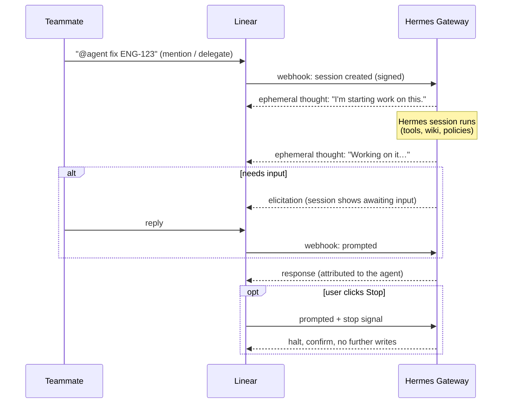

# Linear Agent Setup

Hermes can appear in Linear as a first-class **Agent**: teammates @-mention it or delegate issues to it, Linear opens an Agent Session, and Hermes replies with Agent Activities. All writes (issues, comments, projects, …) attribute to the agent's app identity — never to a human's personal token — through the bundled `linear_agent` platform plugin.

| | |
|---|---|
| **Identity** | Linear OAuth app actor — writes show the agent's name and badge |
| **Transport** | Signed webhooks in (Agent Session + Issue events), GraphQL out |
| **Replies** | Agent Activities: `thought` → `elicitation` → `response`/`error` |
| **Writes** | 58 `linear_agent_*` tools, every one fail-closed behind `mutation_policy` |
| **Built to** | Linear's [Agent Interaction Guidelines](https://linear.app/developers/aig) and [best practices](https://linear.app/developers/agent-best-practices) |



## How the Agent Behaves

- A `created` Agent Session webhook (mention or delegation) becomes a new Hermes gateway session with structured Linear context; `prompted` follow-ups continue the same session.
- Linear's interaction guidelines are followed end-to-end: an ephemeral `thought` acknowledges the session immediately (`ack_on_created`), a rate-limited "Working on it…" thought shows progress during long turns, clarifying questions post as `elicitation` (the session shows *awaiting input*), final answers post as `response`, and failures as `error`.
- A human **stop** signal halts the session immediately: the in-flight turn is interrupted, nothing further is written, and one confirming activity is posted.
- The agent can attach external links (PRs, docs) to its session (`linear_agent_set_session_links`) and publish a live execution plan (`linear_agent_update_plan`, Linear Agent Plans technology preview).
- **Delegation:** by default (`auto_start_on_delegation: true`) an issue whose delegate is this agent is moved to the team's first `started` workflow state — requires `mutation_policy.update_issues`, skips triage-state issues (humans own triage), and only ever fires on a *verified* delegate match, never on generic issue edits. With `auto_self_delegate: true` (opt-in, default off) the agent also claims unclaimed issues when a session is created on them; otherwise it never sets itself as delegate.
- Issue-delegation webhooks have no Agent Session, so replies to them post as **comments** on the issue (requires `mutation_policy.create_comments`).
- Cron jobs can deliver to Linear: set `LINEAR_AGENT_HOME_TARGET` to an issue ID/identifier and `deliver=linear_agent` results post there as comments — including when cron runs out-of-process from the gateway.

## Step 1: Create the Linear OAuth App

1. In Linear: **Settings → API → Applications → New application**.
2. Install it with `actor=app` so actions attribute to the app, not a person.
3. Add the agent scopes: `app:mentionable` and `app:assignable`, plus normal `read,write` scopes (writes stay disabled in Hermes until you enable `mutation_policy` keys).
4. Enable **client credentials** for the app — Hermes mints and refreshes app-actor tokens automatically, no browser flow needed.

:::warning[Credentials shown only once]
The Client Secret is only displayed once when you create the app. Store it in the profile `.env` immediately — never in `config.yaml` or Git.
:::

## Step 2: Enable Webhooks

1. Enable the **Agent Session events** webhook category for the app (this delivers `created`/`prompted` sessions). Enable **Issue** events too if you want delegation handling.
2. Set a **webhook signing secret** and keep it — Hermes rejects unsigned webhooks by default.

:::tip[Fail-closed by design]
No signing secret means no webhooks: Hermes refuses unsigned deliveries rather than trusting whatever reaches the port. For throwaway local testing only, `allow_unsigned_webhooks: true` opts out.
:::
3. Point the webhook URL at Hermes (path is configurable; default shown):

```text
https://your-public-host.example/hermes/linear-agent
```

## Step 3: Expose the Webhook Port

Linear cannot deliver webhooks to `localhost`. For local development, use any tunnel tool to get a public HTTPS URL. The default port is `8651` — change it with `webhook_port` if needed.

```bash
# cloudflared
cloudflared tunnel --url http://localhost:8651

# devtunnel (Microsoft)
devtunnel create hermes-linear --allow-anonymous
devtunnel port create hermes-linear -p 8651 --protocol https
devtunnel host hermes-linear

# ngrok
ngrok http 8651
```

Copy the `https://` URL and set Linear's webhook URL to it plus the configured path (e.g. `https://example-tunnel.trycloudflare.com/hermes/linear-agent`). Leave the tunnel running while developing. For production, point the webhook at your server's public domain instead.

## Step 4: Find Your App User ID

:::warning[Skip this and the agent talks to itself]
Every write the agent makes fires an Issue webhook back at Hermes. Without `LINEAR_AGENT_APP_USER_ID`, those echoes spawn new sessions reviewing the agent's own changes — a feedback loop. The ID also powers delegation detection, so set it before enabling any write policies.
:::

The interactive setup wizard detects and saves this automatically, and the adapter also self-discovers it from Linear each time the gateway connects — so this step is a fallback for manual setups (and worth doing anyway, so a Linear outage at startup can't leave the filter unarmed). Query it with the app token:

```bash
curl -s https://api.linear.app/graphql \
  -H "Authorization: Bearer $LINEAR_AGENT_ACCESS_TOKEN" \
  -H "Content-Type: application/json" \
  -d '{"query":"{ viewer { id name } }"}'
```

Use the returned `viewer.id` as `LINEAR_AGENT_APP_USER_ID` in the next step.

## Step 5: Configure Hermes

### Option A: Interactive Setup (Recommended)

Run the guided setup command and pick **Linear Agent**:

```bash
hermes gateway setup
```

The wizard goes well beyond credential entry: it **verifies your credentials against Linear** (minting an app-actor token for client credentials), **auto-detects and saves the app user ID** — the echo-filter variable from Step 4, so you can skip that step — and offers your **workspace member list** when building the authorization allowlist. It finishes by printing the webhook URL and remaining steps.

### Option B: Manual Configuration

Put secrets in the profile `.env`. **Recommended:** OAuth client credentials:

```bash
# Required
LINEAR_AGENT_CLIENT_ID=...
LINEAR_AGENT_CLIENT_SECRET=...
LINEAR_AGENT_WEBHOOK_SECRET=linear_webhook_signing_secret

# Strongly recommended (see Step 4)
LINEAR_AGENT_APP_USER_ID=...

# Authorization — Linear user IDs allowed to drive the agent (fail-closed:
# with no allowlist and no allow-all, every user is denied)
LINEAR_AGENT_ALLOWED_USERS=user-id-1,user-id-2
# LINEAR_AGENT_ALLOW_ALL_USERS=true   # any workspace member (use with care)

# Optional
LINEAR_AGENT_WORKSPACE_ID=
LINEAR_AGENT_HOME_TARGET=            # issue for cron delivery, e.g. ENG-123
```

A static app token also works instead of client credentials:

```bash
LINEAR_AGENT_ACCESS_TOKEN=lin_oauth_or_app_token
```

Then add the platform block to `config.yaml`:

```yaml
linear_agent:
  enabled: true
  webhook_host: 0.0.0.0
  webhook_port: 8651
  webhook_path: /hermes/linear-agent
  workspace_id: ""
  app_user_id: ""
  allowed_teams: []
  allowed_users: []
  allow_all_users: false
  ack_on_created: true
  # Move an issue delegated to the agent to its first "started" workflow
  # state (Linear best practice). Default true — set false to opt out.
  # Requires mutation_policy.update_issues: true; triage is left for humans.
  auto_start_on_delegation: true
  # Opt-in: also claim auto-started issues that have no delegate.
  # Default false — humans decide what the agent owns.
  auto_self_delegate: false
  # Opt-in: dispatch full agent turns for issue-update webhooks (replies
  # post as issue comments). Default false — delegation already arrives
  # as a real agent session; update webhooks only feed auto-start.
  dispatch_issue_updates: false
  # Every write operation fails closed; enable only what you need.
  # update_projects also covers project (status) updates, milestones,
  # and initiatives.
  mutation_policy:
    create_comments: false
    update_comments: false
    update_issues: false
    create_issues: false
    update_projects: false
    create_documents: false
    update_documents: false
    create_customer_needs: false
    update_customer_needs: false
    # create_releases/update_releases also gate release NOTES.
    create_releases: false
    update_releases: false
    create_customers: false      # customer (business entity) create
    update_customers: false      # customer update
    create_labels: false         # issue label create (team or workspace)
    # Deletes are a separate fail-closed family (default false).
    delete_comments: false
    delete_customer_needs: false
    delete_status_updates: false
    delete_attachments: false
    delete_customers: false
```

You may also place the same block under `platforms.linear_agent`. Environment variables win for secrets.

Toolsets: with no `platform_toolsets.linear_agent` entry, sessions get the auto-generated `hermes-linear_agent` composite (core tools + all `linear_agent_*` tools). If you save a custom entry, include `linear_agent` in the list or the attribution-safe tools are dropped.

## Step 6: Start the Gateway and Test

```bash
hermes gateway start          # or: hermes --profile <name> gateway restart
```

Then, in Linear:

1. **@-mention the agent** on an issue — the session should acknowledge within seconds ("I'm starting work on this.") and reply as the agent.
2. **Delegate an issue** to it — the issue should move to the team's first started state (if `update_issues` is enabled).
3. Ask it to change an issue's status — the write should attribute to the agent in Linear's history.

:::tip[If nothing happens]
Watch the gateway logs (`~/.hermes/profiles/<name>/logs/gateway.log`). The two most common causes are an unsigned/mis-signed webhook (look for "Invalid webhook signature" / "Webhook secret not configured") and an unauthorized user (`Unauthorized user … on linear_agent` — add their Linear user ID to `LINEAR_AGENT_ALLOWED_USERS`). Write tools that reply "disabled by mutation_policy" are working as intended — enable the named key.
:::

## Configuration Reference

All `LINEAR_AGENT_*` environment variables are listed in the [environment variables reference](/reference/environment-variables#linear-agent-agent-sessions). YAML config wins over defaults; env vars win for secrets and are honored as fallbacks for the allowlist and behavior flags.

## Formatting and Capabilities

- Activity bodies and issue/comment content are **Markdown**; mention users with `@displayName`.
- `linear_agent_update_issue` / `create_issue` accept friendly references — `state: "Done"`, `priority: "Low"`, `assignee` by name/email/`me`, `labels`, `project`, `team`, `cycle`, `milestone`, `delegate` — and resolve them to Linear's `*Id` fields before mutating. Ambiguous or unknown names abort with the candidates listed. Success messages echo the applied fields.
- Issue relations (`blocks`/`blockedBy`/`relatedTo`, `parentId`, `duplicateOf`) and URL attachments (`links`) are managed through `update_issue`; comments support threaded replies and editing.

## Security

- Store OAuth tokens, client secrets, and webhook secrets in `.env`, not `config.yaml`.
- Unsigned webhook requests are rejected unless `allow_unsigned_webhooks: true` (or `LINEAR_AGENT_ALLOW_UNSIGNED_WEBHOOKS=true`) is explicitly set. When `LINEAR_AGENT_WEBHOOK_SECRET` is configured, requests with missing or invalid signatures are rejected.
- Authorization is two-layer and **fail-closed at both layers**. The gateway layer grants conversation access: with no `LINEAR_AGENT_ALLOWED_USERS` / `LINEAR_AGENT_ALLOW_ALL_USERS` (or DM pairing / `GATEWAY_ALLOWED_USERS`), every user is denied by default. The adapter checks the sender **before any webhook side effect** by consulting that same gateway authorization chain (so pairing and gateway-level grants work here too), with YAML `allowed_users` / `allow_all_users` granting as a union — an unauthorized sender gets a 403 and never triggers the ack, auto-start, or stop handling. `allowed_teams` narrows further and never grants.
- Write mutations other than Agent Activities are disabled unless `mutation_policy` explicitly permits them. Deletes are a separate fail-closed key family, never implied by update/create permissions.
- Webhook replay is deduplicated, and issue-update echoes of the agent's own writes are filtered via `LINEAR_AGENT_APP_USER_ID`.
- The adapter does not persist raw webhook payloads outside the normal Hermes session flow.

## Limitations

- Creating the Linear OAuth app itself happens in Linear's developer UI (Hermes-side setup is interactive via `hermes gateway setup`).
- Per-tool `action` activities (streaming each tool call into the session timeline) are not yet emitted; progress shows as ephemeral thoughts.
- After a gateway restart, a `prompted` follow-up starts a fresh Hermes session with only the follow-up text — prior session context is not yet rebuilt from Linear's session/activity history.
- Binary attachment uploads (multipart) and documentation search are not covered by `linear_agent_*` tools — use the Linear MCP connector for those.
- Agent Plans is a Linear technology-preview API and may change.

## MCP parity

The `linear_agent_*` tools are drop-in replacements for the `mcp_linear_*` connector for the core issue / project / comment workflows, with the advantage that writes appear under the agent (app) identity, fail closed by `mutation_policy`, and echo the applied fields back:

- `update_issue` / `create_issue` resolve friendly references (`assignee` by name / email / `me`, `labels`, `project`, `team`, `cycle`, `milestone`, `delegate`) to Linear's `*Id` fields; `null` clears; raw `*Id` keys pass through. Ambiguous or unknown names abort before the mutation.
- `update_issue` manages relations (`blocks` / `blockedBy` / `relatedTo`, append-only, with `remove*` variants; `parentId`; `duplicateOf`) and URL attachments (`links`).
- `create_comment` edits an existing comment (`comment_id`, gated on `update_comments`) and posts threaded replies (`parentId`).
- `create_comment` also targets a non-issue parent — pass exactly ONE of `project_id`, `project_update_id`, `initiative_id`, `initiative_update_id`, or `document_content_id`.
- Delete tools (`delete_comment`, `delete_customer_need`, `delete_status_update`, `delete_attachment`, `delete_customer`) require explicit IDs and each gate on their own `delete_*` policy key.
- Customers (`save_customer`, `delete_customer`), release notes (`save_release_note`), and issue labels (`create_issue_label`) are covered, plus reads for teams, milestones, documents, attachments, release notes, project labels, and agent skills (`get_*` / `list_*`).

The only remaining follow-ups route through the Linear MCP connector: documentation search and the code-review diffs surface (both MCP-server internal, with no public GraphQL), and binary attachment uploads (multipart, outside the GraphQL-only scope).
