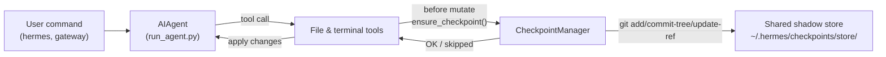

# チェックポイントと `/rollback`

Hermes Agent は、**破壊的操作** の前にプロジェクトを自動的にスナップショットし、1つのコマンドで復元できます。チェックポイントは v2 以降 **オプトイン** です。ほとんどのユーザーは `/rollback` を使わず、シャドウストアのストレージは時間が経つと無視できない量になるため、デフォルトはオフです。

セッションごとに `--checkpoints` でチェックポイントを有効にします。

```bash
hermes chat --checkpoints
```

または、`~/.hermes/config.yaml` でグローバルに有効にします。

```yaml
checkpoints:
  enabled: true
```

この安全策は、`~/.hermes/checkpoints/store/` の下に単一の共有シャドウ git リポジトリを保持する内部の **チェックポイントマネージャー** によって駆動されます。実際のプロジェクトの `.git` は決して触れられません。エージェントが作業するすべてのプロジェクトが同じストアを共有するため、git のコンテンツアドレス指定可能なオブジェクト DB が、プロジェクト間およびターン間で重複を排除します。

## チェックポイントをトリガーするもの

チェックポイントは、次の前に自動的に取得されます。

- **ファイルツール** — `write_file` と `patch`
- **破壊的なターミナルコマンド** — `rm`、`rmdir`、`cp`、`install`、`mv`、`sed -i`、`truncate`、`dd`、`shred`、出力リダイレクト（`>`）、`git reset`/`clean`/`checkout`

エージェントは **ディレクトリごと、ターンごとに最大1つのチェックポイント** を作成するため、長時間実行されるセッションでもスナップショットが乱発されることはありません。

## クイックリファレンス

セッション内のスラッシュコマンド:

| コマンド | 説明 |
|---------|-------------|
| `/rollback` | 変更統計とともにすべてのチェックポイントを一覧表示 |
| `/rollback <N>` | チェックポイント N に復元（直前のチャットターンも取り消し） |
| `/rollback diff <N>` | チェックポイント N と現在の状態との差分をプレビュー |
| `/rollback <N> <file>` | チェックポイント N から単一ファイルを復元 |

セッション外でストアを検査・管理するための CLI:

| コマンド | 説明 |
|---------|-------------|
| `hermes checkpoints` | 合計サイズ、プロジェクト数、プロジェクトごとの内訳を表示 |
| `hermes checkpoints status` | 素の `checkpoints` と同じ |
| `hermes checkpoints list` | `status` のエイリアス |
| `hermes checkpoints prune` | 強制スイープ: 孤立／古いものを削除、GC、サイズ上限を強制 |
| `hermes checkpoints clear` | チェックポイントベース全体を消去（最初に確認） |
| `hermes checkpoints clear-legacy` | v1 移行からの `legacy-*` アーカイブのみを削除 |

## チェックポイントの仕組み

大まかには:

- Hermes は、ツールが作業ツリー内の **ファイルを変更しようとしている** ことを検出します。
- 会話のターンごとに1回（ディレクトリごとに）、次のことを行います。
  - ファイルに対する妥当なプロジェクトルートを解決します。
  - `~/.hermes/checkpoints/store/` にある **単一の共有シャドウストア** を初期化または再利用します。
  - プロジェクトごとのインデックスにステージし、ツリーを構築し、プロジェクトごとの ref（`refs/hermes/<project-hash>`）にコミットします。
- これらのプロジェクトごとの ref が、`/rollback` で検査・復元できるチェックポイント履歴を形成します。



## 設定

`~/.hermes/config.yaml` で設定します。

```yaml
checkpoints:
  enabled: false              # マスタースイッチ（デフォルト: false — オプトイン）
  max_snapshots: 20           # プロジェクトごとの最大チェックポイント数（ref 書き換え + gc で強制）
  max_total_size_mb: 500      # ストア合計サイズのハードキャップ; 最も古いコミットを破棄
  max_file_size_mb: 10        # これより大きい単一ファイルはスキップ

  # 自動メンテナンス（デフォルトでオン）: 起動時に ~/.hermes/checkpoints/ をスイープし、
  # 作業ディレクトリがもはや存在しない（孤立）か、last_touch が retention_days より古い
  # プロジェクトエントリを削除します。min_interval_hours ごとに最大1回実行され、
  # .last_prune マーカーで追跡されます。
  auto_prune: true
  retention_days: 7
  delete_orphans: true
  min_interval_hours: 24
```

すべてを無効にするには:

```yaml
checkpoints:
  enabled: false
  auto_prune: false
```

`enabled: false` のとき、チェックポイントマネージャーは何もせず、git 操作を試みることはありません。`auto_prune: false` のとき、ストアは `hermes checkpoints prune` を手動で実行するまで増え続けます。

## チェックポイントを一覧表示する

CLI セッションから:

```
/rollback
```

Hermes は、変更統計を示す整形されたリストで応答します。

```text
📸 Checkpoints for /path/to/project:

  1. 4270a8c  2026-03-16 04:36  before patch  (1 file, +1/-0)
  2. eaf4c1f  2026-03-16 04:35  before write_file
  3. b3f9d2e  2026-03-16 04:34  before terminal: sed -i s/old/new/ config.py  (1 file, +1/-1)

  /rollback <N>             restore to checkpoint N
  /rollback diff <N>        preview changes since checkpoint N
  /rollback <N> <file>      restore a single file from checkpoint N
```

## シェルからストアを検査する

```bash
hermes checkpoints
```

サンプル出力:

```text
Checkpoint base: /home/you/.hermes/checkpoints
Total size:      142.3 MB
  store/         138.1 MB
  legacy-*       4.2 MB
Projects:        12

  WORKDIR                                                       COMMITS    LAST TOUCH  STATE
  /home/you/code/hermes-agent                                        20       2h ago  live
  /home/you/code/experiments/rl-runner                                8       1d ago  live
  /home/you/code/old-prototype                                        3       9d ago  orphan
  ...

Legacy archives (1):
  legacy-20260506-050616                           4.2 MB

Clear with: hermes checkpoints clear-legacy
```

完全なスイープを強制します（24h のべき等性マーカーを無視）:

```bash
hermes checkpoints prune --retention-days 3 --max-size-mb 200
```

## `/rollback diff` で変更をプレビューする

復元を確定する前に、チェックポイント以降に何が変わったかをプレビューします。

```
/rollback diff 1
```

これは git diff の統計サマリーに続いて実際の差分を表示します。

## `/rollback` で復元する

```
/rollback 1
```

裏側で、Hermes は次のことを行います。

1. 対象のコミットがシャドウストアに存在することを検証します。
2. 後で「取り消しの取り消し」ができるように、現在の状態の **ロールバック前スナップショット** を取得します。
3. 作業ディレクトリ内の追跡対象ファイルを復元します。
4. エージェントのコンテキストが復元されたファイルシステムの状態と一致するように、**直前の会話ターンを取り消します**。

## 単一ファイルの復元

ディレクトリの残りに影響を与えずに、チェックポイントから1つのファイルだけを復元します。

```
/rollback 1 src/broken_file.py
```

## 安全性とパフォーマンスのガード

- **git の可用性** — `git` が `PATH` に見つからない場合、チェックポイントは透過的に無効化されます。
- **ディレクトリのスコープ** — Hermes は過度に広いディレクトリ（ルート `/`、ホーム `$HOME`）をスキップします。
- **リポジトリのサイズ** — 50,000を超えるファイルを含むディレクトリはスキップされます。
- **ファイルごとのサイズ上限** — `max_file_size_mb`（デフォルト 10 MB）より大きいファイルはスナップショットから除外されます。データセット、モデルの重み、生成メディアを誤って取り込むことを防ぎます。
- **ストア合計サイズの上限** — ストアが `max_total_size_mb`（デフォルト 500 MB）を超えると、上限を下回るまでプロジェクトごとの最も古いコミットがラウンドロビンで破棄されます。
- **実際のプルーニング** — `max_snapshots` は、プロジェクトごとの ref を書き換え、その後に `git gc --prune=now` を実行することで強制されるため、ルーズオブジェクトが蓄積しません。
- **変更なしのスナップショット** — 前回のスナップショット以降に変更がない場合、チェックポイントはスキップされます。
- **致命的でないエラー** — チェックポイントマネージャー内のすべてのエラーは debug レベルでログに記録されます。ツールは引き続き実行されます。

## チェックポイントの保存場所

```text
~/.hermes/checkpoints/
  ├── store/                 # 単一の共有 bare git リポジトリ
  │   ├── HEAD, objects/     # git の内部（プロジェクト間で共有）
  │   ├── refs/hermes/<hash> # プロジェクトごとのブランチの先端
  │   ├── indexes/<hash>     # プロジェクトごとの git インデックス
  │   ├── projects/<hash>.json  # workdir + created_at + last_touch
  │   └── info/exclude
  ├── .last_prune            # 自動プルーニングのべき等性マーカー
  └── legacy-<ts>/           # アーカイブされた v2 以前のプロジェクトごとシャドウリポジトリ
```

各 `<hash>` は、作業ディレクトリの絶対パスから導出されます。通常、これらを手動で触る必要はありません。代わりに `hermes checkpoints status` / `prune` / `clear` を使用してください。

### v1 からの移行

v2 への書き換え以前は、各作業ディレクトリが `~/.hermes/checkpoints/<hash>/` の直下に独自の完全なシャドウ git リポジトリを持っていました。そのレイアウトはプロジェクト間でオブジェクトを重複排除できず、文書化された通り何もしないプルーナーを持っていたため、ストアは際限なく増え続けていました。

最初の v2 実行時に、v2 以前のシャドウリポジトリは `~/.hermes/checkpoints/legacy-<timestamp>/` に移動され、新しい単一ストアレイアウトがクリーンに開始されます。古い `/rollback` 履歴は、レガシーアーカイブを `git` で手動検査することで引き続き到達可能です。不要だと確信できたら、次を実行して

```bash
hermes checkpoints clear-legacy
```

スペースを回収してください。レガシーアーカイブも `retention_days` 後に `auto_prune` によってスイープされます。

## ベストプラクティス

- **必要なときだけチェックポイントを有効にする** — `hermes chat --checkpoints` またはプロファイルごとの `enabled: true`。
- **復元前に `/rollback diff` を使う** — 何が変わるかをプレビューして、適切なチェックポイントを選びます。
- エージェント駆動の変更のみを取り消したいときは、**`git reset` の代わりに `/rollback` を使う**。
- チェックポイントを定期的に使うなら、**ときどき `hermes checkpoints status` を確認する** — どのプロジェクトがアクティブで、ストアがどれだけのコストになっているかを示します。
- 最大限の安全のために **Git worktree と組み合わせる** — 各 Hermes セッションを独自の worktree／ブランチに保ち、チェックポイントを追加のレイヤーとします。

同じリポジトリで複数のエージェントを並行実行する方法については、[Git worktree](./git-worktrees.md) のガイドを参照してください。
