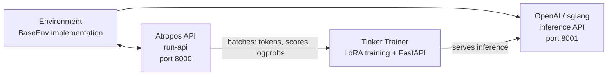

# RLトレーニング

Hermes Agentには、**Tinker-Atropos** 上に構築された統合RL（強化学習）トレーニングパイプラインが含まれています。これにより、LoRAアダプターを用いたGRPO（Group Relative Policy Optimization）で、環境固有のタスクに言語モデルをトレーニングできます。すべてはエージェントのツールインターフェースを通じてオーケストレーションされます。

## 概要

RLトレーニングシステムは、3つのコンポーネントから構成されます。

1. **[Atropos](https://github.com/NousResearch/atropos)** — 環境とのやり取りを調整し、ロールアウトグループを管理し、アドバンテージを計算するトラジェクトリAPIサーバー
2. **[Tinker](https://thinkingmachines.ai/tinker/)** — モデルの重み、LoRAトレーニング、サンプリング/推論、オプティマイザーステップを扱うトレーニングサービス
3. **環境** — タスク、スコアリング、報酬関数を定義するPythonクラス（例: GSM8Kの数学問題）

エージェントは、`rl_*` ツール群を通じて、環境の発見、トレーニングパラメータの設定、トレーニング実行の起動、メトリクスの監視を — すべて行えます。

## 要件

RLトレーニングには次が必要です。

- **Python >= 3.11**（Tinkerパッケージの要件）
- **TINKER_API_KEY** — Tinkerトレーニングサービスのapiキー
- **WANDB_API_KEY** — [Weights & Biases](https://wandb.ai/) のメトリクス追跡用apiキー
- `tinker-atropos` サブモジュール（Hermesルートからの相対パスで `tinker-atropos/`）

```bash
# API キーをセットアップする
hermes config set TINKER_API_KEY your-tinker-key
hermes config set WANDB_API_KEY your-wandb-key
```

両方のキーが存在し、Python >= 3.11が利用可能な場合、`rl` ツールセットは自動的に有効化されます。

## 利用可能なツール

| ツール | 説明 |
|------|-------------|
| `rl_list_environments` | 利用可能なRL環境を発見する |
| `rl_select_environment` | 環境を選択し、その設定を読み込む |
| `rl_get_current_config` | 設定可能フィールドとロックされたフィールドを表示する |
| `rl_edit_config` | 設定可能なトレーニングパラメータを変更する |
| `rl_start_training` | トレーニング実行を起動する（3つのプロセスを生成） |
| `rl_check_status` | トレーニングの進行状況とWandBメトリクスを監視する |
| `rl_stop_training` | 実行中のトレーニングジョブを停止する |
| `rl_get_results` | 最終メトリクスとモデルの重みのパスを取得する |
| `rl_list_runs` | アクティブおよび完了したすべての実行を一覧表示する |
| `rl_test_inference` | OpenRouterを使ったクイック推論テスト |

## ワークフロー

### 1. 環境を発見する

```
List the available RL environments
```

エージェントは `rl_list_environments()` を呼び出し、AST解析を使って `tinker-atropos/tinker_atropos/environments/` をスキャンし、`BaseEnv` を継承するPythonクラスを見つけます。各環境は次を定義します。

- **データセットの読み込み** — トレーニングデータの取得元（例: HuggingFaceデータセット）
- **プロンプトの構築** — モデル向けにアイテムをどうフォーマットするか
- **スコアリング/検証** — モデルの出力をどう評価し、報酬を割り当てるか

### 2. 選択して設定する

```
Select the GSM8K environment and show me the configuration
```

エージェントは `rl_select_environment("gsm8k_tinker")` を呼び出し、次に `rl_get_current_config()` を呼び出してすべてのパラメータを確認します。

設定フィールドは2つのカテゴリに分かれています。

**設定可能フィールド**（変更可能）:
- `group_size` — アイテムあたりの補完数（デフォルト: 16）
- `batch_size` — トレーニングのバッチサイズ（デフォルト: 128）
- `wandb_name` — WandB実行名（自動で `{env}-{timestamp}` に設定）
- その他の環境固有のパラメータ

**ロックされたフィールド**（インフラ設定、変更不可）:
- `tokenizer_name` — モデルのトークナイザー（例: `Qwen/Qwen3-8B`）
- `rollout_server_url` — Atropos APIのURL（`http://localhost:8000`）
- `max_token_length` — 最大トークン長（8192）
- `max_num_workers` — 最大並列ワーカー数（2048）
- `total_steps` — 合計トレーニングステップ数（2500）
- `lora_rank` — LoRAアダプターのランク（32）
- `learning_rate` — 学習率（4e-5）
- `max_token_trainer_length` — トレーナー向けの最大トークン数（9000）

### 3. トレーニングを開始する

```
Start the training run
```

エージェントは `rl_start_training()` を呼び出し、次を行います。

1. ロックされた設定と設定可能なオーバーライドをマージしたYAML設定ファイルを生成する
2. 一意の実行IDを作成する
3. 3つのプロセスを生成する:
   - **Atropos APIサーバー**（`run-api`） — トラジェクトリの調整
   - **Tinkerトレーナー**（`launch_training.py`） — LoRAトレーニング + ポート8001のFastAPI推論サーバー
   - **環境**（`environment.py serve`） — Atroposに接続する選択された環境

これらのプロセスは、適切な初期化順序を保証するために、ずらした遅延（APIに5秒、トレーナーに30秒、環境にさらに90秒）を伴って起動します。

### 4. 進行状況を監視する

```
Check the status of training run abc12345
```

エージェントは `rl_check_status(run_id)` を呼び出し、次を報告します。

- プロセスステータス（3つのプロセスそれぞれについて running/exited）
- 実行時間
- WandBメトリクス（ステップ、報酬の平均、正解率、評価精度）
- デバッグ用のログファイルの場所

:::note レート制限
ステータスチェックは、実行IDごとに**30分**に1回までにレート制限されています。これにより、何時間もかかる長時間のトレーニングジョブ中の過剰なポーリングを防ぎます。
:::

### 5. 停止または結果の取得

```
Stop the training run
# または
Get the final results for run abc12345
```

`rl_stop_training()` は、3つのプロセスを逆順（環境 → トレーナー → API）で終了します。`rl_get_results()` は、最終的なWandBメトリクスとトレーニング履歴を取得します。

## 推論テスト

完全なトレーニング実行に踏み切る前に、`rl_test_inference` を使って環境が正しく動作するかをテストできます。これは、OpenRouterを使って数ステップの推論とスコアリングを実行します — Tinker APIは不要で、`OPENROUTER_API_KEY` だけで済みます。

```
Test the selected environment with inference
```

デフォルト設定:
- **3ステップ × 16補完 = モデルあたり48ロールアウト**
- 堅牢性のために、異なる規模の3モデルをテスト:
  - `qwen/qwen3-8b`（小）
  - `z-ai/glm-4.7-flash`（中）
  - `minimax/minimax-m2.7`（大）
- 合計: 約144ロールアウト

これは次を検証します。
- 環境が正しく読み込まれる
- プロンプトの構築が機能する
- 推論レスポンスの解析がモデル規模をまたいで堅牢である
- 検証/スコアリングのロジックが有効な報酬を生成する

## Tinker API連携

トレーナーは、モデルトレーニング操作に [Tinker](https://tinker.computer) APIを使用します。

- **ServiceClient** — トレーニングおよびサンプリングのクライアントを作成する
- **トレーニングクライアント** — 重要度サンプリング損失を伴うforward-backwardパス、オプティマイザーステップ（Adam）、重みのチェックポイントを扱う
- **サンプリングクライアント** — 最新のトレーニング済み重みを使った推論を提供する

トレーニングループ:
1. Atroposからロールアウトのバッチ（プロンプト + 補完 + スコア）を取得する
2. パディングされたlogprobsとアドバンテージを持つTinker Datumオブジェクトに変換する
3. 重要度サンプリング損失を伴うforward-backwardパスを実行する
4. オプティマイザーステップを行う（Adam: lr=4e-5、β1=0.9、β2=0.95）
5. 重みを保存し、次のステップの推論用に新しいサンプリングクライアントを作成する
6. メトリクスをWandBにログ記録する

## アーキテクチャ図



## カスタム環境の作成

新しいRL環境を作成するには次のようにします。

1. `tinker-atropos/tinker_atropos/environments/` にPythonファイルを作成する
2. `BaseEnv` を継承するクラスを定義する
3. 必須メソッドを実装する:
   - `load_dataset()` — トレーニングデータを読み込む
   - `get_next_item()` — モデルに次のアイテムを提供する
   - `score_answer()` — モデルの出力をスコアリングし、報酬を割り当てる
   - `collect_trajectories()` — トラジェクトリを収集して返す
4. 必要に応じて、`BaseEnvConfig` を継承するカスタム設定クラスを定義する

既存の `gsm8k_tinker.py` をテンプレートとして参考にしてください。エージェントは新しい環境の作成を手伝えます — 既存の環境ファイルを読み、HuggingFaceデータセットを調べ、新しい環境コードを書くことができます。

## WandBメトリクス

トレーニング実行は、次の主要メトリクスをWeights & Biasesにログ記録します。

| メトリクス | 説明 |
|--------|-------------|
| `train/loss` | トレーニング損失（重要度サンプリング） |
| `train/learning_rate` | 現在の学習率 |
| `reward/mean` | グループをまたいだ報酬の平均 |
| `logprobs/mean` | 参照logprobsの平均 |
| `logprobs/mean_training` | トレーニングlogprobsの平均 |
| `logprobs/diff` | logprobのドリフト（参照 - トレーニング） |
| `advantages/mean` | アドバンテージ値の平均 |
| `advantages/std` | アドバンテージの標準偏差 |

## ログファイル

各トレーニング実行は、`~/.hermes/logs/rl_training/` にログファイルを生成します。

```
logs/
├── api_{run_id}.log        # Atropos API サーバーのログ
├── trainer_{run_id}.log    # Tinker トレーナーのログ
├── env_{run_id}.log        # 環境プロセスのログ
└── inference_tests/        # 推論テストの結果
    ├── test_{env}_{model}.jsonl
    └── test_{env}_{model}.log
```

これらは、トレーニングが失敗したり予期しない結果を生んだりしたときのデバッグに非常に役立ちます。
