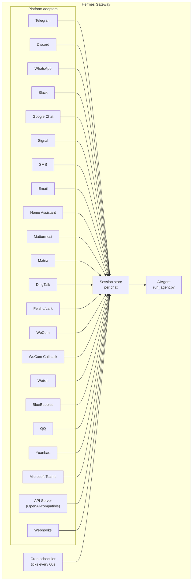

# メッセージングゲートウェイ

Telegram、Discord、Slack、WhatsApp、Signal、SMS、Email、Home Assistant、Mattermost、Matrix、DingTalk、Feishu/Lark、WeCom、Weixin、BlueBubbles（iMessage）、QQ、Yuanbao、Microsoft Teams、LINE、またはブラウザからHermesとチャットできます。ゲートウェイは、設定したすべてのプラットフォームに接続し、セッションを処理し、cronジョブを実行し、ボイスメッセージを配信する単一のバックグラウンドプロセスです。

CLIのマイクモード、メッセージングでの音声返信、Discordのボイスチャンネルでの会話を含む、すべての音声機能セットについては、[ボイスモード](/docs/user-guide/features/voice-mode)と[Hermesでボイスモードを使う](/docs/guides/use-voice-mode-with-hermes)を参照してください。

## プラットフォーム比較

| プラットフォーム | 音声 | 画像 | ファイル | スレッド | リアクション | 入力中 | ストリーミング |
|----------|:-----:|:------:|:-----:|:-------:|:---------:|:------:|:---------:|
| Telegram | ✅ | ✅ | ✅ | ✅ | — | ✅ | ✅ |
| Discord | ✅ | ✅ | ✅ | ✅ | ✅ | ✅ | ✅ |
| Slack | ✅ | ✅ | ✅ | ✅ | ✅ | ✅ | ✅ |
| Google Chat | — | ✅ | ✅ | ✅ | — | ✅ | — |
| WhatsApp | — | ✅ | ✅ | — | — | ✅ | ✅ |
| Signal | — | ✅ | ✅ | — | — | ✅ | ✅ |
| SMS | — | — | — | — | — | — | — |
| Email | — | ✅ | ✅ | ✅ | — | — | — |
| Home Assistant | — | — | — | — | — | — | — |
| Mattermost | ✅ | ✅ | ✅ | ✅ | — | ✅ | ✅ |
| Matrix | ✅ | ✅ | ✅ | ✅ | ✅ | ✅ | ✅ |
| DingTalk | — | ✅ | ✅ | — | ✅ | — | ✅ |
| Feishu/Lark | ✅ | ✅ | ✅ | ✅ | ✅ | ✅ | ✅ |
| WeCom | ✅ | ✅ | ✅ | — | — | ✅ | ✅ |
| WeCom Callback | — | — | — | — | — | — | — |
| Weixin | ✅ | ✅ | ✅ | — | — | ✅ | ✅ |
| BlueBubbles | — | ✅ | ✅ | — | ✅ | ✅ | — |
| QQ | ✅ | ✅ | ✅ | — | — | ✅ | — |
| Yuanbao | ✅ | ✅ | ✅ | — | — | ✅ | ✅ |
| Microsoft Teams | — | ✅ | — | ✅ | — | ✅ | — |
| LINE | — | ✅ | ✅ | — | — | ✅ | — |

**音声** = TTS音声返信および/または音声メッセージの文字起こし。**画像** = 画像の送受信。**ファイル** = ファイル添付の送受信。**スレッド** = スレッド化された会話。**リアクション** = メッセージへの絵文字リアクション。**入力中** = 処理中の入力中インジケーター。**ストリーミング** = 編集による段階的なメッセージ更新。

## アーキテクチャ



各プラットフォームアダプターはメッセージを受信し、チャットごとのセッションストアを経由してルーティングし、処理のためにAIAgentにディスパッチします。ゲートウェイはcronスケジューラも実行し、60秒ごとにティックして期限が来たジョブを実行します。

## クイックセットアップ

メッセージングプラットフォームを設定する最も簡単な方法は、対話型ウィザードです。

```bash
hermes gateway setup        # すべてのメッセージングプラットフォームの対話型セットアップ
```

これは、矢印キーによる選択で各プラットフォームの設定を順を追って案内し、すでに設定済みのプラットフォームを表示し、完了時にゲートウェイの起動/再起動を提案します。

## ゲートウェイコマンド

```bash
hermes gateway              # フォアグラウンドで実行
hermes gateway setup        # メッセージングプラットフォームを対話的に設定
hermes gateway install      # ユーザーサービス（Linux）/ launchdサービス（macOS）としてインストール
sudo hermes gateway install --system   # Linuxのみ: ブート時のシステムサービスをインストール
hermes gateway start        # デフォルトサービスを起動
hermes gateway stop         # デフォルトサービスを停止
hermes gateway status       # デフォルトサービスのステータスを確認
hermes gateway status --system         # Linuxのみ: システムサービスを明示的に確認
```

## チャットコマンド（メッセージング内）

| コマンド | 説明 |
|---------|-------------|
| `/new` または `/reset` | 新しい会話を開始します |
| `/model [provider:model]` | モデルを表示または変更します（`provider:model` 構文をサポート） |
| `/personality [name]` | パーソナリティを設定します |
| `/retry` | 最後のメッセージを再試行します |
| `/undo` | 最後のやり取りを削除します |
| `/status` | セッション情報を表示します |
| `/whoami` | このスコープでのスラッシュコマンドのアクセス権を表示します（admin / user / unrestricted） |
| `/stop` | 実行中のエージェントを停止します |
| `/approve` | 保留中の危険なコマンドを承認します |
| `/deny` | 保留中の危険なコマンドを拒否します |
| `/sethome` | このチャットをホームチャンネルとして設定します |
| `/compress` | 会話コンテキストを手動で圧縮します |
| `/title [name]` | セッションタイトルを設定または表示します |
| `/resume [name]` | 以前に名前を付けたセッションを再開します |
| `/usage` | このセッションのトークン使用量を表示します |
| `/insights [days]` | 使用状況のインサイトと分析を表示します |
| `/reasoning [level\|show\|hide]` | 推論の労力を変更するか、推論の表示を切り替えます |
| `/voice [on\|off\|tts\|join\|leave\|status]` | メッセージングの音声返信とDiscordのボイスチャンネルの動作を制御します |
| `/rollback [number]` | ファイルシステムのチェックポイントを一覧表示または復元します |
| `/background <prompt>` | 別のバックグラウンドセッションでプロンプトを実行します |
| `/reload-mcp` | 設定からMCPサーバーを再読み込みします |
| `/update` | Hermes Agentを最新バージョンに更新します |
| `/help` | 利用可能なコマンドを表示します |
| `/<skill-name>` | インストール済みの任意のスキルを呼び出します |

## セッション管理

### セッションの永続化

セッションはリセットされるまでメッセージをまたいで永続化されます。エージェントはあなたの会話コンテキストを記憶します。

### リセットポリシー

セッションは設定可能なポリシーに基づいてリセットされます。

| ポリシー | デフォルト | 説明 |
|--------|---------|-------------|
| Daily | 4:00 AM | 毎日特定の時刻にリセット |
| Idle | 1440 min | N分間の無活動後にリセット |
| Both | （組み合わせ） | いずれか先にトリガーされた方 |

`~/.hermes/gateway.json` でプラットフォームごとのオーバーライドを設定します。

```json
{
  "reset_by_platform": {
    "telegram": { "mode": "idle", "idle_minutes": 240 },
    "discord": { "mode": "idle", "idle_minutes": 60 }
  }
}
```

## セキュリティ

**デフォルトでは、ゲートウェイは許可リストに含まれていない、またはDMでペアリングされていないすべてのユーザーを拒否します。** これはターミナルアクセスを持つボットにとって安全なデフォルトです。

```bash
# 特定のユーザーに制限する（推奨）:
TELEGRAM_ALLOWED_USERS=123456789,987654321
DISCORD_ALLOWED_USERS=123456789012345678
SIGNAL_ALLOWED_USERS=+155****4567,+155****6543
SMS_ALLOWED_USERS=+155****4567,+155****6543
EMAIL_ALLOWED_USERS=trusted@example.com,colleague@work.com
MATTERMOST_ALLOWED_USERS=3uo8dkh1p7g1mfk49ear5fzs5c
MATRIX_ALLOWED_USERS=@alice:matrix.org
DINGTALK_ALLOWED_USERS=user-id-1
FEISHU_ALLOWED_USERS=ou_xxxxxxxx,ou_yyyyyyyy
WECOM_ALLOWED_USERS=user-id-1,user-id-2
WECOM_CALLBACK_ALLOWED_USERS=user-id-1,user-id-2
TEAMS_ALLOWED_USERS=aad-object-id-1,aad-object-id-2

# または許可する
GATEWAY_ALLOWED_USERS=123456789,987654321

# または明示的にすべてのユーザーを許可する（ターミナルアクセスを持つボットには非推奨）:
GATEWAY_ALLOW_ALL_USERS=true
```

### DMペアリング（許可リストの代替） {#dm-pairing-alternative-to-allowlists}

ユーザーIDを手動で設定する代わりに、未知のユーザーがボットにDMを送ると、一度限りのペアリングコードを受け取ります。

```bash
# ユーザーには次のように表示されます: "Pairing code: XKGH5N7P"
# 次のコマンドで承認します:
hermes pairing approve telegram XKGH5N7P

# その他のペアリングコマンド:
hermes pairing list          # 保留中 + 承認済みのユーザーを表示
hermes pairing revoke telegram 123456789  # アクセスを削除
```

ペアリングコードは1時間後に期限切れになり、レート制限があり、暗号学的なランダム性を使用します。

### スラッシュコマンドのアクセス制御

ユーザーが許可されると、それらを**管理者**（すべてのスラッシュコマンドへのアクセス権）と**一般ユーザー**（明示的に有効にしたスラッシュコマンドのみ）に分けることができます。これはプラットフォームごと、スコープごと（DM対グループ/チャンネル）に適用され、ライブのコマンドレジストリを通じて機能するため、機能ごとの配線なしに組み込みおよびプラグイン登録のスラッシュコマンドの両方をカバーします。

```yaml
gateway:
  platforms:
    discord:
      extra:
        allow_from: ["111", "222", "333"]
        allow_admin_from: ["111"]                    # 管理者 → すべてのスラッシュコマンド
        user_allowed_commands: [status, model]       # 非管理者が実行できるもの
        # オプション: グループ/チャンネルのスコープを分離
        group_allow_admin_from: ["111"]
        group_user_allowed_commands: [status]
```

動作:

- あるスコープで `allow_admin_from` に含まれるユーザーは、登録された**すべての**スラッシュコマンドを実行できます。
- `allow_from` に含まれるが `allow_admin_from` に含まれないユーザーは、`user_allowed_commands` 内のコマンドに加え、常に許可される最低限のもの（`/help` と `/whoami`）のみを実行できます。
- 通常のチャットには影響しません。非管理者は引き続き通常どおりエージェントと話すことができ、任意のコマンドをトリガーできないだけです。
- **後方互換性:** あるスコープで `allow_admin_from` が設定されていない場合、そのスコープのスラッシュゲーティングは無効になります。既存のインストールは変更なしで動作し続けます。
- DMの管理者ステータスは、グループ/チャンネルの管理者ステータスを意味しません。各スコープには独自の管理者リストがあります。

任意のプラットフォームから `/whoami` を使用すると、アクティブなスコープ、あなたの階層（admin / user / unrestricted）、および実行できるスラッシュコマンドを確認できます。プラットフォーム固有の例については、[Telegram](/docs/user-guide/messaging/telegram#slash-command-access-control)と[Discord](/docs/user-guide/messaging/discord#slash-command-access-control)のページを参照してください。

## エージェントの中断

エージェントが作業中に任意のメッセージを送信すると中断できます。主な動作:

- **進行中のターミナルコマンドは即座に強制終了されます**（SIGTERM、その後1秒後にSIGKILL）
- **ツール呼び出しはキャンセルされます** — 現在実行中のものだけが実行され、残りはスキップされます
- **複数のメッセージは結合されます** — 中断中に送信されたメッセージは1つのプロンプトに統合されます
- **`/stop` コマンド** — フォローアップメッセージをキューに入れずに中断します

### キュー対中断対ステア（busy-inputモード）

デフォルトでは、ビジー状態のエージェントにメッセージを送ると中断します。他に2つのモードが利用できます。

- `queue` — フォローアップメッセージは待機し、現在のタスクが終了した後に次のターンとして実行されます。
- `steer` — フォローアップメッセージは `/steer` を介して現在の実行に注入され、次のツール呼び出しの後にエージェントに到達します。中断もなく、新しいターンもありません。エージェントがまだ開始していない場合は `queue` の動作にフォールバックします。

```yaml
display:
  busy_input_mode: steer   # または queue、または interrupt（デフォルト）
  busy_ack_enabled: true   # ⚡/⏳/⏩ のチャット返信を完全に抑制するには false に設定
```

任意のプラットフォームでビジー状態のエージェントに初めてメッセージを送ると、Hermesはこのノブを説明する1行のリマインダー（`"💡 First-time tip — …"`）をbusy-ackに追加します。このリマインダーはインストールごとに1回発火します。`onboarding.seen.busy_input_prompt` の下のフラグがそれをラッチします。そのキーを削除すると、再びヒントが表示されます。

busy-ackがうるさいと感じる場合 — 特に音声入力や連続したメッセージで — は、`display.busy_ack_enabled: false` を設定してください。入力は引き続き通常どおりキューに入れられ/ステアされ/中断されます。チャット返信のみが抑制されます。

## ツール進捗通知

`~/.hermes/config.yaml` で、どれだけのツールアクティビティを表示するかを制御します。

```yaml
display:
  tool_progress: all    # off | new | all | verbose
  tool_progress_command: false  # メッセージングで /verbose を有効にするには true に設定
```

有効にすると、ボットは作業中にステータスメッセージを送信します。

```text
💻 `ls -la`...
🔍 web_search...
📄 web_extract...
🐍 execute_code...
```

## バックグラウンドセッション

別のバックグラウンドセッションでプロンプトを実行し、メインチャットの応答性を保ちながら、エージェントがそれを独立して処理するようにします。

```
/background Check all servers in the cluster and report any that are down
```

Hermesは即座に確認します。

```
🔄 Background task started: "Check all servers in the cluster..."
   Task ID: bg_143022_a1b2c3
```

### 仕組み

各 `/background` プロンプトは、非同期で実行される**別個のエージェントインスタンス**を生成します。

- **分離されたセッション** — バックグラウンドエージェントは独自の会話履歴を持つ独自のセッションを持ちます。現在のチャットコンテキストを認識せず、提供したプロンプトのみを受け取ります。
- **同じ設定** — 現在のゲートウェイ設定から、モデル、プロバイダー、ツールセット、推論設定、プロバイダールーティングを継承します。
- **ノンブロッキング** — メインチャットは完全に対話可能なままです。作業中にメッセージを送信したり、他のコマンドを実行したり、さらにバックグラウンドタスクを開始したりできます。
- **結果の配信** — タスクが終了すると、結果はコマンドを発行した**同じチャットまたはチャンネル**に「✅ Background task complete」を前置きして返送されます。失敗した場合は、エラーとともに「❌ Background task failed」が表示されます。

### バックグラウンドプロセス通知

バックグラウンドセッションを実行しているエージェントが `terminal(background=true)` を使用して長時間実行されるプロセス（サーバー、ビルドなど）を開始すると、ゲートウェイはステータス更新をチャットにプッシュできます。これは `~/.hermes/config.yaml` の `display.background_process_notifications` で制御します。

```yaml
display:
  background_process_notifications: all    # all | result | error | off
```

| モード | 受け取る内容 |
|------|-----------------|
| `all` | 実行中の出力の更新**および**最終的な完了メッセージ（デフォルト） |
| `result` | 最終的な完了メッセージのみ（終了コードに関係なく） |
| `error` | 終了コードがゼロ以外の場合の最終メッセージのみ |
| `off` | プロセスウォッチャーのメッセージは一切なし |

これは環境変数でも設定できます。

```bash
HERMES_BACKGROUND_NOTIFICATIONS=result
```

### ユースケース

- **サーバー監視** — "/background Check the health of all services and alert me if anything is down"
- **長時間のビルド** — "/background Build and deploy the staging environment" とチャットを続けながら
- **リサーチタスク** — "/background Research competitor pricing and summarize in a table"
- **ファイル操作** — "/background Organize the photos in ~/Downloads by date into folders"

:::tip
メッセージングプラットフォームでのバックグラウンドタスクは「撃ちっぱなし（fire-and-forget）」です。待つ必要も確認する必要もありません。タスクが終了すると、結果が同じチャットに自動的に届きます。
:::

## サービス管理

### Linux（systemd）

```bash
hermes gateway install               # ユーザーサービスとしてインストール
hermes gateway start                 # サービスを起動
hermes gateway stop                  # サービスを停止
hermes gateway status                # ステータスを確認
journalctl --user -u hermes-gateway -f  # ログを表示

# lingering を有効にする（ログアウト後も実行を継続）
sudo loginctl enable-linger $USER

# またはユーザーとして実行しつつ、ブート時のシステムサービスをインストール
sudo hermes gateway install --system
sudo hermes gateway start --system
sudo hermes gateway status --system
journalctl -u hermes-gateway -f
```

ラップトップや開発マシンではユーザーサービスを使用してください。systemdのlingerに依存せずブート時に復帰すべきVPSやヘッドレスホストでは、システムサービスを使用してください。

本当に意図する場合を除き、ユーザーとシステムの両方のゲートウェイユニットを同時にインストールしておくのは避けてください。start/stop/statusの動作が曖昧になるため、Hermesは両方を検出すると警告します。

:::info 複数のインストール
同じマシンで複数のHermesインストール（異なる `HERMES_HOME` ディレクトリ）を実行する場合、それぞれが独自のsystemdサービス名を取得します。デフォルトの `~/.hermes` は `hermes-gateway` を使用し、他のインストールは `hermes-gateway-<hash>` を使用します。`hermes gateway` コマンドは、現在の `HERMES_HOME` に対応する正しいサービスを自動的に対象とします。
:::

### macOS（launchd） {#macos-launchd}

```bash
hermes gateway install               # launchdエージェントとしてインストール
hermes gateway start                 # サービスを起動
hermes gateway stop                  # サービスを停止
hermes gateway status                # ステータスを確認
tail -f ~/.hermes/logs/gateway.log   # ログを表示
```

生成されたplistは `~/Library/LaunchAgents/ai.hermes.gateway.plist` にあります。3つの環境変数が含まれます。

- **PATH** — インストール時の完全なシェルPATHに、venvの `bin/` と `node_modules/.bin` が先頭に追加されたもの。これにより、ユーザーがインストールしたツール（Node.js、ffmpegなど）が、WhatsAppブリッジのようなゲートウェイのサブプロセスで利用可能になります。
- **VIRTUAL_ENV** — ツールがパッケージを正しく解決できるよう、Pythonのvirtualenvを指します。
- **HERMES_HOME** — ゲートウェイをあなたのHermesインストールにスコープします。

:::tip インストール後のPATH変更
launchdのplistは静的です。ゲートウェイをセットアップした後に新しいツール（例: nvm経由の新しいNode.jsバージョン、Homebrew経由のffmpeg）をインストールした場合は、`hermes gateway install` を再度実行して更新されたPATHを取り込んでください。ゲートウェイは古いplistを検出し、自動的に再読み込みします。
:::

:::info 複数のインストール
Linuxのsystemdサービスと同様に、各 `HERMES_HOME` ディレクトリは独自のlaunchdラベルを取得します。デフォルトの `~/.hermes` は `ai.hermes.gateway` を使用し、他のインストールは `ai.hermes.gateway-<suffix>` を使用します。
:::

## プラットフォーム固有のツールセット

各プラットフォームには独自のツールセットがあります。

| プラットフォーム | ツールセット | 機能 |
|----------|---------|--------------|
| CLI | `hermes-cli` | フルアクセス |
| Telegram | `hermes-telegram` | terminalを含むフルツール |
| Discord | `hermes-discord` | terminalを含むフルツール |
| WhatsApp | `hermes-whatsapp` | terminalを含むフルツール |
| Slack | `hermes-slack` | terminalを含むフルツール |
| Google Chat | `hermes-google_chat` | terminalを含むフルツール |
| Signal | `hermes-signal` | terminalを含むフルツール |
| SMS | `hermes-sms` | terminalを含むフルツール |
| Email | `hermes-email` | terminalを含むフルツール |
| Home Assistant | `hermes-homeassistant` | フルツール + HAデバイス制御（ha_list_entities、ha_get_state、ha_call_service、ha_list_services） |
| Mattermost | `hermes-mattermost` | terminalを含むフルツール |
| Matrix | `hermes-matrix` | terminalを含むフルツール |
| DingTalk | `hermes-dingtalk` | terminalを含むフルツール |
| Feishu/Lark | `hermes-feishu` | terminalを含むフルツール |
| WeCom | `hermes-wecom` | terminalを含むフルツール |
| WeCom Callback | `hermes-wecom-callback` | terminalを含むフルツール |
| Weixin | `hermes-weixin` | terminalを含むフルツール |
| BlueBubbles | `hermes-bluebubbles` | terminalを含むフルツール |
| QQBot | `hermes-qqbot` | terminalを含むフルツール |
| Yuanbao | `hermes-yuanbao` | terminalを含むフルツール |
| Microsoft Teams | `hermes-teams` | terminalを含むフルツール |
| API Server | `hermes-api-server` | フルツール（`clarify`、`send_message`、`text_to_speech` を除く — プログラムによるアクセスには対話的なユーザーがいません） |
| Webhooks | `hermes-webhook` | terminalを含むフルツール |

## 次のステップ

- [Telegramのセットアップ](telegram.md)
- [Discordのセットアップ](discord.md)
- [Slackのセットアップ](slack.md)
- [Google Chatのセットアップ](google_chat.md)
- [WhatsAppのセットアップ](whatsapp.md)
- [Signalのセットアップ](signal.md)
- [SMSのセットアップ（Twilio）](sms.md)
- [Emailのセットアップ](email.md)
- [Home Assistant連携](homeassistant.md)
- [Mattermostのセットアップ](mattermost.md)
- [Matrixのセットアップ](matrix.md)
- [DingTalkのセットアップ](dingtalk.md)
- [Feishu/Larkのセットアップ](feishu.md)
- [WeComのセットアップ](wecom.md)
- [WeCom Callbackのセットアップ](wecom-callback.md)
- [Weixinのセットアップ（WeChat）](weixin.md)
- [BlueBubblesのセットアップ（iMessage）](bluebubbles.md)
- [QQBotのセットアップ](qqbot.md)
- [Yuanbaoのセットアップ](yuanbao.md)
- [Microsoft Teamsのセットアップ](teams.md)
- [Teams会議パイプライン](teams-meetings.md)
- [Open WebUI + APIサーバー](open-webui.md)
- [Webhook](webhooks.md)
