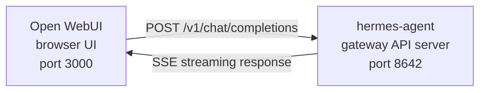

# Open WebUI 統合

[Open WebUI](https://github.com/open-webui/open-webui)（126k★）は、AI 向けの最も人気のある
セルフホスト型チャットインターフェースです。Hermes Agent の組み込み API サーバーを使えば、
Open WebUI をエージェントの洗練された Web フロントエンドとして利用できます。会話の管理、
ユーザーアカウント、モダンなチャットインターフェースが揃っています。

## アーキテクチャ



Open WebUI は、OpenAI に接続するのとまったく同じように Hermes Agent の API サーバーに接続します。
Hermes は、その完全なツールセット（terminal、ファイル操作、web 検索、メモリ、スキル）でリクエストを
処理し、最終的な応答を返します。

:::important ランタイムの場所
API サーバーは、純粋な LLM プロキシではなく、**Hermes エージェントランタイム**です。リクエスト
ごとに、Hermes は API サーバーのホスト上にサーバーサイドの `AIAgent` を作成します。ツール呼び出しは、
その API サーバーが稼働している場所で実行されます。

例えば、ラップトップが Open WebUI や別の OpenAI 互換クライアントをリモートマシン上の Hermes API
サーバーに向けた場合、`pwd`、ファイルツール、ブラウザツール、ローカル MCP ツール、その他の
ワークスペースツールは、ラップトップではなくリモートの API サーバーホスト上で実行されます。
:::

Open WebUI は Hermes とサーバー間で通信するため、この統合では `API_SERVER_CORS_ORIGINS` は不要です。

## クイックセットアップ

### ワンコマンドのローカルブートストラップ（macOS/Linux、Docker 不要）

Hermes と Open WebUI を再利用可能なランチャーとともにローカルで連携させたい場合は、次を実行します。

```bash
cd ~/.hermes/hermes-agent
bash scripts/setup_open_webui.sh
```

このスクリプトが行うこと:

- `~/.hermes/.env` に `API_SERVER_ENABLED`、`API_SERVER_HOST`、`API_SERVER_KEY`、
  `API_SERVER_PORT`、`API_SERVER_MODEL_NAME` が含まれていることを保証する
- API サーバーが立ち上がるように Hermes ゲートウェイを再起動する
- Open WebUI を `~/.local/open-webui-venv` にインストールする
- `~/.local/bin/start-open-webui-hermes.sh` にランチャーを書き込む
- macOS では `launchd` ユーザーサービスをインストールし、`systemd --user` を持つ Linux では
  そこにユーザーサービスをインストールする

デフォルト:

- Hermes API: `http://127.0.0.1:8642/v1`
- Open WebUI: `http://127.0.0.1:8080`
- Open WebUI に通知されるモデル名: `Hermes Agent`

便利なオーバーライド:

```bash
OPEN_WEBUI_NAME='My Hermes UI' \
OPEN_WEBUI_ENABLE_SIGNUP=true \
HERMES_API_MODEL_NAME='My Hermes Agent' \
bash scripts/setup_open_webui.sh
```

Linux では、自動のバックグラウンドサービスのセットアップに、動作する `systemd --user` セッションが
必要です。ヘッドレスの SSH ボックスにいてサービスのインストールをスキップしたい場合は、次を実行します。

```bash
OPEN_WEBUI_ENABLE_SERVICE=false bash scripts/setup_open_webui.sh
```

### 1. API サーバーを有効化する

```bash
hermes config set API_SERVER_ENABLED true
hermes config set API_SERVER_KEY your-secret-key
```

`hermes config set` は、フラグを `config.yaml` に、シークレットを `~/.hermes/.env` に自動的に
ルーティングします。ゲートウェイがすでに稼働している場合は、変更を有効にするために再起動します。

```bash
hermes gateway stop && hermes gateway
```

### 2. Hermes Agent のゲートウェイを起動する

```bash
hermes gateway
```

次が表示されるはずです。

```
[API Server] API server listening on http://127.0.0.1:8642
```

### 3. API サーバーに到達できることを確認する

```bash
curl -s http://127.0.0.1:8642/health
# {"status": "ok", ...}

curl -s -H "Authorization: Bearer your-secret-key" http://127.0.0.1:8642/v1/models
# {"object":"list","data":[{"id":"hermes-agent", ...}]}
```

`/health` が失敗する場合、ゲートウェイが `API_SERVER_ENABLED=true` を拾っていません — 再起動して
ください。`/v1/models` が `401` を返す場合、`Authorization` ヘッダーが `API_SERVER_KEY` と
一致していません。

### 4. Open WebUI を起動する

```bash
docker run -d -p 3000:8080 \
  -e OPENAI_API_BASE_URL=http://host.docker.internal:8642/v1 \
  -e OPENAI_API_KEY=your-secret-key \
  -e ENABLE_OLLAMA_API=false \
  --add-host=host.docker.internal:host-gateway \
  -v open-webui:/app/backend/data \
  --name open-webui \
  --restart always \
  ghcr.io/open-webui/open-webui:main
```

`ENABLE_OLLAMA_API=false` は、デフォルトの Ollama バックエンドを抑制します。これがないと、空の
まま表示されてモデルピッカーを散らかします。実際に Ollama を併用している場合は省略してください。

初回起動には 15～30 秒かかります。Open WebUI は初回起動時に sentence-transformer の埋め込み
モデル（約 150MB）をダウンロードします。UI を開く前に、`docker logs open-webui` が落ち着くのを
待ってください。

### 5. UI を開く

**http://localhost:3000** に移動します。管理者アカウントを作成します（最初のユーザーが管理者に
なります）。モデルのドロップダウンにエージェントが表示されるはずです（プロファイル名にちなんだ名前、
またはデフォルトプロファイルの場合は **hermes-agent**）。チャットを開始しましょう！

## Docker Compose のセットアップ

より恒久的なセットアップには、`docker-compose.yml` を作成します。

```yaml
services:
  open-webui:
    image: ghcr.io/open-webui/open-webui:main
    ports:
      - "3000:8080"
    volumes:
      - open-webui:/app/backend/data
    environment:
      - OPENAI_API_BASE_URL=http://host.docker.internal:8642/v1
      - OPENAI_API_KEY=your-secret-key
      - ENABLE_OLLAMA_API=false
    extra_hosts:
      - "host.docker.internal:host-gateway"
    restart: always

volumes:
  open-webui:
```

そして次を実行します。

```bash
docker compose up -d
```

## 管理 UI 経由での設定

環境変数の代わりに UI を通じて接続を設定したい場合:

1. **http://localhost:3000** で Open WebUI にログインします
2. **プロフィールアバター** → **Admin Settings** をクリックします
3. **Connections** に移動します
4. **OpenAI API** の下で、**レンチアイコン**（Manage）をクリックします
5. **+ Add New Connection** をクリックします
6. 次を入力します:
   - **URL**: `http://host.docker.internal:8642/v1`
   - **API Key**: Hermes の `API_SERVER_KEY` とまったく同じ値
7. 接続を確認するために**チェックマーク**をクリックします
8. **Save** します

これで、エージェントのモデルがモデルのドロップダウンに表示されるはずです（プロファイル名にちなんだ
名前、またはデフォルトプロファイルの場合は **hermes-agent**）。

:::warning
環境変数は、Open WebUI の**初回起動時**にのみ有効になります。それ以降、接続設定はその内部
データベースに保存されます。後で変更するには、管理 UI を使うか、Docker ボリュームを削除して最初から
やり直してください。
:::

## API タイプ: Chat Completions vs Responses

Open WebUI は、バックエンドに接続するときに 2 つの API モードをサポートします。

| モード | 形式 | 使うべきとき |
|------|--------|-------------|
| **Chat Completions**（デフォルト） | `/v1/chat/completions` | 推奨。そのまま動作します。 |
| **Responses**（実験的） | `/v1/responses` | `previous_response_id` 経由のサーバーサイドの会話状態用。 |

### Chat Completions を使う（推奨）

これはデフォルトであり、追加の設定は不要です。Open WebUI は標準の OpenAI 形式のリクエストを送信し、
Hermes Agent がそれに応じて応答します。各リクエストには完全な会話履歴が含まれます。

### Responses API を使う

Responses API モードを使うには:

1. **Admin Settings** → **Connections** → **OpenAI** → **Manage** に移動します
2. hermes-agent の接続を編集します
3. **API Type** を「Chat Completions」から **「Responses (Experimental)」** に変更します
4. 保存します

Responses API では、Open WebUI が Responses 形式（`input` 配列 ＋ `instructions`）でリクエストを
送信し、Hermes Agent は `previous_response_id` 経由でターンをまたいで完全なツール呼び出し履歴を
保持できます。`stream: true` の場合、Hermes は仕様ネイティブの `function_call` と
`function_call_output` のアイテムもストリーミングします。これにより、Responses イベントを
レンダリングするクライアントでカスタムの構造化ツール呼び出し UI が可能になります。

:::note
Open WebUI は現在、Responses モードであっても会話履歴をクライアント側で管理します — つまり
`previous_response_id` を使う代わりに、各リクエストで完全なメッセージ履歴を送信します。今日の
Responses モードの主な利点は、構造化されたイベントストリームです。テキストのデルタ、`function_call`、
`function_call_output` のアイテムが、Chat Completions のチャンクではなく OpenAI Responses の SSE
イベントとして到着します。
:::

## 仕組み

Open WebUI でメッセージを送信すると:

1. Open WebUI が、メッセージと会話履歴を含む `POST /v1/chat/completions` リクエストを送信します
2. Hermes Agent が、API サーバーのプロファイル、モデル／プロバイダー設定、メモリ、スキル、設定済みの
   API サーバーツールセットを使って、サーバーサイドの `AIAgent` インスタンスを作成します
3. エージェントがリクエストを処理します — API サーバーのホスト上でツール（terminal、ファイル操作、
   web 検索など）を呼び出すことがあります
4. ツールが実行されると、**インラインの進捗メッセージが UI にストリーミングされ**、エージェントが
   何をしているかが見えます（例: `` `💻 ls -la` ``、`` `🔍 Python 3.12 release` ``）
5. エージェントの最終的なテキスト応答が Open WebUI にストリーミングで返されます
6. Open WebUI が、そのチャットインターフェースに応答を表示します

エージェントは、その API サーバーの Hermes インスタンスと同じツールと機能にアクセスできます。API
サーバーがリモートなら、それらのツールもリモートです。

今日、ツールを**ローカル**のワークスペースに対して実行する必要がある場合は、Hermes をローカルで
実行し、純粋な LLM プロバイダーまたは純粋な OpenAI 互換のモデルプロキシ（例: vLLM、LiteLLM、Ollama、
llama.cpp、OpenAI、OpenRouter など）に向けてください。「リモートの頭脳、ローカルの手」のための将来の
ランタイム分割モードは [#18715](https://github.com/NousResearch/hermes-agent/issues/18715) で
追跡されています。これは現在の API サーバーの挙動ではありません。

:::tip ツールの進捗
ストリーミングを有効にすると（デフォルト）、ツールが実行されるときに簡潔なインラインの
インジケーター（ツールの絵文字とその主要な引数）が表示されます。これらは、エージェントの最終的な
回答の前に応答ストリームに現れ、裏で何が起きているかの可視性を与えてくれます。
:::

## 設定リファレンス

### Hermes Agent（API サーバー）

| 変数 | デフォルト | 説明 |
|----------|---------|-------------|
| `API_SERVER_ENABLED` | `false` | API サーバーを有効にする |
| `API_SERVER_PORT` | `8642` | HTTP サーバーのポート |
| `API_SERVER_HOST` | `127.0.0.1` | バインドアドレス |
| `API_SERVER_KEY` | _(必須)_ | 認証用のベアラートークン。`OPENAI_API_KEY` と一致させる。 |

### Open WebUI

| 変数 | 説明 |
|----------|-------------|
| `OPENAI_API_BASE_URL` | Hermes Agent の API URL（`/v1` を含める） |
| `OPENAI_API_KEY` | 空でないこと。`API_SERVER_KEY` と一致させる。 |

## トラブルシューティング

### ドロップダウンにモデルが表示されない

- **URL に `/v1` サフィックスがあるか確認**: `http://host.docker.internal:8642/v1`（`:8642` だけではない）
- **ゲートウェイが稼働しているか確認**: `curl http://localhost:8642/health` が `{"status": "ok"}` を返すはず
- **モデル一覧を確認**: `curl -H "Authorization: Bearer your-secret-key" http://localhost:8642/v1/models` が `hermes-agent` を含む一覧を返すはず
- **Docker ネットワーキング**: Docker の内部からは、`localhost` はコンテナを意味し、ホストではありません。`host.docker.internal` または `--network=host` を使ってください。
- **空の Ollama バックエンドがピッカーを覆い隠す**: `ENABLE_OLLAMA_API=false` を省略した場合、Open WebUI は Hermes モデルの上に空の Ollama セクションを表示します。`-e ENABLE_OLLAMA_API=false` でコンテナを再起動するか、**Admin Settings → Connections** で Ollama を無効にしてください。

### 接続テストは通るがモデルが読み込まれない

これはほぼ常に、`/v1` サフィックスの欠落です。Open WebUI の接続テストは基本的な接続性チェックで
あり、モデル一覧が機能するかは検証しません。

### 応答に時間がかかる

Hermes Agent は、最終的な応答を生成する前に、複数のツール呼び出し（ファイルの読み取り、コマンドの
実行、web の検索）を実行している可能性があります。これは複雑なクエリでは正常です。応答は、エージェントが
完了したときに一度に表示されます。

### 「Invalid API key」エラー

Open WebUI の `OPENAI_API_KEY` が、Hermes Agent の `API_SERVER_KEY` と一致していることを確認します。

:::warning
Open WebUI は、初回起動後に OpenAI 互換の接続設定を自身のデータベースに永続化します。誤ったキーを
管理 UI で保存してしまった場合、環境変数を修正するだけでは不十分です — **Admin Settings →
Connections** で保存された接続を更新または削除するか、Open WebUI のデータディレクトリ／
データベースをリセットしてください。
:::

## プロファイルによるマルチユーザーのセットアップ

ユーザーごとに別々の Hermes インスタンス（それぞれ独自の設定、メモリ、スキルを持つ）を実行するには、
[プロファイル](/docs/user-guide/profiles) を使います。各プロファイルは異なるポートで独自の API
サーバーを実行し、Open WebUI でプロファイル名を自動的にモデルとして通知します。

### 1. プロファイルを作成して API サーバーを設定する

`API_SERVER_*` は YAML 設定キーではなく環境変数なので、各プロファイルの `.env` に書き込みます。
デフォルトのプラットフォーム範囲外のポート（`8644` は webhook アダプター、`8645` は wecom-callback、
`8646` は msgraph-webhook）、例えば `8650` 以降を選びます。

```bash
hermes profile create alice
cat >> ~/.hermes/profiles/alice/.env <<EOF
API_SERVER_ENABLED=true
API_SERVER_PORT=8650
API_SERVER_KEY=alice-secret
EOF

hermes profile create bob
cat >> ~/.hermes/profiles/bob/.env <<EOF
API_SERVER_ENABLED=true
API_SERVER_PORT=8651
API_SERVER_KEY=bob-secret
EOF
```

### 2. 各ゲートウェイを起動する

```bash
hermes -p alice gateway &
hermes -p bob gateway &
```

### 3. Open WebUI で接続を追加する

**Admin Settings** → **Connections** → **OpenAI API** → **Manage** で、プロファイルごとに 1 つの
接続を追加します。

| 接続 | URL | API Key |
|-----------|-----|---------|
| Alice | `http://host.docker.internal:8650/v1` | `alice-secret` |
| Bob | `http://host.docker.internal:8651/v1` | `bob-secret` |

モデルのドロップダウンには、`alice` と `bob` が別々のモデルとして表示されます。管理パネルから Open
WebUI のユーザーにモデルを割り当てることで、各ユーザーに独自の分離された Hermes エージェントを
与えられます。

:::tip カスタムモデル名
モデル名はデフォルトでプロファイル名になります。上書きするには、プロファイルの `.env` で
`API_SERVER_MODEL_NAME` を設定します。
```bash
hermes -p alice config set API_SERVER_MODEL_NAME "Alice's Agent"
```
:::

## Linux Docker（Docker Desktop なし）

Docker Desktop のない Linux では、`host.docker.internal` はデフォルトでは解決されません。選択肢:

```bash
# Option 1: ホストマッピングを追加
docker run --add-host=host.docker.internal:host-gateway ...

# Option 2: ホストネットワーキングを使用
docker run --network=host -e OPENAI_API_BASE_URL=http://localhost:8642/v1 ...

# Option 3: Docker ブリッジ IP を使用
docker run -e OPENAI_API_BASE_URL=http://172.17.0.1:8642/v1 ...
```
