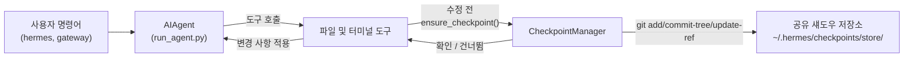

# 체크포인트 및 `/rollback`

Hermes Agent는 **파괴적인 작업** 전에 프로젝트의 스냅샷을 자동으로 생성하고 단일 명령으로 복원할 수 있습니다. v2부터 체크포인트는 **선택적(opt-in)**입니다. 대부분의 사용자는 `/rollback`을 사용하지 않으며, 시간이 지남에 따라 섀도우 저장소의 스토리지 용량이 무시할 수 없는 수준이 되므로 기본적으로 꺼져 있습니다.

`--checkpoints` 플래그를 사용하여 세션별로 체크포인트를 활성화하세요:

```bash
hermes chat --checkpoints
```

또는 `~/.hermes/config.yaml`에서 전역으로 활성화할 수 있습니다:

```yaml
checkpoints:
  enabled: true
```

이 안전망은 `~/.hermes/checkpoints/store/` 아래에 단일 공유 섀도우 git 저장소를 유지하는 내부 **Checkpoint Manager**에 의해 구동됩니다. 실제 프로젝트의 `.git`은 절대 건드리지 않습니다. 에이전트가 작업하는 모든 프로젝트는 동일한 저장소를 공유하므로, git의 콘텐츠 주소 지정 객체 DB를 통해 프로젝트와 턴 간의 중복이 제거됩니다.

## 체크포인트 트리거 조건

체크포인트는 다음 작업 전에 자동으로 생성됩니다:

- **파일 도구** — `write_file` 및 `patch`
- **파괴적인 터미널 명령어** — `rm`, `rmdir`, `cp`, `install`, `mv`, `sed -i`, `truncate`, `dd`, `shred`, 출력 리디렉션 (`>`), 그리고 `git reset`/`clean`/`checkout`

에이전트는 **디렉토리 당 턴마다 최대 한 개의 체크포인트만 생성**하므로, 장기간 실행되는 세션에서 스냅샷이 스팸처럼 생성되지 않습니다.

## 빠른 참조

세션 내 슬래시 명령어:

| 명령어 | 설명 |
|---------|-------------|
| `/rollback` | 변경 통계와 함께 모든 체크포인트 나열 |
| `/rollback <N>` | 체크포인트 N으로 복원 (마지막 채팅 턴도 취소됨) |
| `/rollback diff <N>` | 체크포인트 N과 현재 상태 간의 변경 사항(diff) 미리보기 |
| `/rollback <N> <file>` | 체크포인트 N에서 단일 파일 복원 |

세션 외부에서 저장소를 검사하고 관리하기 위한 CLI:

| 명령어 | 설명 |
|---------|-------------|
| `hermes checkpoints` | 전체 크기, 프로젝트 수, 프로젝트별 분석 표시 |
| `hermes checkpoints status` | 단일 `checkpoints` 명령어와 동일 |
| `hermes checkpoints list` | `status`의 별칭 |
| `hermes checkpoints prune` | 정리 강제 실행: 고아(orphan)/오래된 항목 삭제, GC, 크기 제한 적용 |
| `hermes checkpoints clear` | 전체 체크포인트 베이스 삭제 (확인 프롬프트 표시) |
| `hermes checkpoints clear-legacy` | v1 마이그레이션에서 남은 `legacy-*` 아카이브만 삭제 |

## 체크포인트 작동 방식

간략한 구조:

- Hermes는 도구가 작업 트리에서 **파일을 수정**하려고 할 때 이를 감지합니다.
- 대화 턴당 한 번(디렉토리당), 다음과 같은 작업을 수행합니다:
  - 파일에 대한 적절한 프로젝트 루트를 확인합니다.
  - `~/.hermes/checkpoints/store/`에 있는 **단일 공유 섀도우 저장소**를 초기화하거나 재사용합니다.
  - 프로젝트별 인덱스에 스테이징하고 트리를 빌드한 후, 프로젝트별 참조(`refs/hermes/<project-hash>`)에 커밋합니다.
- 이 프로젝트별 참조는 `/rollback`을 통해 검사하고 복원할 수 있는 체크포인트 기록을 형성합니다.



## 구성

`~/.hermes/config.yaml`에서 구성합니다:

```yaml
checkpoints:
  enabled: false              # 마스터 스위치 (기본값: false — 선택적)
  max_snapshots: 20           # 프로젝트당 최대 체크포인트 수 (참조 재작성 + gc를 통해 적용)
  max_total_size_mb: 500      # 전체 저장소 크기 제한; 가장 오래된 커밋이 삭제됨
  max_file_size_mb: 10        # 이 크기보다 큰 단일 파일은 건너뜀

  # 자동 유지보수(기본적으로 켜져 있음): 시작 시 ~/.hermes/checkpoints/를 스윕하여
  # 작업 디렉토리가 더 이상 존재하지 않거나(고아)
  # last_touch가 retention_days보다 오래된 프로젝트 항목을 삭제합니다.
  # min_interval_hours 당 최대 한 번 실행되며 .last_prune 마커를 통해 추적됩니다.
  auto_prune: true
  retention_days: 7
  delete_orphans: true
  min_interval_hours: 24
```

모든 기능을 비활성화하려면:

```yaml
checkpoints:
  enabled: false
  auto_prune: false
```

`enabled: false`인 경우 Checkpoint Manager는 아무 작업도 수행하지 않으며 git 작업을 시도하지 않습니다. `auto_prune: false`인 경우 수동으로 `hermes checkpoints prune`을 실행할 때까지 저장소가 계속 커집니다.

## 체크포인트 나열

CLI 세션에서:

```
/rollback
```

Hermes는 변경 통계가 포함된 형식화된 목록으로 응답합니다:

```text
📸 Checkpoints for /path/to/project:

  1. 4270a8c  2026-03-16 04:36  before patch  (1 file, +1/-0)
  2. eaf4c1f  2026-03-16 04:35  before write_file
  3. b3f9d2e  2026-03-16 04:34  before terminal: sed -i s/old/new/ config.py  (1 file, +1/-1)

  /rollback <N>             restore to checkpoint N
  /rollback diff <N>        preview changes since checkpoint N
  /rollback <N> <file>      restore a single file from checkpoint N
```

## 셸에서 저장소 검사하기

```bash
hermes checkpoints
```

출력 예시:

```text
Checkpoint base: /home/you/.hermes/checkpoints
Total size:      142.3 MB
  store/         138.1 MB
  legacy-*       4.2 MB
Projects:        12

  WORKDIR                                                       COMMITS    LAST TOUCH  STATE
  /home/you/code/hermes-agent                                        20       2h ago  live
  /home/you/code/experiments/rl-runner                                8       1d ago  live
  /home/you/code/old-prototype                                        3       9d ago  orphan
  ...

Legacy archives (1):
  legacy-20260506-050616                           4.2 MB

Clear with: hermes checkpoints clear-legacy
```

전체 스윕 강제 실행 (24시간 멱등성 마커 무시):

```bash
hermes checkpoints prune --retention-days 3 --max-size-mb 200
```

## `/rollback diff`로 변경 사항 미리보기

복원을 커밋하기 전에 체크포인트 이후 변경된 내용을 미리 볼 수 있습니다:

```
/rollback diff 1
```

그러면 git diff 통계 요약이 표시되고 그 뒤에 실제 diff가 표시됩니다.

## `/rollback`으로 복원

```
/rollback 1
```

백그라운드에서 Hermes는 다음을 수행합니다:

1. 섀도우 저장소에 대상 커밋이 있는지 확인합니다.
2. 나중에 "실행 취소의 실행 취소"를 할 수 있도록 현재 상태의 **롤백 전 스냅샷**을 생성합니다.
3. 작업 디렉토리의 추적된 파일을 복원합니다.
4. 에이전트의 컨텍스트가 복원된 파일 시스템 상태와 일치하도록 **마지막 대화 턴을 실행 취소**합니다.

## 단일 파일 복원

디렉토리의 나머지 부분에 영향을 주지 않고 체크포인트에서 파일 하나만 복원하려면:

```
/rollback 1 src/broken_file.py
```

## 안전 및 성능 보호 장치

- **Git 사용 가능 여부** — `PATH`에서 `git`을 찾을 수 없으면 체크포인트가 투명하게 비활성화됩니다.
- **디렉토리 범위** — Hermes는 너무 광범위한 디렉토리(루트 `/`, 홈 `$HOME`)를 건너뜁니다.
- **저장소 크기** — 파일이 50,000개 이상인 디렉토리는 건너뜁니다.
- **파일당 크기 제한** — `max_file_size_mb`(기본값 10MB)보다 큰 파일은 스냅샷에서 제외됩니다. 이를 통해 실수로 데이터셋, 모델 가중치 또는 생성된 미디어가 삼켜지는 것을 방지합니다.
- **전체 저장소 크기 제한** — 저장소가 `max_total_size_mb`(기본값 500MB)를 초과하면 용량 제한을 맞출 때까지 라운드 로빈 방식으로 프로젝트당 가장 오래된 커밋이 삭제됩니다.
- **실제 정리** — 느슨한 객체(loose object)가 누적되지 않도록 프로젝트별 참조를 다시 작성하고 이후에 `git gc --prune=now`를 실행하여 `max_snapshots`을 적용합니다.
- **변경 없는 스냅샷** — 마지막 스냅샷 이후 변경 사항이 없으면 체크포인트를 건너뜁니다.
- **치명적이지 않은 오류** — Checkpoint Manager 내부의 모든 오류는 디버그 수준으로 로깅되며, 도구는 계속 실행됩니다.

## 체크포인트 저장 위치

```text
~/.hermes/checkpoints/
  ├── store/                 # 단일 공유 베어(bare) git 저장소
  │   ├── HEAD, objects/     # git 내부 요소 (프로젝트 간 공유됨)
  │   ├── refs/hermes/<hash> # 프로젝트별 브랜치 끝(tip)
  │   ├── indexes/<hash>     # 프로젝트별 git 인덱스
  │   ├── projects/<hash>.json  # workdir + created_at + last_touch
  │   └── info/exclude
  ├── .last_prune            # 자동 정리 멱등성 마커
  └── legacy-<ts>/           # 보관된 v2 이전 프로젝트별 섀도우 저장소
```

각 `<hash>`는 작업 디렉토리의 절대 경로에서 파생됩니다. 일반적으로 이를 수동으로 건드릴 필요는 없으며, 대신 `hermes checkpoints status` / `prune` / `clear`를 사용하세요.

### v1에서 마이그레이션

v2 재작성 이전에는 각 작업 디렉토리가 `~/.hermes/checkpoints/<hash>/` 바로 아래에 고유한 전체 섀도우 git 저장소를 가졌습니다. 이 레이아웃은 프로젝트 간에 객체를 중복 제거할 수 없었고 아무 작업도 수행하지 않는(no-op) 정리 도구가 문서화되어 있어 저장소가 끝없이 커지는 문제가 있었습니다.

v2 첫 번째 실행 시, 새로운 단일 저장소 레이아웃이 깔끔하게 시작될 수 있도록 모든 v2 이전 섀도우 저장소가 `~/.hermes/checkpoints/legacy-<timestamp>/`로 이동됩니다. 이전 `/rollback` 기록은 여전히 `git`을 사용하여 레거시 아카이브를 수동으로 검사하여 액세스할 수 있습니다. 해당 기록이 더 이상 필요하지 않다고 확신하면 다음 명령어를 실행하세요:

```bash
hermes checkpoints clear-legacy
```

이를 통해 공간을 회수할 수 있습니다. 레거시 아카이브는 `retention_days`가 지나면 `auto_prune`에 의해 스윕됩니다.

## 모범 사례

- **필요할 때만 체크포인트 활성화** — `hermes chat --checkpoints` 또는 프로필별 `enabled: true`를 사용하세요.
- **복원 전 `/rollback diff` 사용** — 무엇이 변경될지 미리 보고 올바른 체크포인트를 선택하세요.
- **에이전트 주도 변경 사항만 실행 취소하려면 `git reset` 대신 `/rollback` 사용**을 권장합니다.
- **체크포인트를 정기적으로 사용하는 경우 `hermes checkpoints status` 확인** — 활성화된 프로젝트와 저장소의 용량을 확인할 수 있습니다.
- **Git 워크트리와 결합하여 안전성 극대화** — 각 Hermes 세션을 고유한 워크트리/브랜치에 유지하고 체크포인트를 추가 레이어로 활용하세요.

동일한 저장소에서 여러 에이전트를 병렬로 실행하는 방법은 [Git 워크트리](./git-worktrees.md) 가이드를 참조하세요.
