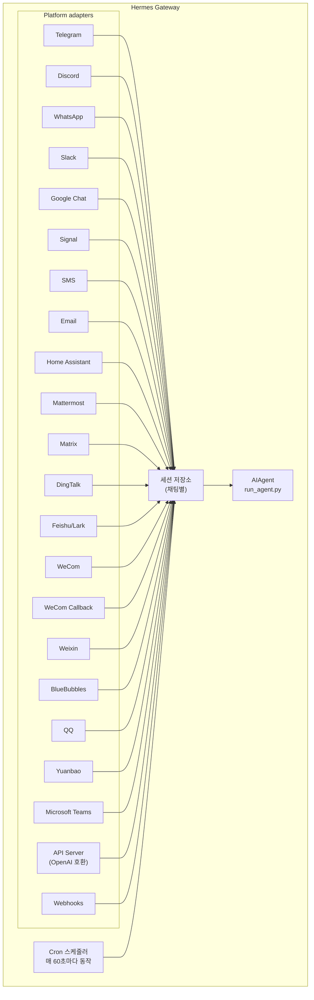

# Messaging Gateway

Telegram, Discord, Slack, WhatsApp, Signal, SMS, 이메일, Home Assistant, Mattermost, Matrix, DingTalk, Feishu/Lark, WeCom, Weixin, BlueBubbles (iMessage), QQ, Yuanbao, Microsoft Teams, LINE, ntfy, 또는 브라우저에서 Hermes와 대화하세요. 게이트웨이는 구성된 모든 플랫폼에 연결하고, 세션을 처리하며, 크론(cron) 작업을 실행하고, 음성 메시지를 전달하는 단일 백그라운드 프로세스입니다.

전체 음성 기능 집합 — CLI 마이크 모드, 메시징 앱에서의 음성 답변, Discord 음성 채널 대화 포함 — 을 보려면 [Voice Mode](/user-guide/features/voice-mode)와 [Use Voice Mode with Hermes](/guides/use-voice-mode-with-hermes)를 참조하세요.

:::tip
봇은 모델 제공자(provider)와 도구 제공자(TTS, 웹 등)가 모두 필요합니다. [Nous Portal](/integrations/nous-portal) 구독은 이 모든 것을 번들로 제공합니다.
:::

## 플랫폼 비교

| 플랫폼 | 음성 | 이미지 | 파일 | 스레드 | 리액션 | 타이핑 | 스트리밍 |
|----------|:-----:|:------:|:-----:|:-------:|:---------:|:------:|:---------:|
| Telegram | ✅ | ✅ | ✅ | ✅ | — | ✅ | ✅ |
| Discord | ✅ | ✅ | ✅ | ✅ | ✅ | ✅ | ✅ |
| Slack | ✅ | ✅ | ✅ | ✅ | ✅ | ✅ | ✅ |
| Google Chat | — | ✅ | ✅ | ✅ | — | ✅ | — |
| WhatsApp | — | ✅ | ✅ | — | — | ✅ | ✅ |
| Signal | — | ✅ | ✅ | — | — | ✅ | ✅ |
| SMS | — | — | — | — | — | — | — |
| Email | — | ✅ | ✅ | ✅ | — | — | — |
| Home Assistant | — | — | — | — | — | — | — |
| Mattermost | ✅ | ✅ | ✅ | ✅ | — | ✅ | ✅ |
| Matrix | ✅ | ✅ | ✅ | ✅ | ✅ | ✅ | ✅ |
| DingTalk | — | ✅ | ✅ | — | ✅ | — | ✅ |
| Feishu/Lark | ✅ | ✅ | ✅ | ✅ | ✅ | ✅ | ✅ |
| WeCom | ✅ | ✅ | ✅ | — | — | ✅ | ✅ |
| WeCom Callback | — | — | — | — | — | — | — |
| Weixin | ✅ | ✅ | ✅ | — | — | ✅ | ✅ |
| BlueBubbles | — | ✅ | ✅ | — | ✅ | ✅ | — |
| QQ | ✅ | ✅ | ✅ | — | — | ✅ | — |
| Yuanbao | ✅ | ✅ | ✅ | — | — | ✅ | ✅ |
| Microsoft Teams | — | ✅ | — | ✅ | — | ✅ | — |
| LINE | — | ✅ | ✅ | — | — | ✅ | — |
| ntfy | — | — | — | — | — | — | — |

**음성** = TTS 오디오 응답 및/또는 음성 메시지 변환(transcription). **이미지** = 이미지 송수신. **파일** = 파일 첨부 송수신. **스레드** = 스레드 대화. **리액션** = 메시지 이모지 리액션. **타이핑** = 처리 중 입력 상태 표시. **스트리밍** = 메시지 편집을 통한 점진적 업데이트.

## 아키텍처



각 플랫폼 어댑터는 메시지를 수신하고, 이를 채팅별 세션 저장소를 통해 라우팅하며, 처리를 위해 AIAgent로 디스패치합니다. 게이트웨이는 60초마다 동작하여 예약된 작업을 실행하는 크론 스케줄러도 실행합니다.

## 빠른 설정

메시징 플랫폼을 구성하는 가장 쉬운 방법은 대화형 마법사입니다:

```bash
hermes gateway setup        # 모든 메시징 플랫폼에 대한 대화형 설정
```

이 도구는 화살표 키 선택으로 각 플랫폼 구성을 안내하고, 어떤 플랫폼이 이미 구성되었는지 보여주며, 완료 시 게이트웨이를 시작/재시작할 것을 제안합니다.

## 게이트웨이 명령어

```bash
hermes gateway              # 포그라운드에서 실행
hermes gateway setup        # 대화형으로 메시징 플랫폼 구성
hermes gateway install      # 사용자 서비스(Linux) / launchd 서비스(macOS)로 설치
sudo hermes gateway install --system   # Linux 전용: 부팅 시 시스템 서비스 설치
hermes gateway start        # 기본 서비스 시작
hermes gateway stop         # 기본 서비스 중지
hermes gateway status       # 기본 서비스 상태 확인
hermes gateway status --system         # Linux 전용: 명시적으로 시스템 서비스 검사
```

## 채팅 명령어 (메시징 앱 내부)

| 명령 | 설명 |
|---------|-------------|
| `/new` 또는 `/reset` | 새로운 대화 시작 |
| `/model [provider:model]` | 모델 표시 또는 변경 (`provider:model` 구문 지원) |
| `/personality [name]` | 성격(personality) 설정 |
| `/retry` | 마지막 메시지 재시도 |
| `/undo` | 마지막 대화(exchange) 제거 |
| `/status` | 세션 정보 표시 |
| `/whoami` | 현재 범위에서의 슬래시 명령 접근 권한 표시 (관리자 / 사용자 / 제한 없음) |
| `/stop` | 실행 중인 에이전트 중지 |
| `/approve` | 보류 중인 위험한 명령 승인 |
| `/deny` | 보류 중인 위험한 명령 거부 |
| `/sethome` | 이 채팅을 홈 채널로 설정 |
| `/compress` | 수동으로 대화 컨텍스트 압축 |
| `/title [name]` | 세션 제목 설정 또는 표시 |
| `/resume [name]` | 이전에 명명된 세션 재개 |
| `/usage` | 현재 세션의 토큰 사용량 표시 |
| `/insights [days]` | 사용량 통계 및 분석 표시 |
| `/reasoning [level\|show\|hide]` | 추론 노력 수준 변경 또는 추론 결과 표시 여부 전환 |
| `/voice [on\|off\|tts\|join\|leave\|status]` | 메시징 앱의 음성 응답 및 Discord 음성 채널 동작 제어 |
| `/rollback [number]` | 파일 시스템 체크포인트 목록 표시 또는 복원 |
| `/background <prompt>` | 별도의 백그라운드 세션에서 프롬프트 실행 |
| `/reload-mcp` | 구성(config)에서 MCP 서버 새로 고침 |
| `/update` | Hermes Agent를 최신 버전으로 업데이트 |
| `/help` | 사용 가능한 명령어 표시 |
| `/<skill-name>` | 설치된 스킬 호출 |

## 세션 관리

### 세션 영속성

세션은 재설정될 때까지 여러 메시지에 걸쳐 유지됩니다. 에이전트는 대화 컨텍스트를 기억합니다.

### 초기화(Reset) 정책

구성 가능한 정책에 따라 세션이 재설정됩니다:

| 정책 | 기본값 | 설명 |
|--------|---------|-------------|
| Daily (일 단위) | 오전 4:00 | 매일 특정 시간에 재설정 |
| Idle (유휴 상태) | 1440분 | N분 동안 활동이 없으면 재설정 |
| Both (둘 다) | (조합) | 둘 중 먼저 트리거되는 것 기준 |

`~/.hermes/gateway.json`에서 플랫폼별 재정의(override) 구성:

```json
{
  "reset_by_platform": {
    "telegram": { "mode": "idle", "idle_minutes": 240 },
    "discord": { "mode": "idle", "idle_minutes": 60 }
  }
}
```

## 보안

**기본적으로 게이트웨이는 허용 목록(allowlist)에 없거나 DM으로 페어링되지 않은 모든 사용자를 거부합니다.** 이는 터미널 액세스 권한이 있는 봇에 대한 안전한 기본값입니다.

```bash
# 특정 사용자로 제한 (권장):
TELEGRAM_ALLOWED_USERS=123456789,987654321
DISCORD_ALLOWED_USERS=123456789012345678
SIGNAL_ALLOWED_USERS=+155****4567,+155****6543
SMS_ALLOWED_USERS=+155****4567,+155****6543
EMAIL_ALLOWED_USERS=trusted@example.com,colleague@work.com
MATTERMOST_ALLOWED_USERS=3uo8dkh1p7g1mfk49ear5fzs5c
MATRIX_ALLOWED_USERS=@alice:matrix.org
DINGTALK_ALLOWED_USERS=user-id-1
FEISHU_ALLOWED_USERS=ou_xxxxxxxx,ou_yyyyyyyy
WECOM_ALLOWED_USERS=user-id-1,user-id-2
WECOM_CALLBACK_ALLOWED_USERS=user-id-1,user-id-2
TEAMS_ALLOWED_USERS=aad-object-id-1,aad-object-id-2

# 또는 모든 게이트웨이 사용자 허용 목록 일괄 적용
GATEWAY_ALLOWED_USERS=123456789,987654321

# 또는 명시적으로 모든 사용자 허용 (터미널 액세스 권한이 있는 봇에는 권장하지 않음):
GATEWAY_ALLOW_ALL_USERS=true
```

### DM 페어링 (허용 목록의 대안)

사용자 ID를 수동으로 구성하는 대신, 알려지지 않은 사용자는 봇에게 DM을 보낼 때 1회용 페어링 코드를 받습니다:

```bash
# 사용자가 보는 메시지: "Pairing code: XKGH5N7P"
# 여러분은 다음 명령으로 그들을 승인합니다:
hermes pairing approve telegram XKGH5N7P

# 기타 페어링 관련 명령:
hermes pairing list          # 대기 중 + 승인된 사용자 목록 보기
hermes pairing revoke telegram 123456789  # 액세스 권한 제거
```

페어링 코드는 1시간 후에 만료되며, 생성 속도가 제한되고, 암호학적 난수를 사용합니다.

### 관리자 vs 일반 사용자

허용 목록은 "이 사람이 애초에 봇에 접근할 수 있는가?"에 답합니다. **관리자 / 사용자 구분**은 "이제 들어왔는데 무엇을 할 수 있도록 허용할 것인가?"에 답합니다.

모든 허용된 사용자는 범위(DM vs 그룹/채널)당 두 티어(tier) 중 하나에 속합니다:

- **관리자 (Admin)** — 모든 권한. 내장(built-in) + 플러그인 등 모든 등록된 슬래시 명령을 실행할 수 있으며 게이트로 보호된 모든 기능을 사용할 수 있습니다.
- **일반 사용자 (Regular user)** — 제한된 권한. 에이전트와 정상적으로 채팅할 수 있지만, 명시적으로 활성화한 슬래시 명령만 실행할 수 있습니다. 항상 허용되는 최하한은 `/help`와 `/whoami`입니다.

티어는 플랫폼별, 범위별로 구성됩니다. DM 관리자 자격은 그룹/채널 관리자 자격을 의미하지 않습니다 — 각 범위는 자체 관리자 목록을 가집니다.

**현재 계층이 제한하는 것:** 슬래시 명령. 권한 분할은 라이브 커맨드 레지스트리를 통해 실행되므로 개별 기능별 배선 작업 없이 내장 명령과 플러그인이 등록한 명령 모두를 포괄합니다. 일반 채팅은 영향을 받지 않습니다 — 관리자가 아닌 사용자도 에이전트와 대화할 수 있습니다.

**향후 제한될 수 있는 것:** 도구 접근, 모델 전환, 비용이 많이 드는 작업 등 더 많은 기능 표면이 추가됨에 따라 동일한 관리자/사용자 구분에 의존하게 됩니다. 지금 분할을 구성하면, 나중에 관리자가 누구인지 다시 모델링할 필요 없이 미래의 제한 사항들이 깔끔하게 적용됩니다.

#### 구성

```yaml
gateway:
  platforms:
    discord:
      extra:
        allow_from: ["111", "222", "333"]
        allow_admin_from: ["111"]                    # 관리자 → 모든 슬래시 명령 사용
        user_allowed_commands: [status, model]       # 비관리자가 실행 가능한 명령
        # 선택 사항: 그룹/채널 범위 별도 설정
        group_allow_admin_from: ["111"]
        group_user_allowed_commands: [status]
```

**역호환성:** 특정 범위에 대해 `allow_admin_from`이 설정되지 않으면, 해당 범위에 대해 계층 분할이 비활성화되며 허용된 모든 사용자가 전체 접근 권한을 갖습니다. 기존 설치는 변경 없이 작동합니다 — 구분이 필요할 때 선택해서 사용(opt-in)하세요.

#### 권한 검사하기

모든 플랫폼에서 `/whoami` 명령어를 사용하여 활성화된 범위, 사용자의 티어(관리자 / 사용자 / 무제한), 그리고 사용할 수 있는 슬래시 명령어들을 확인할 수 있습니다. 플랫폼별 예시는 [Telegram](/user-guide/messaging/telegram#slash-command-access-control) 및 [Discord](/user-guide/messaging/discord#slash-command-access-control) 문서를 참조하세요.

## 에이전트 중단(Interrupt) 시키기

에이전트가 작업 중일 때 메시지를 보내어 작업을 중단시킵니다. 주요 동작들:

- **실행 중인 터미널 명령이 즉시 종료됩니다** (SIGTERM 후 1초 뒤 SIGKILL)
- **도구 호출 취소** — 현재 실행 중인 도구만 실행하고 나머지는 건너뜁니다
- **여러 메시지 결합** — 인터럽트 도중에 전송된 메시지들은 하나의 프롬프트로 병합됩니다
- **`/stop` 명령어** — 새 메시지를 대기열에 넣지 않고 작업을 중단합니다

### 큐잉(Queue) vs 인터럽트(Interrupt) vs 편승(Steer) (작업 중 입력 모드)

기본적으로 바쁜 에이전트에 메시지를 보내면 작업이 중단됩니다. 다음 두 가지 다른 모드도 이용 가능합니다:

- `queue` — 후속 메시지들이 대기했다가 현재 작업이 완료된 후 다음 차례로 실행됩니다.
- `steer` — 후속 메시지가 `/steer`를 통해 현재 실행 중인 런(run)에 주입되며 다음 도구 호출 이후에 에이전트에게 전달됩니다. 작업이 중지되거나 새 턴이 발생하지 않습니다. 에이전트가 아직 시작 전이라면 `queue` 동작으로 떨어집니다(fall back).

```yaml
display:
  busy_input_mode: steer   # 또는 queue, interrupt (기본값)
  busy_ack_enabled: true   # 채팅상의 ⚡/⏳/⏩ 알림 답변을 완전히 숨기고 싶을 땐 false로 설정
```

플랫폼 불문하고 바쁜 에이전트에게 첫 번째로 메시지를 보내면 Hermes는 알림과 함께 이 기능에 대한 한 줄짜리 설명 팁(`"💡 First-time tip — …"`)을 덧붙입니다. 이 알림은 설치 당 한 번만 발생합니다 — `onboarding.seen.busy_input_prompt`라는 플래그로 기억합니다. 이 팁을 다시 보려면 이 키를 지우면 됩니다.

만약 바쁨 상태 확인(busy-ack) 알림이 너무 시끄럽다고 느끼신다면 — 특히 음성 입력이나 연속적인 메시지 전송 시에 — `display.busy_ack_enabled: false`를 설정하십시오. 당신의 입력은 여전히 설정된 `queue/steer/interrupt`에 따라 정상 처리되며 오직 채팅방의 알림만 침묵시킵니다.

## 도구 진행 상태 알림

`~/.hermes/config.yaml`에서 도구 활동 표시 수준을 제어하세요:

```yaml
display:
  tool_progress: all    # off | new | all | verbose
  tool_progress_command: false  # 메시징에서 /verbose를 활성화하려면 true로 설정
```

활성화되면, 봇은 다음과 같이 작업 상태 메시지를 전송합니다:

```text
💻 `ls -la`...
🔍 web_search...
📄 web_extract...
🐍 execute_code...
```

## 백그라운드 세션

별도의 백그라운드 세션에서 프롬프트를 실행하면 메인 채팅창이 반응성을 유지하는 동안 에이전트가 독립적으로 작업을 수행합니다:

```
/background 클러스터의 모든 서버를 확인하고 다운된 서버를 보고해줘
```

Hermes는 즉각 확인 메시지를 냅니다:

```
🔄 백그라운드 작업 시작됨: "클러스터의 모든 서버를 확인하고..."
   작업 ID: bg_143022_a1b2c3
```

### 동작 원리

각 `/background` 프롬프트는 비동기적으로 실행되는 **독립된 에이전트 인스턴스**를 생성합니다:

- **격리된 세션** — 백그라운드 에이전트는 고유한 대화 기록이 있는 자신만의 세션을 갖습니다. 현재 대화 상황을 전혀 알지 못하며 당신이 제공한 프롬프트만 받습니다.
- **동일한 구성 환경** — 현재 게이트웨이 설정의 모델, 제공자, 툴셋, 추론 설정 및 라우팅을 그대로 상속합니다.
- **논블로킹(Non-blocking)** — 여러분의 메인 채팅은 여전히 응답 가능합니다. 작업이 진행되는 동안 메시지를 보내고, 다른 명령을 실행하고, 더 많은 백그라운드 작업을 시작하십시오.
- **결과 전달** — 작업이 끝나면, "✅ Background task complete"가 덧붙여진 결과가 명령을 내린 **해당 채팅이나 채널**로 전달됩니다. 실패하면 오류 내용과 함께 "❌ Background task failed"가 표시됩니다.

### 백그라운드 프로세스 알림

백그라운드 세션을 실행 중인 에이전트가 시간이 오래 걸리는 작업(서버 실행, 빌드 등)을 시작하기 위해 `terminal(background=true)`을 사용할 때 게이트웨이가 진행 상태를 채팅에 업데이트할 수 있습니다. `~/.hermes/config.yaml` 내 `display.background_process_notifications` 값으로 제어합니다:

```yaml
display:
  background_process_notifications: all    # all | result | error | off
```

| 모드 | 당신이 받는 것 |
|------|-----------------|
| `all` | 실행 중 출력 상태 업데이트 **및** 최종 완료 메시지 (기본값) |
| `result` | (종료 코드에 상관없이) 오직 최종 완료 메시지 하나만 |
| `error` | 종료 코드가 0이 아닐(오류 시) 때의 최종 메시지 |
| `off` | 프로세스 감시자(watcher)의 어떠한 메시지도 받지 않음 |

환경 변수를 통해서도 설정할 수 있습니다:

```bash
HERMES_BACKGROUND_NOTIFICATIONS=result
```

### 사용 사례 (Use Cases)

- **서버 모니터링** — "/background 모든 서비스의 상태 점검을 하고 다운된 게 있으면 경고해 줘"
- **오랜 시간이 걸리는 빌드** — "/background 스테이징 환경을 빌드하고 배포해 줘" (실행 중일 동안 다른 채팅 계속 가능)
- **리서치 업무** — "/background 경쟁사 가격을 조사하고 표로 요약해 줘"
- **파일 작업** — "/background ~/Downloads의 사진들을 날짜별 폴더로 정리해 줘"

:::tip
메시징 플랫폼의 백그라운드 작업은 한 번 쏘면 끝(fire-and-forget)입니다 — 기다리거나 계속 확인할 필요가 없습니다. 작업이 끝나면 해당 채팅창에 자동으로 결과가 도착합니다.
:::

## 서비스 관리

### Linux (systemd)

```bash
hermes gateway install               # 사용자 서비스로 설치
hermes gateway start                 # 서비스 시작
hermes gateway stop                  # 서비스 정지
hermes gateway status                # 상태 확인
journalctl --user -u hermes-gateway -f  # 로그 조회

# Linger 활성화 (로그아웃 후에도 계속 실행됨)
sudo loginctl enable-linger $USER

# 혹은 당신의 계정으로 작동하면서도 부팅 시 켜지는 시스템 서비스를 설치할 수도 있습니다
sudo hermes gateway install --system
sudo hermes gateway start --system
sudo hermes gateway status --system
journalctl -u hermes-gateway -f
```

랩탑이나 개발용 PC에서는 사용자 서비스를 이용하세요. VPS 혹은 systemd linger 기능에 기대지 않고 부팅 시 돌아오길 바라는 헤드리스 호스트에서는 시스템 서비스를 이용하세요.

의도한 것이 아니라면 사용자 단위와 시스템 단위의 게이트웨이 서비스 유닛을 동시에 양쪽 다 설치하지 마세요. 시작/정지/상태 조회의 동작이 모호해지기 때문에 Hermes가 감지하면 경고할 것입니다.

:::info 다중 설치 (Multiple installations)
동일한 머신에서 (서로 다른 `HERMES_HOME` 디렉터리로) 여러 Hermes 인스턴스를 운영하면, 각기 다른 systemd 서비스 이름을 갖습니다. 기본 `~/.hermes`는 `hermes-gateway`를 사용하고 기타 다른 설치들은 `hermes-gateway-<hash>`를 씁니다. `hermes gateway` 커맨드들은 현재 `HERMES_HOME` 환경에 알맞은 서비스를 자동으로 타겟팅합니다.
:::

### macOS (launchd)

```bash
hermes gateway install               # launchd 에이전트로 설치
hermes gateway start                 # 서비스 시작
hermes gateway stop                  # 서비스 정지
hermes gateway status                # 상태 확인
tail -f ~/.hermes/logs/gateway.log   # 로그 조회
```

생성된 plist 파일은 `~/Library/LaunchAgents/ai.hermes.gateway.plist`에 위치합니다. 이 안에는 다음 세 개의 환경 변수가 포함됩니다:

- **PATH** — 설치할 당시의 풀 shell PATH. 앞부분에 venv의 `bin/` 경로 및 `node_modules/.bin` 이 붙어있습니다. 이로써 사용자 권한으로 설치된 도구(Node.js, ffmpeg 등)를 게이트웨이의 하위 프로세스(예: WhatsApp 브릿지)들이 원활히 쓸 수 있게 합니다.
- **VIRTUAL_ENV** — Python 패키지를 올바로 인식하게 하려고 가상환경을 지시합니다.
- **HERMES_HOME** — 게이트웨이 스코프를 당신의 Hermes 설치 환경에 맞춥니다.

:::tip 설치 이후 PATH가 변경되었을 때
launchd의 plist는 정적입니다 — 게이트웨이 세팅 이후 새 도구를 설치했다면(예: nvm으로 Node.js 새 버전을 깔았거나 Homebrew로 ffmpeg를 깔았다면) `hermes gateway install`을 한 번 더 돌려서 갱신된 PATH를 적용해 주십시오. 게이트웨이는 오래된 plist를 알아차리고 자동으로 다시 띄웁니다.
:::

:::info 다중 설치
Linux systemd와 마찬가지로, 각각의 `HERMES_HOME` 디렉터리는 자신만의 launchd 라벨을 가집니다. 기본값인 `~/.hermes`는 `ai.hermes.gateway`를 쓰고, 그 외 설치본들은 `ai.hermes.gateway-<suffix>` 꼴을 사용합니다.
:::

## 플랫폼 특화 툴셋 (Toolset)

각 플랫폼은 스스로의 도구 모음(Toolset)을 가집니다:

| 플랫폼 | 툴셋 (Toolset) | 기능(Capabilities) |
|----------|---------|--------------|
| CLI | `hermes-cli` | 전체 접근 가능 |
| Telegram | `hermes-telegram` | 터미널 포함 전체 도구 지원 |
| Discord | `hermes-discord` | 터미널 포함 전체 도구 지원 |
| WhatsApp | `hermes-whatsapp` | 터미널 포함 전체 도구 지원 |
| Slack | `hermes-slack` | 터미널 포함 전체 도구 지원 |
| Google Chat | `hermes-google_chat` | 터미널 포함 전체 도구 지원 |
| Signal | `hermes-signal` | 터미널 포함 전체 도구 지원 |
| SMS | `hermes-sms` | 터미널 포함 전체 도구 지원 |
| Email | `hermes-email` | 터미널 포함 전체 도구 지원 |
| Home Assistant | `hermes-homeassistant` | 전체 도구 + HA 기기 제어 (`ha_list_entities`, `ha_get_state`, `ha_call_service`, `ha_list_services`) |
| Mattermost | `hermes-mattermost` | 터미널 포함 전체 도구 지원 |
| Matrix | `hermes-matrix` | 터미널 포함 전체 도구 지원 |
| DingTalk | `hermes-dingtalk` | 터미널 포함 전체 도구 지원 |
| Feishu/Lark | `hermes-feishu` | 터미널 포함 전체 도구 지원 |
| WeCom | `hermes-wecom` | 터미널 포함 전체 도구 지원 |
| WeCom Callback | `hermes-wecom-callback` | 터미널 포함 전체 도구 지원 |
| Weixin | `hermes-weixin` | 터미널 포함 전체 도구 지원 |
| BlueBubbles | `hermes-bluebubbles` | 터미널 포함 전체 도구 지원 |
| QQBot | `hermes-qqbot` | 터미널 포함 전체 도구 지원 |
| Yuanbao | `hermes-yuanbao` | 터미널 포함 전체 도구 지원 |
| Microsoft Teams | `hermes-teams` | 터미널 포함 전체 도구 지원 |
| API Server | `hermes-api-server` | 전체 도구 (`clarify`, `send_message`, `text_to_speech` 제외 — API 접근은 실제 사용자가 있는 환경이 아니기 때문) |
| Webhooks | `hermes-webhook` | 터미널 포함 전체 도구 지원 |

## 멀티-플랫폼 게이트웨이 운영하기

게이트웨이는 대개 한 번에 여러 개의 어댑터를 구동시킵니다(Telegram + Discord + Slack 등). 아래 섹션은 모든 플랫폼에 영향을 미치는 운영 관리(day-2 operations)에 대해 다룹니다.

### `/platform` 커맨드

게이트웨이가 구동 중일 때 CLI나 채팅창에서 `/platform` 슬래시 커맨드를 쓰면, 게이트웨이 전체를 껐다 킬 필요 없이 개별 어댑터의 상태를 점검하거나 통제할 수 있습니다:

```
/platform list                  # 모든 어댑터의 상태 표시
/platform pause <name>          # 특정 어댑터로 들어오는 메시지 중지
/platform resume <name>         # 일시 정지된 어댑터 재활성화
```

`/platform list`는 각 어댑터가 `running(실행 중)`, `paused(수동 정지됨)` 혹은 `paused-by-breaker(자동 차단됨)` 인지 알려줍니다. 일시 정지 중에도 어댑터 자체는 메모리에 떠 있으며 배경 루프도 살아있습니다 — 단지 수신된 메시지를 무시할 뿐이므로 다시 켜면 (resume) 즉각 활성화됩니다.

더 폭넓은 상태 조회 커맨드인 [`/platforms`](../../reference/slash-commands.md#info)도 확인해 보세요.

### 자동 서킷 브레이커 (Circuit Breaker)

각 어댑터는 서킷 브레이커로 감싸져 있습니다. 반복적인 재시도 가능 실패(네트워크 끊김, 한도 초과(rate-limit), 5xx 서버 오류, 웹소켓 연결 해제 등)가 누적되면 브레이커가 차단(trip)됩니다 — 해당 어댑터는 자동으로 멈추고, 다른 플랫폼의 홈 채널이 켜져 있으면 운영자에게 알림을 날리며, 구조화된 로그(log line)를 뱉어냅니다.

브레이커는 **절대로** 스스로 복구(auto-resume)하지 않습니다 — 당신이 직접 `/platform resume <name>`을 치기 전까지 차단된 채로 남아있습니다. 이는 의도된 설계입니다: 플랫폼 서비스가 계속 죽어있는 상태에서 게이트웨이가 무의미한 재연결 시도로 몸살을 앓지 않게 하기 위함입니다.

### 플랫폼이 정지되었을 때 확인해야 할 곳

어댑터가 일시 정지되었을 때는 다음 사항을 검토하십시오:

1. **게이트웨이 로그** (`~/.hermes/logs/gateway.log` 또는 systemd/launchd 로그). 플랫폼 이름과 함께 `circuit breaker`, `paused`, `disabled` 라는 단어를 검색하세요. 차단(trip) 이벤트에는 오류 발생 횟수와 마지막 에러 내용이 함께 기록됩니다.
2. **`/platform list`** 실행 결과 — 현재 상태와 마지막 원인이 무엇이었는지 보여줍니다.
3. **각 서비스의 Status 페이지** (Telegram 봇 API 상태, Discord 장애 공지 등). 브레이커가 작동했다는 것은 그 플랫폼 서비스 상태가 건강하지 못하다는 의미입니다. 해당 플랫폼이 복구될 때까지 섣불리 재가동을 시도하지 마십시오.

업스트림(서비스 제공자 측)이 정상으로 돌아오면, `/platform resume <name>` 명령어로 서킷 브레이커를 초기화하고 어댑터를 복구하세요.

### 재시작 시 알림 (Restart notifications)

게이트웨이가 재시작될 때 (또는 작업 중이던 세션이 있는 상태로 종료된 경우), "에이전트가 돌아왔습니다(the agent is back)" 혹은 "작업이 중단되었습니다(the agent was interrupted)" 식의 일회성 알림 메시지를 각 플랫폼의 홈 채널에 전송할 수 있습니다. `gateway-config.yaml`에 정의된 `gateway_restart_notification` 플래그로 플랫폼마다 제어 가능하며 기본값은 `true`입니다:

```yaml
gateway:
  platforms:
    telegram:
      home_chat_id: "123456789"
      gateway_restart_notification: false   # 이 플랫폼만 끕니다
    discord:
      home_chat_id: "987654321"
      # gateway_restart_notification을 지우면 기본값(true) 적용
```

알람이 너무 많이 와서 귀찮거나 우선순위가 떨어지는 플랫폼은 알림을 끄시고 메인 채팅 채널에만 알림이 오도록 두십시오. 알림은 진행 중이던 세션 개수와 무관하게 각 재시작 당 한 번씩만 발송됩니다.

### 게이트웨이 재시작 시 세션 이어서 하기 (Session resume)

도구를 쓰고 있거나 답변을 생성하던 중에 게이트웨이가 꺼져버렸다면, 영향을 받은 해당 세션들은 `restart_interrupted` 라는 플래그가 붙습니다. 그다음 기동될 때 게이트웨이는 이들에 대한 자동 재개(auto-resume) 일정을 잡아둡니다 — 사용자는 채팅창에서 가벼운 알림을 하나 받게 됩니다 ("게이트웨이가 재시작되었습니다. 아무 메시지나 보내주시면 하던 작업을 이어서 진행합니다."). 사용자가 아무 메시지나 답변하면 끊겼던 그 직전 턴에서 이어서 다시 돌아갑니다.

이 기능은 기본으로 활성화되어 있으며 게이트웨이 시작 시 로그에 다음과 같이 찍힙니다:

```
Scheduled auto-resume for N restart-interrupted session(s)
```

아무 설정도 필요 없습니다. 만일 사용자에게 알림이 팝업되는 게 싫다면 `gateway_restart_notification: false` 로 설정하시면 됩니다.

### 모바일 친화적 진행 과정 기본값 설정

Telegram과 같은 플랫폼은 모바일 기반 편지함 역할을 주로 하므로 기본 설정값이 모바일에 맞춰 조정되어 있습니다:

- **`tool_progress`** 는 기본값이 **`off`**입니다 — 도구별 진행 과정을 채팅창에 줄줄이 띄우지 않습니다.
- **`busy_ack_detail`** 은 기본값이 **`off`**입니다 — 너무 세세한 작업 중 상태나 반복 과정에 대한 알림(예: `iteration 21/60` 같은 디버깅성 상세)은 노출을 피합니다.
- **`interim_assistant_messages`** 는 기본적으로 켜져 있습니다 (**on**) — 다음 행동을 암시하는 어시스턴트의 턴 중간 코멘트는 꽤 유의미한 신호(noise가 아닌 signal)이므로 보여줍니다.
- **`long_running_notifications`** 역시 켜져 있습니다 (**on**) — 30분 동안 `typing…` 표시만 노려보게 만드는 대신, "⏳ Working — N min" 버블이 채팅창 내에서 제자리 수정(edit-in-place)되며 주기적인 생존신호를 줍니다.

어느 플랫폼이든 위의 기본 설정값을 다시 되돌리거나, 진행 과정을 세밀하게 보고 싶을 때엔 다음과 같이 구성하십시오:

```yaml
display:
  platforms:
    telegram:
      # 진행 과정 스트림 켜기
      tool_progress: new
      # 바쁨 응답 시 "iteration N/M, running: tool" 등 구체적 지표 보이기
      busy_ack_detail: true
      # 아예 완전 침묵 시키기
      interim_assistant_messages: false
      long_running_notifications: false
```

### 진행 버블(Progress bubble) 지우기 (옵션)

작업이 종료된 후, 그동안 찍혔던 도구 상태나 "작업 중..."이라는 안내 멘트를 남기지 않고 깔끔하게 정리하려면 `display.platforms.<platform>.cleanup_progress` 기능을 켜면 됩니다:

```yaml
display:
  platforms:
    telegram:
      cleanup_progress: true
    discord:
      cleanup_progress: true
```

기본값은 `false`입니다. 현재 이 기능을 구현한(delete_message API가 있는) 플랫폼(주로 Telegram, Discord 등)에서만 동작합니다. 작업이 실패(Failed runs)한 경우에는 나중에 디버그 목적으로 로그를 남기기 위해 치우지 않고 그냥 둡니다.

## 다음 단계 (Next Steps)

- [Telegram 설정](telegram.md)
- [Discord 설정](discord.md)
- [Slack 설정](slack.md)
- [Google Chat 설정](google_chat.md)
- [WhatsApp 설정](whatsapp.md)
- [Signal 설정](signal.md)
- [SMS 설정 (Twilio)](sms.md)
- [Email 설정](email.md)
- [Home Assistant 연동](homeassistant.md)
- [Mattermost 설정](mattermost.md)
- [Matrix 설정](matrix.md)
- [DingTalk 설정](dingtalk.md)
- [Feishu/Lark 설정](feishu.md)
- [WeCom 설정](wecom.md)
- [WeCom Callback 설정](wecom-callback.md)
- [Weixin 설정 (WeChat)](weixin.md)
- [BlueBubbles 설정 (iMessage)](bluebubbles.md)
- [QQBot 설정](qqbot.md)
- [Yuanbao 설정](yuanbao.md)
- [Microsoft Teams 설정](teams.md)
- [Teams Meetings Pipeline](teams-meetings.md)
- [Open WebUI + API Server](open-webui.md)
- [Webhooks](webhooks.md)
