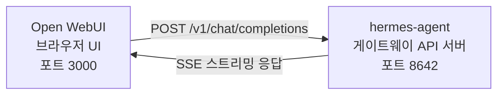

# Open WebUI 연동 (Integration)

[Open WebUI](https://github.com/open-webui/open-webui) (126k★)는 AI를 위한 가장 인기 있는 자체 호스팅 채팅 인터페이스입니다. Hermes Agent의 내장 API 서버를 사용하면, Open WebUI를 에이전트의 세련된 웹 프론트엔드로 활용할 수 있습니다 — 대화 관리, 사용자 계정, 최신 채팅 인터페이스를 완벽하게 갖추고 있습니다.

## 아키텍처 (Architecture)



Open WebUI는 OpenAI에 연결하는 것과 동일한 방식으로 Hermes Agent의 API 서버에 연결합니다. Hermes는 전체 도구 모음(터미널, 파일 작업, 웹 검색, 메모리, 스킬)을 사용하여 요청을 처리하고 최종 응답을 반환합니다.

:::important 런타임 위치
API 서버는 순수한 LLM 프록시가 아니라 **Hermes 에이전트 런타임**입니다. 각 요청에 대해 Hermes는 API 서버 호스트에 서버측(server-side) `AIAgent`를 생성합니다. 도구 호출(Tool calls)은 해당 API 서버가 실행 중인 곳에서 실행됩니다.

예를 들어, 랩탑에서 Open WebUI 또는 다른 OpenAI 호환 클라이언트를 통해 원격 머신의 Hermes API 서버를 가리키는 경우, `pwd`, 파일 도구, 브라우저 도구, 로컬 MCP 도구 및 기타 작업 공간 도구는 랩탑이 아닌 원격 API 서버 호스트에서 실행됩니다.
:::

Open WebUI는 Hermes와 서버 대 서버로 통신하므로, 이 연동을 위해 `API_SERVER_CORS_ORIGINS`가 필요하지 않습니다.

## 빠른 설정 (Quick Setup)

### 단일 명령 로컬 부트스트랩 (macOS/Linux, Docker 미사용)

Hermes와 Open WebUI를 로컬에서 재사용 가능한 런처와 함께 연결하려면 다음을 실행하세요:

```bash
cd ~/.hermes/hermes-agent
bash scripts/setup_open_webui.sh
```

스크립트의 역할:

- `~/.hermes/.env`에 `API_SERVER_ENABLED`, `API_SERVER_HOST`, `API_SERVER_KEY`, `API_SERVER_PORT` 및 `API_SERVER_MODEL_NAME`이 포함되어 있는지 확인합니다.
- API 서버가 가동되도록 Hermes 게이트웨이를 다시 시작합니다.
- `~/.local/open-webui-venv`에 Open WebUI를 설치합니다.
- `~/.local/bin/start-open-webui-hermes.sh`에 런처를 작성합니다.
- macOS의 경우 `launchd` 사용자 서비스를 설치하고, `systemd --user`를 사용하는 Linux의 경우 해당 환경에 사용자 서비스를 설치합니다.

기본값:

- Hermes API: `http://127.0.0.1:8642/v1`
- Open WebUI: `http://127.0.0.1:8080`
- Open WebUI에 광고되는 모델 이름: `Hermes Agent`

유용한 재정의(Overrides):

```bash
OPEN_WEBUI_NAME='My Hermes UI' \
OPEN_WEBUI_ENABLE_SIGNUP=true \
HERMES_API_MODEL_NAME='My Hermes Agent' \
bash scripts/setup_open_webui.sh
```

Linux의 경우 자동 백그라운드 서비스 설정에는 정상적으로 작동하는 `systemd --user` 세션이 필요합니다. 헤드리스 SSH 머신에 있고 서비스 설치를 건너뛰려면 다음을 실행하세요:

```bash
OPEN_WEBUI_ENABLE_SERVICE=false bash scripts/setup_open_webui.sh
```

### 1. API 서버 활성화

```bash
hermes config set API_SERVER_ENABLED true
hermes config set API_SERVER_KEY your-secret-key
```

`hermes config set`은 자동으로 플래그를 `config.yaml`로, 시크릿(secret)을 `~/.hermes/.env`로 라우팅합니다. 게이트웨이가 이미 실행 중인 경우, 변경 사항이 적용되도록 게이트웨이를 다시 시작하세요:

```bash
hermes gateway stop && hermes gateway
```

### 2. Hermes Agent 게이트웨이 시작

```bash
hermes gateway
```

다음이 표시되어야 합니다:

```
[API Server] API server listening on http://127.0.0.1:8642
```

### 3. API 서버 연결 확인

```bash
curl -s http://127.0.0.1:8642/health
# {"status": "ok", ...}

curl -s -H "Authorization: Bearer your-secret-key" http://127.0.0.1:8642/v1/models
# {"object":"list","data":[{"id":"hermes-agent", ...}]}
```

`/health`가 실패하면 게이트웨이가 `API_SERVER_ENABLED=true`를 인식하지 못한 것이므로 다시 시작하세요. `/v1/models`가 `401`을 반환하면 `Authorization` 헤더가 `API_SERVER_KEY`와 일치하지 않는 것입니다.

### 4. Open WebUI 시작

```bash
docker run -d -p 3000:8080 \
  -e OPENAI_API_BASE_URL=http://host.docker.internal:8642/v1 \
  -e OPENAI_API_KEY=your-secret-key \
  -e ENABLE_OLLAMA_API=false \
  --add-host=host.docker.internal:host-gateway \
  -v open-webui:/app/backend/data \
  --name open-webui \
  --restart always \
  ghcr.io/open-webui/open-webui:main
```

`ENABLE_OLLAMA_API=false`는 비어 있는 상태로 표시되어 모델 선택기(model picker)를 복잡하게 만드는 기본 Ollama 백엔드를 숨깁니다. 백엔드에서 Ollama를 실제로 실행 중인 경우 이 옵션을 생략하세요.

처음 실행하는 데 15~30초가 걸립니다: Open WebUI는 처음 시작할 때 sentence-transformer 임베딩 모델(약 150MB)을 다운로드합니다. UI를 열기 전에 `docker logs open-webui`가 안정화될 때까지 기다리세요.

### 5. UI 열기

**[http://localhost:3000](http://localhost:3000)**으로 이동합니다. 관리자 계정을 생성합니다(첫 번째 사용자가 관리자가 됨). 모델 드롭다운에서 프로필 이름 또는 기본 프로필의 경우 **hermes-agent**라는 이름의 에이전트가 표시되어야 합니다. 채팅을 시작하세요!

## Docker Compose 설정

보다 영구적인 설정을 위해 `docker-compose.yml`을 생성합니다:

```yaml
services:
  open-webui:
    image: ghcr.io/open-webui/open-webui:main
    ports:
      - "3000:8080"
    volumes:
      - open-webui:/app/backend/data
    environment:
      - OPENAI_API_BASE_URL=http://host.docker.internal:8642/v1
      - OPENAI_API_KEY=your-secret-key
      - ENABLE_OLLAMA_API=false
    extra_hosts:
      - "host.docker.internal:host-gateway"
    restart: always

volumes:
  open-webui:
```

그런 다음:

```bash
docker compose up -d
```

## 관리자 UI를 통한 구성

환경 변수 대신 UI를 통해 연결을 구성하려는 경우:

1. **[http://localhost:3000](http://localhost:3000)**에서 Open WebUI에 로그인합니다.
2. **프로필 아바타** → **관리자 설정(Admin Settings)**을 클릭합니다.
3. **연결(Connections)**로 이동합니다.
4. **OpenAI API** 아래에서 **렌치 아이콘**(관리)을 클릭합니다.
5. **+ 새 연결 추가(+ Add New Connection)**를 클릭합니다.
6. 다음을 입력합니다:
   - **URL**: `http://host.docker.internal:8642/v1`
   - **API Key**: Hermes의 `API_SERVER_KEY`와 정확히 같은 값
7. **체크 표시(checkmark)**를 클릭하여 연결을 확인합니다.
8. **저장(Save)**

이제 에이전트 모델이 모델 드롭다운에 표시되어야 합니다(프로필 이름 또는 기본 프로필의 경우 **hermes-agent**).

:::warning
환경 변수는 Open WebUI의 **첫 번째 실행** 시에만 적용됩니다. 이후에는 연결 설정이 내부 데이터베이스에 저장됩니다. 나중에 변경하려면 관리자 UI를 사용하거나 Docker 볼륨을 삭제하고 새로 시작하세요.
:::

## API 유형: Chat Completions vs Responses

Open WebUI는 백엔드에 연결할 때 두 가지 API 모드를 지원합니다:

| 모드 | 형식 | 사용 시기 |
|------|--------|-------------|
| **Chat Completions** (기본값) | `/v1/chat/completions` | 권장됨. 기본적으로 작동합니다. |
| **Responses** (실험적) | `/v1/responses` | `previous_response_id`를 통한 서버측 대화 상태 유지를 위해. |

### Chat Completions 사용 (권장)

이것이 기본값이며 추가 구성이 필요하지 않습니다. Open WebUI는 표준 OpenAI 형식의 요청을 보내고 Hermes Agent는 그에 따라 응답합니다. 각 요청에는 전체 대화 기록이 포함됩니다.

### Responses API 사용

Responses API 모드를 사용하려면:

1. **관리자 설정(Admin Settings)** → **연결(Connections)** → **OpenAI** → **관리(Manage)**로 이동합니다.
2. hermes-agent 연결을 편집합니다.
3. **API Type**을 "Chat Completions"에서 **"Responses (Experimental)"**로 변경합니다.
4. 저장합니다.

Responses API를 사용하면 Open WebUI는 Responses 형식(`input` 배열 + `instructions`)으로 요청을 보내고, Hermes Agent는 `previous_response_id`를 통해 턴(turn) 전반에 걸쳐 전체 도구 호출 내역을 보존할 수 있습니다. `stream: true`일 때 Hermes는 사양 네이티브(spec-native) `function_call` 및 `function_call_output` 항목도 스트리밍하므로, Responses 이벤트를 렌더링하는 클라이언트에서 사용자 정의 구조화된 도구 호출 UI를 활성화할 수 있습니다.

:::note
Open WebUI는 현재 Responses 모드에서도 여전히 대화 기록을 클라이언트 측에서 관리합니다 — 즉 `previous_response_id`를 사용하는 대신 각 요청에 전체 메시지 기록을 보냅니다. 오늘날 Responses 모드의 주요 장점은 구조화된 이벤트 스트림입니다: 텍스트 델타, `function_call`, `function_call_output` 항목이 Chat Completions 청크(chunks) 대신 OpenAI Responses SSE 이벤트로 도착합니다.
:::

## 작동 방식

Open WebUI에서 메시지를 보낼 때:

1. Open WebUI는 메시지와 대화 기록이 포함된 `POST /v1/chat/completions` 요청을 보냅니다.
2. Hermes Agent는 API 서버의 프로필, 모델/제공자 구성, 메모리, 스킬 및 구성된 API 서버 툴셋을 사용하여 서버측 `AIAgent` 인스턴스를 생성합니다.
3. 에이전트가 요청을 처리합니다 — API 서버 호스트에서 도구(터미널, 파일 작업, 웹 검색 등)를 호출할 수 있습니다.
4. 도구가 실행되는 동안 에이전트가 무엇을 하고 있는지 볼 수 있도록 **진행 메시지가 UI로 인라인(inline) 스트리밍**됩니다 (예: `` `💻 ls -la` ``, `` `🔍 Python 3.12 release` ``).
5. 에이전트의 최종 텍스트 응답이 Open WebUI로 스트리밍됩니다.
6. Open WebUI가 채팅 인터페이스에 응답을 표시합니다.

에이전트는 해당 API 서버 Hermes 인스턴스와 동일한 도구 및 기능에 액세스할 수 있습니다. API 서버가 원격인 경우 해당 도구도 원격입니다.

오늘날 **로컬** 워크스페이스에 대해 도구를 실행해야 하는 경우, Hermes를 로컬에서 실행하고 순수 LLM 공급자 또는 순수 OpenAI 호환 모델 프록시(예: vLLM, LiteLLM, Ollama, llama.cpp, OpenAI, OpenRouter 등)를 가리키게 하세요. 향후 "remote brain, local hands(원격 두뇌, 로컬 손)"를 위한 분할 런타임 모드는 [#18715](https://github.com/NousResearch/hermes-agent/issues/18715)에서 추적 중입니다; 이는 현재 API 서버의 동작이 아닙니다.

:::tip 도구 진행 상황 (Tool Progress)
스트리밍이 활성화된 경우(기본값), 도구가 실행될 때 도구 이모지와 주요 인수(argument)가 인라인 표시기로 잠시 나타납니다. 이는 에이전트의 최종 답변 전 응답 스트림에 나타나므로 배후에서 어떤 일이 일어나고 있는지 가시성을 제공합니다.
:::

## 구성 참조 (Configuration Reference)

### Hermes Agent (API 서버)

| 변수 | 기본값 | 설명 |
|----------|---------|-------------|
| `API_SERVER_ENABLED` | `false` | API 서버 활성화 |
| `API_SERVER_PORT` | `8642` | HTTP 서버 포트 |
| `API_SERVER_HOST` | `127.0.0.1` | 바인딩 주소 |
| `API_SERVER_KEY` | _(필수)_ | 인증을 위한 Bearer 토큰. `OPENAI_API_KEY`와 일치해야 합니다. |

### Open WebUI

| 변수 | 설명 |
|----------|-------------|
| `OPENAI_API_BASE_URL` | Hermes Agent의 API URL (`/v1` 포함) |
| `OPENAI_API_KEY` | 비어 있어서는 안 됩니다. `API_SERVER_KEY`와 일치해야 합니다. |

## 문제 해결 (Troubleshooting)

### 드롭다운에 모델이 나타나지 않음

- **URL에 `/v1` 접미사가 있는지 확인**: `http://host.docker.internal:8642/v1` (`:8642`만이 아님)
- **게이트웨이가 실행 중인지 확인**: `curl http://localhost:8642/health`가 `{"status": "ok"}`를 반환해야 합니다.
- **모델 목록 확인**: `curl -H "Authorization: Bearer your-secret-key" http://localhost:8642/v1/models`가 `hermes-agent`가 포함된 목록을 반환해야 합니다.
- **Docker 네트워킹**: Docker 내부에서 `localhost`는 호스트가 아닌 컨테이너를 의미합니다. `host.docker.internal` 또는 `--network=host`를 사용하세요.
- **빈 Ollama 백엔드가 선택기를 가림**: `ENABLE_OLLAMA_API=false`를 생략한 경우 Open WebUI는 Hermes 모델 위에 빈 Ollama 섹션을 표시합니다. `-e ENABLE_OLLAMA_API=false`와 함께 컨테이너를 다시 시작하거나 **관리자 설정(Admin Settings) → 연결(Connections)**에서 Ollama를 비활성화하세요.

### 연결 테스트는 통과하지만 모델이 로드되지 않음

이는 거의 항상 누락된 `/v1` 접미사 때문입니다. Open WebUI의 연결 테스트는 기본 연결 검사입니다 — 모델 목록(model listing) 작동 여부를 확인하지 않습니다.

### 응답에 시간이 오래 걸림

Hermes Agent는 최종 응답을 생성하기 전에 여러 도구 호출(파일 읽기, 명령 실행, 웹 검색)을 실행할 수 있습니다. 이는 복잡한 쿼리에서는 정상입니다. 에이전트가 완료되면 응답이 한 번에 나타납니다.

### "Invalid API key" 오류

Open WebUI의 `OPENAI_API_KEY`가 Hermes Agent의 `API_SERVER_KEY`와 일치하는지 확인하세요.

:::warning
Open WebUI는 첫 번째 실행 후 자체 데이터베이스에 OpenAI 호환 연결 설정을 지속적으로 유지합니다. 실수로 관리자 UI에 잘못된 키를 저장한 경우, 환경 변수만 수정하는 것으로는 충분하지 않습니다 — **관리자 설정(Admin Settings) → 연결(Connections)**에서 저장된 연결을 업데이트/삭제하거나 Open WebUI 데이터 디렉터리/데이터베이스를 재설정하세요.
:::

## 프로필을 사용한 다중 사용자 설정 (Multi-User Setup with Profiles)

사용자별로 자체 구성, 메모리 및 스킬이 있는 분리된 Hermes 인스턴스를 실행하려면 [프로필(profiles)](/user-guide/profiles)을 사용하세요. 각 프로필은 다른 포트에서 자체 API 서버를 실행하고 Open WebUI의 모델로 프로필 이름을 자동으로 알립니다.

### 1. 프로필 생성 및 API 서버 구성

`API_SERVER_*`는 YAML 구성 키가 아니라 환경 변수(env vars)이므로 각 프로필의 `.env`에 기록하세요. 기본 플랫폼 범위(`8644`는 webhook 어댑터, `8645`는 wecom-callback, `8646`은 msgraph-webhook) 이외의 포트(예: `8650+`)를 선택하세요:

```bash
hermes profile create alice
cat >> ~/.hermes/profiles/alice/.env <<EOF
API_SERVER_ENABLED=true
API_SERVER_PORT=8650
API_SERVER_KEY=alice-secret
EOF

hermes profile create bob
cat >> ~/.hermes/profiles/bob/.env <<EOF
API_SERVER_ENABLED=true
API_SERVER_PORT=8651
API_SERVER_KEY=bob-secret
EOF
```

### 2. 각 게이트웨이 시작

```bash
hermes -p alice gateway &
hermes -p bob gateway &
```

### 3. Open WebUI에 연결 추가

**관리자 설정(Admin Settings)** → **연결(Connections)** → **OpenAI API** → **관리(Manage)**에서 각 프로필마다 하나의 연결을 추가합니다:

| 연결 (Connection) | URL | API Key |
|-----------|-----|---------|
| Alice | `http://host.docker.internal:8650/v1` | `alice-secret` |
| Bob | `http://host.docker.internal:8651/v1` | `bob-secret` |

모델 드롭다운에는 `alice`와 `bob`이 별개의 모델로 표시됩니다. 관리자 패널을 통해 Open WebUI 사용자에게 모델을 할당하여 각 사용자에게 고유한 격리된 Hermes 에이전트를 제공할 수 있습니다.

:::tip 사용자 지정 모델 이름 (Custom Model Names)
모델 이름의 기본값은 프로필 이름입니다. 이를 재정의하려면 프로필의 `.env`에 `API_SERVER_MODEL_NAME`을 설정하세요:
```bash
hermes -p alice config set API_SERVER_MODEL_NAME "Alice's Agent"
```
:::

## Linux Docker (Docker Desktop 미사용)

Docker Desktop이 없는 Linux에서는 기본적으로 `host.docker.internal`이 확인(resolve)되지 않습니다. 다음 옵션을 사용할 수 있습니다:

```bash
# 옵션 1: 호스트 매핑 추가
docker run --add-host=host.docker.internal:host-gateway ...

# 옵션 2: 호스트 네트워킹 사용
docker run --network=host -e OPENAI_API_BASE_URL=http://localhost:8642/v1 ...

# 옵션 3: Docker 브리지 IP 사용
docker run -e OPENAI_API_BASE_URL=http://172.17.0.1:8642/v1 ...
```
