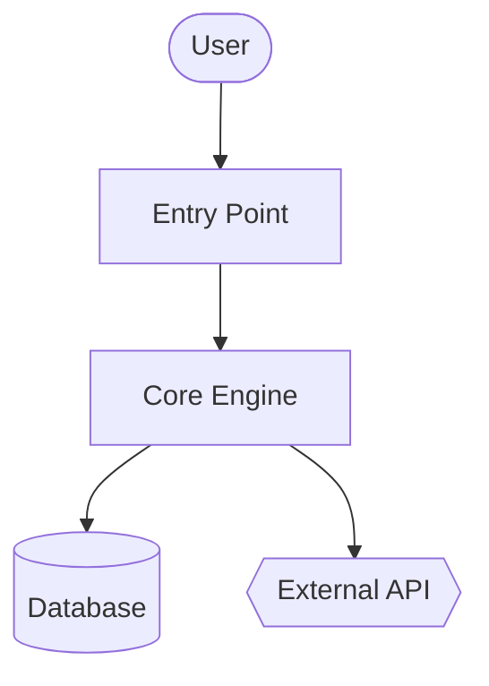
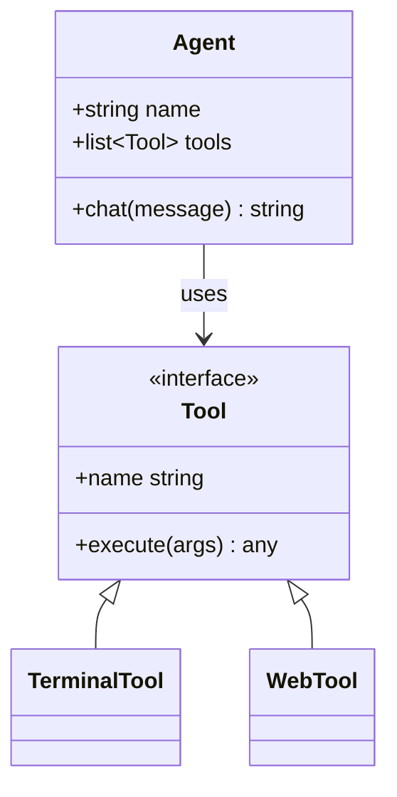
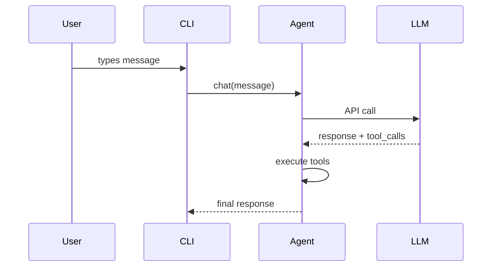

{/* This page is auto-generated from the skill's SKILL.md by website/scripts/generate-skill-docs.py. Edit the source SKILL.md, not this page. */}

# Code Wiki

모든 코드베이스에 대한 위키 문서 및 Mermaid 다이어그램을 생성합니다.

## 스킬 메타데이터

| | |
|---|---|
| 출처 | 선택 사항 — `hermes skills install official/software-development/code-wiki`로 설치 |
| 경로 | `optional-skills/software-development/code-wiki` |
| 버전 | `0.1.0` |
| 작성자 | Teknium (teknium1), Hermes Agent |
| 라이선스 | MIT |
| 플랫폼 | linux, macos, windows |
| 태그 | `Documentation`, `Mermaid`, `Architecture`, `Diagrams`, `Wiki`, `Code-Analysis` |
| 관련 스킬 | [`codebase-inspection`](/docs/user-guide/skills/bundled/github/github-codebase-inspection), [`github-repo-management`](/docs/user-guide/skills/bundled/github/github-github-repo-management) |

## 참고: 전체 SKILL.md

:::info
다음은 이 스킬이 트리거될 때 Hermes가 로드하는 전체 스킬 정의입니다. 이것은 스킬이 활성화되었을 때 에이전트가 지침으로 보는 내용입니다.
:::

# Code Wiki 스킬

코드베이스 전반에 대한 종합 위키(개요, 아키텍처, 모듈별 심층 설명, Mermaid 클래스 및 시퀀스 다이어그램 등)를 생성합니다. Google CodeWiki에서 영감을 받았으나 로컬 저장소, 비공개 저장소 및 모든 언어에서 작동합니다. 기존에 존재하는 Hermes의 도구들(`terminal`, `read_file`, `search_files`, `write_file`)만 사용하며, Docker나 외부 서비스, 추가 의존성 모듈이 필요하지 않습니다.

이 스킬은 **레퍼런스 문서(Reference documentation)** (무엇을 어떻게 하는지)를 생성합니다. 전략적인 내러티브(왜 존재하는지 — 다른 스킬의 영역임)는 다루지 않습니다.

## 언제 사용하나요

- 사용자가 "이 코드베이스를 문서화해줘", "위키를 생성해줘", "아키텍처 다이어그램을 만들어줘"라고 요청할 때
- 생소한 저장소에 온보딩하며 구조적인 레퍼런스가 필요할 때
- 사용자가 GitHub URL을 알려주면서 문서화를 요청할 때
- GitHub에서 바로 렌더링할 수 있는 안정적인 결과물(마크다운 + Mermaid)이 필요할 때

다음과 같은 경우에는 이 스킬을 **사용하지 마십시오**:
- 단일 파일 또는 단일 함수에 대한 문서화 — 그냥 직접 답변하세요.
- 특정 엔드포인트 하나에 대한 API 레퍼런스 — `read_file`을 사용해 인라인으로 답변하세요.
- 전략적인 "이것이 왜 존재하는가"에 대한 내러티브 — 다른 스킬, 다른 목적에 해당합니다.
- 사용자가 현재 세션에서 활발히 개발 중인 코드베이스 — 올라오는 질문들에 그때그때 답변하세요.

## 사전 요구 사항

- 필요한 환경 변수가 없습니다.
- 저장소 SHA 추적 및 원격 클론을 위한 `git`이 PATH에 있어야 합니다.
- 선택 사항: 언어별 통계를 내기 위한 `pygount` (`codebase-inspection` 스킬 참조).

## 실행 방법

대상 저장소의 루트 디렉터리에서 `terminal` 도구를 통해 실행한 뒤, `read_file` / `search_files` / `write_file`을 사용하여 위키를 생성합니다. 기본 출력 위치는 `~/.hermes/wikis/<repo-name>/`입니다. 사용자가 명시적으로 요구할 때만 저장소 내부(`docs/wiki/`)에 직접 작성하십시오.

## 빠른 요약 (Quick Reference)

| 단계 | 작업 |
|---|---|
| 1 | 대상 결정 — 로컬의 현재 디렉터리, 주어진 경로, 또는 임시 폴더로 `git clone --depth 50 <url>` |
| 2 | 구조 스캔 — `ls`, `find -maxdepth 3`, 매니페스트 파일들, README 확인 |
| 3 | 문서화할 모듈 8–10개 선정 |
| 4 | `README.md` 작성 (개요 + 모듈 맵) |
| 5 | Mermaid 플로우차트가 포함된 `architecture.md` 작성 |
| 6 | `modules/` 디렉터리에 모듈별 문서 작성 |
| 7 | `diagrams/class-diagram.md` (Mermaid classDiagram) 작성 |
| 8 | `diagrams/sequences.md` (Mermaid sequenceDiagram, 2–4개의 워크플로) 작성 |
| 9 | `getting-started.md` 작성 |
| 10 | 해당될 경우 `api.md` 작성, 아니면 생략 |
| 11 | `.codewiki-state.json` 작성 |
| 12 | 사용자에게 생성된 경로 보고 |

## 절차

### 1. 대상 결정 (Resolve the target)

GitHub URL의 경우:

```bash
WIKI_TMP=$(mktemp -d)
git clone --depth 50 <url> "$WIKI_TMP/repo"
cd "$WIKI_TMP/repo"
REPO_SHA=$(git rev-parse HEAD)
REPO_NAME=$(basename <url> .git)
```

로컬 경로의 경우 (주어지지 않았다면 현재 디렉터리 기준):

```bash
cd <path>
REPO_SHA=$(git rev-parse HEAD 2>/dev/null || echo "uncommitted")
REPO_NAME=$(basename "$PWD")
```

그런 다음 출력 디렉터리를 설정합니다:

```bash
OUTPUT_DIR="$HOME/.hermes/wikis/$REPO_NAME"
mkdir -p "$OUTPUT_DIR/modules" "$OUTPUT_DIR/diagrams"
```

### 2. 저장소 구조 스캔

셸 작업을 위해 `terminal` 도구를 사용하고, 매니페스트를 읽기 위해 `read_file`을 사용합니다:

```bash
# 얕은 계층 트리 먼저 확인
ls -la

# 깊은 계층 트리, 노이즈 필터링
find . -type d \
  -not -path '*/\.*' \
  -not -path '*/node_modules*' \
  -not -path '*/venv*' \
  -not -path '*/__pycache__*' \
  -not -path '*/dist*' \
  -not -path '*/build*' \
  -not -path '*/target*' \
  -maxdepth 3 | sort

# 언어별 비율 분석 (pygount가 없으면 생략)
pygount --format=summary \
  --folders-to-skip=".git,node_modules,venv,.venv,__pycache__,.cache,dist,build,target" \
  . 2>/dev/null || true
```

이후 관련된 매니페스트들 (`package.json`, `pyproject.toml`, `setup.py`, `Cargo.toml`, `go.mod`, `pom.xml`, `build.gradle`) 및 프로젝트 README를 `read_file`합니다. 이름을 무작정 추측하는 것보다 특정 항목을 찾으려면 `search_files target='files'`를 사용하는 것이 좋습니다.

### 3. 문서화할 모듈 선정

초기에는 **8–10개의 모듈**로 제한합니다. 언어별 발견 휴리스틱:

- Python: 최상위 패키지(`__init__.py`가 있는 디렉터리) 및 하위 시스템 디렉터리
- JS/TS: `src/<subdir>`, 최상위 워크스페이스 디렉터리
- Rust: 워크스페이스 내 각 크레이트, 또는 최상위 `src/<module>` 디렉터리
- Go: 최상위 패키지 디렉터리 각각
- 혼합/생소함: 소스 코드가 들어있는 최상위 디렉터리 (설정, 테스트 제외)

매우 큰 저장소의 경우 다음 순서로 우선순위를 둡니다:
1. 참조되는 횟수 (여러 곳에서 import 되는 모듈은 핵심(core)임)
2. 코드 라인 수(LOC) (모듈이 클수록 자체적인 문서가 필요한 경우가 많음)
3. README / 최상위 문서에서의 언급 빈도

방대한 저장소에 대한 개별 모듈 문서화를 진행하기 전, 사용자에게 모듈 목록을 먼저 제시하여 다른 쪽으로 방향을 잡을 기회를 제공하십시오.

### 4. `README.md` 작성

실제 프로젝트 README와 2~3개의 가장 핵심이 되는 진입점(entry-point) 파일들을 `read_file` 한 다음, 아래 내용을 `write_file` 합니다:

````markdown
# <프로젝트 이름>

<한 문단: 이것이 무엇이고 무엇을 위해 사용되는지 서술. 원본 README를 보지 않아도 이해할 수 있도록 독립적으로 작성.>

## 핵심 개념 (Key Concepts)

- **<개념 1>** — <한 줄 설명>
- **<개념 2>** — <한 줄 설명>

## 진입점 (Entry Points)

- [`path/to/main.py`](https://github.com/NousResearch/hermes-agent/blob/main/optional-skills/software-development/code-wiki/<link>) — <실행 시 무엇이 동작하는지>
- [`path/to/cli.py`](https://github.com/NousResearch/hermes-agent/blob/main/optional-skills/software-development/code-wiki/<link>) — <CLI 환경 표면>

## 하이레벨 아키텍처

<2-3 문장 설명. 세부 내용은 architecture.md에 들어감.>

[architecture.md](https://github.com/NousResearch/hermes-agent/blob/main/optional-skills/software-development/code-wiki/architecture.md) 참조.

## 모듈 맵 (Module Map)

| 모듈 | 목적 |
|---|---|
| [`<module>`](https://github.com/NousResearch/hermes-agent/blob/main/optional-skills/software-development/code-wiki/modules/<module>.md) | <한 줄 목적> |

## 시작하기 (Getting Started)

[getting-started.md](https://github.com/NousResearch/hermes-agent/blob/main/optional-skills/software-development/code-wiki/getting-started.md) 참조.
````

로컬 모드의 링크는 상대 경로를 사용합니다. 클론된 원격 저장소의 경우 향후 커밋에서도 링크가 유지되도록 `https://github.com/<owner>/<repo>/blob/<sha>/<path>`를 사용하십시오.

### 5. `architecture.md` 작성

````markdown
# 아키텍처 (Architecture)

<2-3 문단: 시스템의 모양(shape)에 대해 설명. 무엇이 무엇과 통신하는지, 데이터가 어디로 들어오고 어디로 나가는지, 상태는 어디에 저장되는지 등.>

## 구성 요소 (Components)

- **<구성요소>** — <1-2 문장 설명>. [`modules/<module>.md`](https://github.com/NousResearch/hermes-agent/blob/main/optional-skills/software-development/code-wiki/modules/<module>.md) 참조.

## 시스템 다이어그램



## 데이터 흐름 (Data Flow)

1. **<단계>** — [`<file>`](https://github.com/NousResearch/hermes-agent/blob/main/optional-skills/software-development/code-wiki/<link>)
2. **<단계>** — [`<file>`](https://github.com/NousResearch/hermes-agent/blob/main/optional-skills/software-development/code-wiki/<link>)

## 핵심 설계 결정 (Key Design Decisions)

- <독자가 알아두어야 할 시스템의 근간이 되는 내용>
````

**Mermaid 형태 의미 체계(semantics):**
- `[]` = 컴포넌트(component)
- `[()]` = 데이터베이스 / 스토리지
- `{{}}` = 외부 서비스
- `(())` = 진입점(entry point) 또는 터미널
- `-->` = 동기 호출, `-.->` = 비동기/이벤트

다이어그램당 노드는 최대 20개 내외로 제한합니다. 더 크다면 하위 다이어그램으로 나누십시오.

### 6. `modules/` 에 모듈별 문서 작성

선택된 각 모듈에 대해 `ls`로 구조를 검사하고, 3–5개의 가장 중요한 파일들(크기, 파일명(`core.py` / `main.py` / `__init__.py`), 많이 import된 횟수 기준)을 파악한 뒤, 이 파일들을 `read_file` 하십시오 (전체 대신 `offset` / `limit`을 사용하여 필요한 부분만 읽거나, 특정 심볼의 경우 `search_files`를 선호하세요).

````markdown
# 모듈: `<module>`

<1-2 문장의 모듈 목적.>

## 책임 (Responsibilities)

- <총알 기호 목록>
- <총알 기호 목록>

## 주요 파일 (Key Files)

- [`<module>/<file>`](https://github.com/NousResearch/hermes-agent/blob/main/optional-skills/software-development/code-wiki/<link>) — <무엇을 하는지 설명>

## 공개 API (Public API)

<다른 코드가 사용하는 함수/클래스/상수들. 연관된 항목끼리 그룹화. 전체 구현이 아닌 시그니처만 표시.>

## 내부 구조 (Internal Structure)

<모듈이 내부적으로 어떻게 구성되어 있는지 설명. 상태 관리 등.>

## 의존성 (Dependencies)

- **다음 모듈에 의해 사용됨 (Used by):** <다른 모듈들>
- **다음 모듈을 사용함 (Uses):** <다른 모듈 + 외부 라이브러리들>

## 주목할 만한 패턴 / 함정 (Notable Patterns / Gotchas)

- <직관적이지 않거나 주의해야 할 부분>
````

### 7. `diagrams/class-diagram.md` 작성

5–10개의 가장 중요한 클래스/타입을 선정합니다. 이를 `read_file`로 읽은 다음, 다음과 같이 작성합니다:

````markdown
# 클래스 다이어그램

## 핵심 타입 (Core Types)



## 참고 사항 (Notes)

<수명 주기(lifecycle), 스레딩 등 다이어그램으로 표현하기 힘든 내용들>
````

클래스가 없는 언어(Go, C, Rust 등)의 경우: 구조체(struct) 간의 관계를 다이어그램으로 나타내거나, 적합하지 않다면 억지로 짜맞추지 말고 class-diagram.md 파일을 생략한 뒤 architecture.md에 문장으로 설명하십시오.

### 8. `diagrams/sequences.md` 작성

가장 중요한 워크플로 2–4개를 선정합니다. 각 호출 경로를 코드를 통해 추적(진입점 확인, 함수 호출 따라가기)한 후 다음을 작성합니다:

````markdown
# 시퀀스 다이어그램

## 워크플로: <이름>

<이것이 무엇을 하고 언제 실행되는지 설명하는 1문장.>



## 코드 추적 (Walkthrough)

1. **사용자 입력 (User input)** — [`cli.py:HermesCLI.run_session`](https://github.com/NousResearch/hermes-agent/blob/main/optional-skills/software-development/code-wiki/<link>)
2. **메시지 분배 (Message dispatch)** — [`run_agent.py:AIAgent.chat`](https://github.com/NousResearch/hermes-agent/blob/main/optional-skills/software-development/code-wiki/<link>)
````

임의로 참가자(participant)를 만들어내지 마십시오. 모든 요소는 코드 내에서 독자가 찾을 수 있는 실제 컴포넌트와 일치해야 합니다.

### 9. `getting-started.md` 작성

````markdown
# 시작하기 (Getting Started)

## 사전 요구 사항 (Prerequisites)

<매니페스트 파일 + README 기반. 버전이 고정되어 있다면 구체적으로 명시.>

## 설치 (Installation)

```bash
<정확한 명령어들>
```

## 첫 실행 (First Run)

```bash
<시스템이 유용한 작업을 하는 것을 확인할 수 있는 최소한의 실행 명령>
```

## 주요 워크플로 (Common Workflows)

### <워크플로 1>
<명령어들>

## 설정 (Configuration)

- `<config-file>` — <어떤 것을 제어하는지>
- 환경변수 `<VAR>` — <어떤 것을 제어하는지>

## 다음 단계 (Where to Go Next)

- 아키텍처: [architecture.md](https://github.com/NousResearch/hermes-agent/blob/main/optional-skills/software-development/code-wiki/architecture.md)
- 모듈 레퍼런스: [README.md#module-map](https://github.com/NousResearch/hermes-agent/blob/main/optional-skills/software-development/code-wiki/README.md#module-map)
````

### 10. `api.md` 작성 (해당하지 않으면 건너뛰기)

프로젝트가 라이브러리나 API 서버일 경우에만 작성하십시오. 작성 시:

- 공개 API 표면(`__init__.py` 익스포트, OpenAPI 명세서, 라우트 핸들러, 익스포트된 타입 등)을 파악합니다.
- 각 공개 항목을 시그니처, 파라미터, 반환 타입, 한 줄 설명과 함께 문서화합니다.
- 카테고리별로 그룹화합니다.

### 11. 상태 파일 작성

```bash
cat > "$OUTPUT_DIR/.codewiki-state.json" <<EOF
{
  "repo_name": "$REPO_NAME",
  "source_path": "$PWD",
  "source_sha": "$REPO_SHA",
  "generated_at": "$(date -u +%Y-%m-%dT%H:%M:%SZ)",
  "generator": "hermes-agent code-wiki skill v0.1.0",
  "modules_documented": []
}
EOF
```

### 12. 사용자에게 보고

무엇이 어디에 생성되었는지 정확히 말하십시오:

```
~/.hermes/wikis/<repo-name>/ 에 위키를 생성했습니다:
  README.md                   프로젝트 개요, 모듈 맵
  architecture.md             시스템 아키텍처 + 플로우차트
  getting-started.md          설정, 첫 실행, 워크플로
  modules/<N 파일>            모듈별 심층 문서
  diagrams/architecture.md    Mermaid 플로우차트
  diagrams/class-diagram.md   Mermaid 클래스 다이어그램
  diagrams/sequences.md       Mermaid 시퀀스 다이어그램
```

임시 디렉터리로 클론했다면, 사용자가 위키를 다 검토한 후에는 지워도 된다고 알려주십시오 (`rm -rf "$WIKI_TMP"`).

## 범위 제어 (Scope Control)

500K-LOC짜리 모노레포에 대해 전체 위키를 생성하는 것은 엄청나게 많은 토큰을 소모합니다. 기본적으로 범위를 제한하십시오:

- 초기 스캔: 최대 깊이 3까지의 디렉터리
- 개별 모듈 문서: 사용자가 범위를 확장하지 않는 한 최대 10개 모듈로 제한
- 파일별 읽기: 전체 파일을 다 읽기보다 심볼 검색은 `search_files`를 선호하고, 읽기에는 `offset`/`limit`를 둔 `read_file`을 우선 사용
- 외부 패키지 소스 건너뛰기 (`vendor/`, `third_party/`, 생성된 코드, `_pb2.py`, `.min.js`)

만약 사용자가 "하나도 빠짐없이 철저하게 전부 다 해"라고 지시하면 믿고 진행하되 비용을 먼저 대략적으로 알려주십시오: "이 저장소에는 ~340개의 소스 파일이 있습니다. 모든 문서를 다 만들려면 토큰이 많이 소모되는데 진행할까요?"

## 재실행 / 업데이트

대상 경로에 이미 `.codewiki-state.json` 파일이 존재할 경우:

- 파일을 읽어 이전 SHA와 모듈 리스트를 확인
- 소스 SHA가 일치할 경우: 다시 생성할 것인지 건너뛸 것인지 사용자에게 질문
- SHA가 다를 경우: 파일이 변경된 모듈만 부분 재생성할 것을 제안 (`git diff --name-only <old-sha> HEAD`)

완전한 형태의 점진적 재생성 기능은 향후 개선 목표이며 — 지금으로서는 전체를 재생성해도 무방합니다.

## 주의 사항 (Pitfalls)

- **컴포넌트 창작 금지 (Fabricating components).** 다이어그램의 노드와 언급된 함수 호출은 모두 소스코드 내에 실제로 존재하는 것이어야 합니다. 쓰기 전에 `read_file`로 먼저 확인하십시오. 자동 생성된 문서의 가장 큰 실패 원인은 그럴듯해 보이는 가짜 사실을 만들어내는 것입니다.
- **일반적인 AI 문구 자제.** "이 모듈은 ~에 대한 책임을 집니다"와 같은 문구는 무의미합니다. 도메인별 특화된 용어를 사용하여 그 모듈이 실제로 무엇을 하는지 서술하십시오.
- **코드를 산문으로 다시 쓰기.** "이 모듈의 `process` 함수는 각 아이템에 대해 `process_item`을 호출하여 처리합니다"라고 설명하는 것은 그냥 함수에 링크를 거는 것보다 못합니다.
- **50개 이상의 노드를 가진 Mermaid 다이어그램.** 가독성이 떨어지므로 분리하십시오.
- **테스트, 생성된 코드, 벤더 종속성을 제품 코드인 양 문서화하는 것.** 건너뛰십시오.
- **묻지 않고 저장소 내부에 결과물을 출력하는 것.** 기본 경로는 `~/.hermes/wikis/` 입니다. 사용자가 명시적으로 요구할 때만 저장소 내부에 작성하십시오.
- **Mermaid 특수문자 처리:** `A[Tool / Agent]`가 아니라 `A["Tool / Agent"]`처럼 따옴표가 필요합니다. 노드 내부에서의 줄바꿈은 `<br>`을 사용하십시오.
- **SKILL.md 내부의 중첩된 코드 블록(Code fences).** Mermaid 블록이 포함된 마크다운 예제를 작성할 때, 3-backtick 내부의 ` ```mermaid ` 가 바깥쪽 코드 블록을 닫아버리지 않게 외부에 4-backtick 코드 펜스를 사용하십시오. (이 SKILL.md가 그렇게 작성되었습니다.)
- **classDiagram의 제네릭 문법:** `<T>`가 아닌 `~T~` (예: `List~Tool~`)로 렌더링해야 합니다.
- **GitHub의 Mermaid 테마는 고정되어 있습니다** — `%%{init: ...}%%` 구문을 포함하지 마십시오; 렌더링 시 자동으로 제거됩니다.

## 검증 (Verification)

작성 후 다음 사항을 확인하십시오:

1. **Mermaid 블록 균형 확인** — 파일당 여는 괄호와 닫는 괄호의 수가 일치하는지:
   ```bash
   for f in "$OUTPUT_DIR"/diagrams/*.md "$OUTPUT_DIR"/architecture.md; do
     opens=$(grep -c '^```mermaid' "$f")
     total=$(grep -c '^```' "$f")
     echo "$f: $opens 개의 mermaid 블록, $total 개의 총 코드 펜스 (total = opens*2 인지 확인)"
   done
   ```
2. **기대하는 모든 파일 존재 여부** —
   ```bash
   ls "$OUTPUT_DIR"/{README.md,architecture.md,getting-started.md,.codewiki-state.json} \
      "$OUTPUT_DIR"/modules/ "$OUTPUT_DIR"/diagrams/
   ```
3. **모듈 개수 일치 확인** — `ls "$OUTPUT_DIR/modules" | wc -l` 의 결과가 3단계에서 정한 모듈 수와 일치해야 합니다.
4. **존재하지 않는 가짜 경로 없음** — 2–3개의 소스 링크가 실제 파일로 잘 연결되는지(sanity-check) 확인하십시오.
