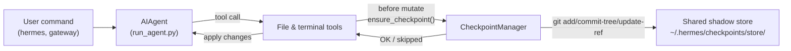

# Checkpoints e `/rollback`

O Hermes Agent pode snapshotar automaticamente seu projeto antes de **operações destrutivas** e restaurá-lo com um único comando. Checkpoints são **opt-in** desde a v2 — a maioria dos usuários nunca usa `/rollback`, e o armazenamento shadow-store não é trivial ao longo do tempo, então o padrão é desligado.

Habilite checkpoints por sessão com `--checkpoints`:

```bash
hermes chat --checkpoints
```

Ou habilite globalmente em `~/.hermes/config.yaml`:

```yaml
checkpoints:
  enabled: true
```

Esta rede de segurança é alimentada por um **Checkpoint Manager** interno que mantém um único repositório git shadow compartilhado em `~/.hermes/checkpoints/store/` — o `.git` real do seu projeto nunca é tocado. Todo projeto em que o agente trabalha compartilha o mesmo store, então o object DB content-addressable do git deduplica entre projetos e entre turnos.

## O que dispara um checkpoint

Checkpoints são tirados automaticamente antes de:

- **Ferramentas de arquivo** — `write_file` e `patch`
- **Comandos de terminal destrutivos** — `rm`, `rmdir`, `cp`, `install`, `mv`, `sed -i`, `truncate`, `dd`, `shred`, redirects de saída (`>`), e `git reset`/`clean`/`checkout`

O agente cria **no máximo um checkpoint por diretório por turno**, então sessões longas não spammam snapshots.

## Referência rápida

Slash commands na sessão:

| Command | Description |
|---------|-------------|
| `/rollback` | List all checkpoints with change stats |
| `/rollback <N>` | Restore to checkpoint N (also undoes last chat turn) |
| `/rollback diff <N>` | Preview diff between checkpoint N and current state |
| `/rollback <N> <file>` | Restore a single file from checkpoint N |

CLI para inspecionar e gerenciar o store fora de uma sessão:

| Command | Description |
|---------|-------------|
| `hermes checkpoints` | Show total size, project count, per-project breakdown |
| `hermes checkpoints status` | Same as bare `checkpoints` |
| `hermes checkpoints list` | Alias for `status` |
| `hermes checkpoints prune` | Force a sweep: delete orphans/stale, GC, enforce size cap |
| `hermes checkpoints clear` | Nuke the entire checkpoint base (asks first) |
| `hermes checkpoints clear-legacy` | Delete only the `legacy-*` archives from v1 migration |

## Como os checkpoints funcionam

Em alto nível:

- O Hermes detecta quando ferramentas estão prestes a **modificar arquivos** na sua working tree.
- Uma vez por turno de conversa (por diretório), ele:
  - Resolve uma raiz de projeto razoável para o arquivo.
  - Inicializa ou reutiliza o **store shadow compartilhado único** em `~/.hermes/checkpoints/store/`.
  - Faz stage em um index por projeto, constrói uma tree e commita em uma ref por projeto (`refs/hermes/<project-hash>`).
- Essas refs por projeto formam um histórico de checkpoint que você pode inspecionar e restaurar via `/rollback`.



## Configuração

Configure em `~/.hermes/config.yaml`:

```yaml
checkpoints:
  enabled: false              # master switch (default: false — opt-in)
  max_snapshots: 20           # max checkpoints per project (enforced via ref rewrite + gc)
  max_total_size_mb: 500      # hard cap on total store size; oldest commits dropped
  max_file_size_mb: 10        # skip any single file larger than this

  # Auto-maintenance (on by default): sweep ~/.hermes/checkpoints/ at startup
  # and delete project entries whose working directory no longer exists
  # (orphans) or whose last_touch is older than retention_days. Runs at most
  # once per min_interval_hours, tracked via a .last_prune marker.
  auto_prune: true
  retention_days: 7
  delete_orphans: true
  min_interval_hours: 24
```

Para desabilitar tudo:

```yaml
checkpoints:
  enabled: false
  auto_prune: false
```

Quando `enabled: false`, o Checkpoint Manager é no-op e nunca tenta operações git. Quando `auto_prune: false`, o store cresce até você executar `hermes checkpoints prune` manualmente.

## Listando checkpoints

De uma sessão CLI:

```
/rollback
```

O Hermes responde com uma lista formatada mostrando estatísticas de mudança:

```text
📸 Checkpoints for /path/to/project:

  1. 4270a8c  2026-03-16 04:36  before patch  (1 file, +1/-0)
  2. eaf4c1f  2026-03-16 04:35  before write_file
  3. b3f9d2e  2026-03-16 04:34  before terminal: sed -i s/old/new/ config.py  (1 file, +1/-1)

  /rollback <N>             restore to checkpoint N
  /rollback diff <N>        preview changes since checkpoint N
  /rollback <N> <file>      restore a single file from checkpoint N
```

## Inspecionando o store pelo shell

```bash
hermes checkpoints
```

Saída de exemplo:

```text
Checkpoint base: /home/you/.hermes/checkpoints
Total size:      142.3 MB
  store/         138.1 MB
  legacy-*       4.2 MB
Projects:        12

  WORKDIR                                                       COMMITS    LAST TOUCH  STATE
  /home/you/code/hermes-agent                                        20       2h ago  live
  /home/you/code/experiments/rl-runner                                8       1d ago  live
  /home/you/code/old-prototype                                        3       9d ago  orphan
  ...

Legacy archives (1):
  legacy-20260506-050616                           4.2 MB

Clear with: hermes checkpoints clear-legacy
```

Force uma varredura completa (ignora o marcador de idempotência de 24h):

```bash
hermes checkpoints prune --retention-days 3 --max-size-mb 200
```

## Pré-visualizando mudanças com `/rollback diff`

Antes de confirmar uma restauração, pré-visualize o que mudou desde um checkpoint:

```
/rollback diff 1
```

Isso mostra um resumo stat git diff seguido do diff real.

## Restaurando com `/rollback`

```
/rollback 1
```

Por baixo dos panos, o Hermes:

1. Verifica que o commit alvo existe no shadow store.
2. Tira um **snapshot pré-rollback** do estado atual para você poder "desfazer o desfazer" depois.
3. Restaura arquivos rastreados no seu diretório de trabalho.
4. **Desfaz o último turno de conversa** para o contexto do agente combinar com o estado restaurado do filesystem.

## Restauração de arquivo único

Restaure apenas um arquivo de um checkpoint sem afetar o resto do diretório:

```
/rollback 1 src/broken_file.py
```

## Proteções de segurança e desempenho

- **Disponibilidade do git** — se `git` não for encontrado no `PATH`, checkpoints são transparentemente desabilitados.
- **Escopo de diretório** — o Hermes pula diretórios amplos demais (raiz `/`, home `$HOME`).
- **Tamanho do repositório** — diretórios com mais de 50.000 arquivos são ignorados.
- **Limite de tamanho por arquivo** — arquivos maiores que `max_file_size_mb` (padrão 10 MB) são excluídos do snapshot. Evita engolir acidentalmente datasets, pesos de modelo ou mídia gerada.
- **Limite de tamanho total do store** — quando o store excede `max_total_size_mb` (padrão 500 MB), o commit mais antigo por projeto é descartado round-robin até ficar abaixo do limite.
- **Pruning real** — `max_snapshots` é imposto reescrevendo a ref por projeto e executando `git gc --prune=now` depois, para loose objects não acumularem.
- **Snapshots sem mudança** — se não há mudanças desde o último snapshot, o checkpoint é pulado.
- **Erros não fatais** — todos os erros dentro do Checkpoint Manager são logados em nível debug; suas ferramentas continuam rodando.

## Onde os checkpoints ficam

```text
~/.hermes/checkpoints/
  ├── store/                 # single shared bare git repo
  │   ├── HEAD, objects/     # git internals (shared across projects)
  │   ├── refs/hermes/<hash> # per-project branch tip
  │   ├── indexes/<hash>     # per-project git index
  │   ├── projects/<hash>.json  # workdir + created_at + last_touch
  │   └── info/exclude
  ├── .last_prune            # auto-prune idempotency marker
  └── legacy-<ts>/           # archived pre-v2 per-project shadow repos
```

Cada `<hash>` é derivado do caminho absoluto do diretório de trabalho. Você normalmente nunca precisa tocar nisso manualmente — use `hermes checkpoints status` / `prune` / `clear`.

### Migração da v1

Antes da reescrita v2, cada diretório de trabalho recebia seu próprio repo git shadow completo diretamente em `~/.hermes/checkpoints/<hash>/`. Aquele layout não deduplicava objetos entre projetos e tinha um pruner documentado no-op — o store cresceria sem limite.

Na primeira execução v2, quaisquer shadow repos pré-v2 são movidos para `~/.hermes/checkpoints/legacy-<timestamp>/` para o novo layout single-store começar limpo. O histórico antigo de `/rollback` ainda é acessível inspecionando manualmente o arquivo legacy com `git`; quando tiver confiança de que não precisa, execute:

```bash
hermes checkpoints clear-legacy
```

para recuperar o espaço. Arquivos legacy também são varridos por `auto_prune` após `retention_days`.

## Boas práticas

- **Habilite checkpoints só quando precisar** — `hermes chat --checkpoints` ou `enabled: true` por perfil.
- **Use `/rollback diff` antes de restaurar** — pré-visualize o que mudará para escolher o checkpoint certo.
- **Use `/rollback` em vez de `git reset`** quando quiser desfazer apenas mudanças dirigidas pelo agente.
- **Verifique `hermes checkpoints status` ocasionalmente** se usa checkpoints regularmente — mostra quais projetos estão ativos e quanto o store custa.
- **Combine com Git worktrees** para máxima segurança — mantenha cada sessão Hermes em seu próprio worktree/branch, com checkpoints como camada extra.

Para executar vários agentes em paralelo no mesmo repo, veja o guia sobre [Git worktrees](./git-worktrees.md).
