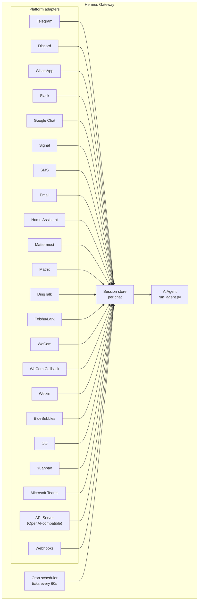

# Gateway de Mensagens

Converse com o Hermes pelo Telegram, Discord, Slack, WhatsApp, Signal, SMS, Email, Home Assistant, Mattermost, Matrix, DingTalk, Feishu/Lark, WeCom, Weixin, BlueBubbles (iMessage), QQ, Yuanbao, Microsoft Teams, LINE, ntfy ou pelo navegador. O gateway é um único processo em segundo plano que se conecta a todas as plataformas configuradas, gerencia sessões, executa jobs cron e entrega mensagens de voz.

Para o conjunto completo de recursos de voz — incluindo modo de microfone no CLI, respostas faladas em mensagens e conversas em canais de voz do Discord — veja [Modo de Voz](/user-guide/features/voice-mode) e [Usar o Modo de Voz com o Hermes](/guides/use-voice-mode-with-hermes).

:::tip
Bots precisam de um provedor de modelo e de provedores de ferramentas (TTS, web). Uma assinatura do [Nous Portal](/integrations/nous-portal) reúne todos eles.
:::

## Comparação de plataformas {#platform-comparison}

| Platform | Voice | Images | Files | Threads | Reactions | Typing | Streaming |
|----------|:-----:|:------:|:-----:|:-------:|:---------:|:------:|:---------:|
| Telegram | ✅ | ✅ | ✅ | ✅ | — | ✅ | ✅ |
| Discord | ✅ | ✅ | ✅ | ✅ | ✅ | ✅ | ✅ |
| Slack | ✅ | ✅ | ✅ | ✅ | ✅ | ✅ | ✅ |
| Google Chat | — | ✅ | ✅ | ✅ | — | ✅ | — |
| WhatsApp | — | ✅ | ✅ | — | — | ✅ | ✅ |
| Signal | — | ✅ | ✅ | — | — | ✅ | ✅ |
| SMS | — | — | — | — | — | — | — |
| Email | — | ✅ | ✅ | ✅ | — | — | — |
| Home Assistant | — | — | — | — | — | — | — |
| Mattermost | ✅ | ✅ | ✅ | ✅ | — | ✅ | ✅ |
| Matrix | ✅ | ✅ | ✅ | ✅ | ✅ | ✅ | ✅ |
| DingTalk | — | ✅ | ✅ | — | ✅ | — | ✅ |
| Feishu/Lark | ✅ | ✅ | ✅ | ✅ | ✅ | ✅ | ✅ |
| WeCom | ✅ | ✅ | ✅ | — | — | — | — |
| WeCom Callback | — | — | — | — | — | — | — |
| Weixin | ✅ | ✅ | ✅ | — | — | ✅ | ✅ |
| BlueBubbles | — | ✅ | ✅ | — | ✅ | ✅ | — |
| QQ | ✅ | ✅ | ✅ | — | — | ✅ | — |
| Yuanbao | ✅ | ✅ | ✅ | — | — | ✅ | ✅ |
| Microsoft Teams | — | ✅ | — | ✅ | — | ✅ | — |
| LINE | — | ✅ | ✅ | — | — | ✅ | — |
| ntfy | — | — | — | — | — | — | — |
| Raft | — | — | — | — | — | — | — |
| IRC | — | — | — | — | — | — | — |

**Voice** = respostas de áudio TTS e/ou transcrição de mensagens de voz. **Images** = enviar/receber imagens. **Files** = enviar/receber anexos de arquivo. **Threads** = conversas em threads. **Reactions** = reações emoji em mensagens. **Typing** = indicador de digitação durante o processamento. **Streaming** = atualizações progressivas de mensagem via edição.

## Arquitetura {#architecture}



Cada adaptador de plataforma recebe mensagens, as encaminha por um armazenamento de sessão por chat e as despacha para o AIAgent para processamento. O gateway também executa o agendador cron, com tick a cada 60 segundos para executar jobs pendentes.

## Tokens de silêncio intencional {#intentional-silence-tokens}

Para chats em grupo, hooks e fluxos de automação, o Hermes suporta tokens de silêncio explícitos. Se a resposta final do agente for exatamente um token suportado, o gateway suprime a entrega de saída e não envia nada ao chat.

Tokens suportados:

- `[SILENT]`
- `SILENT`
- `NO_REPLY`
- `NO REPLY`

Espaços em branco e maiúsculas/minúsculas são normalizados, mas a resposta final inteira deve ser o token. Uma frase como "Use `[SILENT]` quando nada mudou" é entregue normalmente.

O silêncio é apenas uma decisão de entrega. O Hermes mantém o turno de silêncio do assistente na transcrição da sessão, então a conversa continua alternando normalmente:

```text
user: side-channel chatter
assistant: [SILENT]   # stored, not delivered
user: next message
```

Turnos com falha ainda aparecem como erros; o Hermes não oculta falhas só porque o texto se parece com um token de silêncio.

## Configuração rápida {#quick-setup}

A forma mais fácil de configurar plataformas de mensagens é o assistente interativo:

```bash
hermes gateway setup        # Interactive setup for all messaging platforms
```

Ele guia você pela configuração de cada plataforma com seleção por setas, mostra quais plataformas já estão configuradas e oferece iniciar/reiniciar o gateway ao terminar.

## Comandos do gateway {#gateway-commands}

```bash
hermes gateway              # Run in foreground
hermes gateway setup        # Configure messaging platforms interactively
hermes gateway install      # Install as a user service (Linux) / launchd service (macOS)
sudo hermes gateway install --system   # Linux only: install a boot-time system service
hermes gateway start        # Start the default service
hermes gateway stop         # Stop the default service
hermes gateway status       # Check default service status
hermes gateway status --system         # Linux only: inspect the system service explicitly
```

### Watchdog opcional do event loop no Linux {#optional-linux-event-loop-watchdog}

Um gateway gerenciado pelo systemd pode optar por recuperação de processo quando o event loop asyncio do Python deixa de receber tempo de agendamento. Isso cobre travamentos de processo inteiro que também impedem tarefas de liveness específicas de plataforma de rodar:

```yaml title="~/.hermes/config.yaml"
gateway:
  systemd_watchdog_seconds: 120
```

Regenere a unit de serviço após alterar esta configuração:

```bash
hermes gateway install --force
```

Um valor positivo faz a unit gerada usar `Type=notify`,
`NotifyAccess=main` e o `WatchdogSec` correspondente. O Hermes envia heartbeats
somente enquanto seu event loop progride a tempo; o systemd reinicia o
processo quando eles param. O padrão `0` mantém o comportamento `Type=simple`
existente. Esta configuração é exclusiva de Linux/systemd e não trata uma
desconexão de rede comum de plataforma como falha de event loop.

## Comandos de chat (dentro de mensagens) {#chat-commands-inside-messaging}

| Command | Description |
|---------|-------------|
| `/new` or `/reset` | Iniciar uma conversa nova |
| `/model [provider:model]` | Mostrar ou alterar o modelo (suporta sintaxe `provider:model`) |
| `/personality [name]` | Definir uma personalidade |
| `/retry` | Tentar novamente a última mensagem |
| `/undo` | Remover a última troca |
| `/status` | Mostrar informações da sessão |
| `/whoami` | Mostrar seu acesso a slash commands neste escopo (admin / user / unrestricted) |
| `/stop` | Parar o agente em execução |
| `/approve` | Aprovar um comando perigoso pendente |
| `/deny` | Rejeitar um comando perigoso pendente |
| `/sethome` | Definir este chat como canal home |
| `/compress` | Comprimir manualmente o contexto da conversa |
| `/title [name]` | Definir ou mostrar o título da sessão |
| `/resume [name]` | Retomar uma sessão nomeada anteriormente |
| `/usage` | Mostrar uso de tokens desta sessão (`/usage reset [--force]` resgata um reset de limite Codex acumulado) |
| `/insights [days]` | Mostrar insights e análises de uso |
| `/reasoning [level\|show\|hide]` | Alterar esforço de reasoning ou alternar exibição de reasoning |
| `/voice [on\|off\|tts\|join\|leave\|status]` | Controlar respostas de voz em mensagens e comportamento de canal de voz no Discord |
| `/rollback [number]` | Listar ou restaurar checkpoints do filesystem |
| `/background <prompt>` | Executar um prompt em uma sessão em segundo plano separada |
| `/reload-mcp` | Recarregar servidores MCP a partir da config |
| `/update` | Atualizar o Hermes Agent para a versão mais recente |
| `/help` | Mostrar comandos disponíveis |
| `/<skill-name>` | Invocar qualquer skill instalada |

## Gerenciamento de sessão {#session-management}

### Persistência de sessão {#session-persistence}

Sessões persistem entre mensagens até serem resetadas. O agente lembra o contexto da sua conversa.

### Confiabilidade de entrega {#delivery-reliability}

Respostas finais do agente são registradas em um **delivery ledger** durável
(`state.db`) em torno de cada envio de plataforma. Se o gateway travar ou reiniciar
entre produzir uma resposta e a plataforma confirmar recebimento, a próxima
inicialização reentrega a resposta armazenada em vez de perdê-la — ou reexecutar o
turno inteiro.

A semântica é honestamente at-least-once:

- Uma resposta cujo envio **nunca começou** é reentregue como está.
- Uma resposta que estava **no meio do envio** quando o gateway morreu (a plataforma pode ou
  não tê-la recebido) é reentregue com um prefixo visível
  "♻️ Recovered reply — … may be a duplicate". A ambiguidade é rotulada,
  nunca reenviada silenciosamente.
- A reentrega é limitada: 3 tentativas, frescor de 24 horas, depois a linha é
  abandonada. Linhas entregues são podadas após 7 dias.

Desabilite com `gateway.delivery_ledger: false` em `config.yaml` (restaura o
comportamento antigo: respostas em andamento se perdem em crash).

### Políticas de reset {#reset-policies}

**Por padrão, sessões nunca fazem auto-reset** — o contexto permanece até você `/reset`
manualmente ou a compressão de contexto entrar em ação. Se quiser resets automáticos, opte por
com a seção `session_reset` em `~/.hermes/config.yaml`:

```yaml
session_reset:
  mode: idle        # "idle", "daily", "both", or "none" (default)
  idle_minutes: 1440  # for idle/both: minutes of inactivity before reset
  at_hour: 4          # for daily/both: hour of day (0-23, local time)
```

| Mode | Description |
|------|-------------|
| `none` | Nunca faz auto-reset (padrão) |
| `daily` | Reset em uma hora específica a cada dia |
| `idle` | Reset após N minutos de inatividade |
| `both` | O que disparar primeiro |

Um processo em segundo plano ativo (iniciado com `terminal(background=true)`) normalmente
protege sua sessão de reset para que a saída não se perca. Para impedir que um processo
esquecido — digamos, um servidor de preview — mantenha uma sessão aberta para sempre, um
processo em segundo plano mais antigo que `bg_process_max_age_hours` (padrão **24**) não
bloqueia mais o reset. O processo **não** é encerrado, apenas ignorado pelo guardião de reset.
Defina como `0` para desabilitar o corte (qualquer processo ativo bloqueia reset, o
comportamento antigo), ou aumente se você executa jobs legítimos de vários dias cuja liveness
deve manter a conversa aberta.

Configure overrides por plataforma em `~/.hermes/gateway.json`:

```json
{
  "reset_by_platform": {
    "telegram": { "mode": "idle", "idle_minutes": 240 },
    "discord": { "mode": "idle", "idle_minutes": 60 }
  }
}
```

## Segurança {#security}

**Por padrão, o gateway nega todos os usuários que não estão em uma allowlist ou pareados via DM.** Este é o padrão seguro para um bot com acesso ao terminal.

```bash
# Restrict to specific users (recommended):
TELEGRAM_ALLOWED_USERS=123456789,987654321
DISCORD_ALLOWED_USERS=123456789012345678
SIGNAL_ALLOWED_USERS=+155****4567,+155****6543
SMS_ALLOWED_USERS=+155****4567,+155****6543
EMAIL_ALLOWED_USERS=trusted@example.com,colleague@work.com
MATTERMOST_ALLOWED_USERS=3uo8dkh1p7g1mfk49ear5fzs5c
MATRIX_ALLOWED_USERS=@alice:matrix.org
DINGTALK_ALLOWED_USERS=user-id-1
FEISHU_ALLOWED_USERS=ou_xxxxxxxx,ou_yyyyyyyy
WECOM_ALLOWED_USERS=user-id-1,user-id-2
WECOM_CALLBACK_ALLOWED_USERS=user-id-1,user-id-2
TEAMS_ALLOWED_USERS=aad-object-id-1,aad-object-id-2

# Or allow
GATEWAY_ALLOWED_USERS=123456789,987654321

# Or explicitly allow all users (NOT recommended for bots with terminal access):
GATEWAY_ALLOW_ALL_USERS=true
```

### Pareamento por DM (alternativa às allowlists) {#dm-pairing-alternative-to-allowlists}

Em vez de configurar IDs de usuário manualmente, usuários desconhecidos recebem um código de pareamento único quando enviam DM ao bot. Email é a exceção: remetentes de email desconhecidos são ignorados, a menos que o pareamento por email esteja explicitamente habilitado.

```bash
# The user sees: "Pairing code: XKGH5N7P"
# You approve them with:
hermes pairing approve telegram XKGH5N7P

# Other pairing commands:
hermes pairing list          # View pending + approved users
hermes pairing revoke telegram 123456789  # Remove access
```

Códigos de pareamento expiram após 1 hora, são limitados por taxa e usam aleatoriedade criptográfica.

### Admins vs usuários regulares {#admins-vs-regular-users}

Allowlists respondem "esta pessoa pode alcançar o bot?". A **divisão admin / user** responde "agora que entrou, o que pode fazer?".

Cada usuário permitido cai em um de dois níveis por escopo (DM vs grupo/canal):

- **Admin** — acesso total. Pode executar todo slash command registrado (built-in + plugin) e usar toda capacidade gated.
- **Usuário regular** — acesso restrito. Pode conversar com o agente normalmente, mas só pode executar os slash commands que você habilitar explicitamente. O piso sempre permitido é `/help` e `/whoami`.

Os níveis são configurados por plataforma e por escopo. Status de admin em DM não implica admin em grupo/canal — cada escopo tem sua própria lista de admins.

**O que os níveis restringem hoje:** slash commands. A divisão passa pelo registro de comandos ao vivo, então cobre built-ins e comandos registrados por plugin sem wiring por recurso. Chat simples não é afetado — não-admins ainda podem falar com o agente.

**O que pode ser restringido no futuro:** mais superfícies de capacidade (acesso a ferramentas, troca de modelo, operações caras) vão se apoiar na mesma distinção admin / user conforme forem adicionadas. Configurar a divisão agora significa que essas restrições futuras entram de forma limpa, sem você remodelar quem é admin.

#### Configuração

```yaml
gateway:
  platforms:
    discord:
      extra:
        allow_from: ["111", "222", "333"]
        allow_admin_from: ["111"]                    # admins → all slash commands
        user_allowed_commands: [status, model]       # what non-admins may run
        # Optional: separate group/channel scope
        group_allow_admin_from: ["111"]
        group_user_allowed_commands: [status]
```

**Compatibilidade retroativa:** se `allow_admin_from` não estiver definido para um escopo, a divisão de níveis fica desabilitada para esse escopo e todo usuário permitido tem acesso total. Instalações existentes continuam funcionando sem alterações — opte quando quiser a distinção.

#### Inspecionando seu acesso

Use `/whoami` em qualquer plataforma para ver o escopo ativo, seu nível (admin / user / unrestricted) e quais slash commands pode executar. Veja as páginas de [Telegram](/user-guide/messaging/telegram#slash-command-access-control) e [Discord](/user-guide/messaging/discord#slash-command-access-control) para exemplos específicos de plataforma.

## Interromper o agente {#interrupting-the-agent}

Envie qualquer mensagem enquanto o agente está trabalhando para interrompê-lo. Comportamentos principais:

- **Comandos de terminal em andamento são encerrados imediatamente** (SIGTERM, depois SIGKILL após 1s)
- **Chamadas de ferramenta são canceladas** — só a que está executando roda, o resto é ignorado
- **Múltiplas mensagens são combinadas** — mensagens enviadas durante a interrupção são unidas em um prompt
- **Comando `/stop`** — interrompe sem enfileirar mensagem de follow-up

### Fila vs interrupção vs steer (modo busy-input) {#queue-vs-interrupt-vs-steer-busy-input-mode}

Por padrão, enviar mensagem a um agente ocupado o interrompe. Dois outros modos estão disponíveis:

- `queue` — mensagens de follow-up aguardam e rodam como o próximo turno após a tarefa atual terminar.
- `steer` — mensagens de follow-up são injetadas na execução atual via `/steer`, chegando ao agente após a próxima chamada de ferramenta. Sem interrupção, sem novo turno. Volta ao comportamento `queue` se o agente ainda não tiver iniciado.

```yaml
display:
  busy_input_mode: steer   # or queue, or interrupt (default)
  busy_ack_enabled: true   # set to false to suppress the ⚡/⏳/⏩ chat reply entirely
```

Na primeira vez que você envia mensagem a um agente ocupado em qualquer plataforma, o Hermes anexa um lembrete de uma linha ao busy-ack explicando o controle (`"💡 First-time tip — …"`). O lembrete dispara uma vez por instalação — uma flag em `onboarding.seen.busy_input_prompt` trava isso. Apague essa chave para ver a dica novamente.

Se achar o busy-ack barulhento — especialmente com entrada de voz ou mensagens em rajada — defina `display.busy_ack_enabled: false`. Sua entrada ainda é enfileirada/steered/interrompida normalmente; só a resposta no chat fica silenciada.

## Notificações de progresso de ferramentas {#tool-progress-notifications}

Controle quanta atividade de ferramentas é exibida em `~/.hermes/config.yaml`:

```yaml
display:
  tool_progress: all    # off | new | all | verbose
  tool_progress_command: false  # set to true to enable /verbose in messaging
  # How progress is grouped on platforms that support message editing:
  #   accumulate (default) — edit one bubble in place as tools run
  #   separate             — send one message per tool (pre-v0.9 style; noisier)
  # Only applies where tool_progress is already enabled.
  tool_progress_grouping: accumulate   # accumulate | separate
```

### Timestamps de mensagem no contexto do modelo {#message-timestamps-in-model-context}

Desligado por padrão. Quando habilitado, o Hermes prefixa um timestamp legível
(ex.: `[Tue 2026-04-28 13:40:53 CEST]`) em cada mensagem de **usuário** *no
contexto do modelo* para o agente saber quando as mensagens foram enviadas — útil para
raciocínio temporal ("você perguntou de manhã…", notar um longo intervalo). **Não**
é adicionado a mensagens do assistente nem ao system prompt.

```yaml
gateway:
  message_timestamps:
    enabled: false   # set true to show send-times to the model
```

Transcrições persistidas permanecem limpas — o timestamp é armazenado como metadata da mensagem
independente deste toggle, então habilitá-lo depois também expõe
horários de envio de mensagens passadas, e replay nunca acumula prefixos duplicados.

Quando habilitado, o bot envia mensagens de status enquanto trabalha:

```text
💻 `ls -la`...
🔍 web_search...
📄 web_extract...
🐍 execute_code...
```

## Sessões em segundo plano {#background-sessions}

Execute um prompt em uma sessão em segundo plano separada para o agente trabalhar nela de forma independente enquanto seu chat principal permanece responsivo:

```
/background Check all servers in the cluster and report any that are down
```

O Hermes confirma imediatamente:

```
🔄 Background task started: "Check all servers in the cluster..."
   Task ID: bg_143022_a1b2c3
```

### Como funciona {#how-it-works}

Cada prompt `/background` gera uma **instância de agente separada** que roda de forma assíncrona:

- **Sessão isolada** — o agente em segundo plano tem sua própria sessão com seu próprio histórico de conversa. Não tem conhecimento do contexto do seu chat atual e recebe apenas o prompt que você fornece.
- **Mesma configuração** — herda seu modelo, provedor, toolsets, configurações de reasoning e roteamento de provedor da configuração atual do gateway.
- **Não bloqueante** — seu chat principal permanece totalmente interativo. Envie mensagens, execute outros comandos ou inicie mais tarefas em segundo plano enquanto ele trabalha.
- **Entrega de resultado** — quando a tarefa termina, o resultado é enviado de volta ao **mesmo chat ou canal** onde você emitiu o comando, com prefixo "✅ Background task complete". Se falhar, você verá "❌ Background task failed" com o erro.

### Notificações de processo em segundo plano {#background-process-notifications}

Quando o agente executando uma sessão em segundo plano usa `terminal(background=true)` para iniciar processos de longa duração (servidores, builds, etc.), o gateway pode enviar atualizações de status ao seu chat. Controle isso com `display.background_process_notifications` em `~/.hermes/config.yaml`:

```yaml
display:
  background_process_notifications: all    # all | result | error | off
```

| Mode | What you receive |
|------|-----------------|
| `all` | Atualizações de saída em execução **e** a mensagem final de conclusão (padrão) |
| `result` | Apenas a mensagem final de conclusão (independente do exit code) |
| `error` | Apenas a mensagem final quando o exit code é diferente de zero |
| `off` | Nenhuma mensagem do process watcher |

Você também pode definir isso via variável de ambiente:

```bash
HERMES_BACKGROUND_NOTIFICATIONS=result
```

### Casos de uso {#use-cases}

- **Monitoramento de servidores** — "/background Check the health of all services and alert me if anything is down"
- **Builds longos** — "/background Build and deploy the staging environment" enquanto você continua conversando
- **Tarefas de pesquisa** — "/background Research competitor pricing and summarize in a table"
- **Operações de arquivo** — "/background Organize the photos in ~/Downloads by date into folders"

:::tip
Tarefas em segundo plano em plataformas de mensagens são fire-and-forget — você não precisa esperar ou verificar. Os resultados chegam no mesmo chat automaticamente quando a tarefa termina.
:::

## Gerenciamento de serviço {#service-management}

### Linux (systemd) {#linux-systemd}

```bash
hermes gateway install               # Install as user service
hermes gateway start                 # Start the service
hermes gateway stop                  # Stop the service
hermes gateway status                # Check status
journalctl --user -u hermes-gateway -f  # View logs

# Enable lingering (keeps running after logout)
sudo loginctl enable-linger $USER

# Or install a boot-time system service that still runs as your user
sudo hermes gateway install --system
sudo hermes gateway start --system
sudo hermes gateway status --system
journalctl -u hermes-gateway -f
```

Use o serviço de usuário em laptops e máquinas de dev. Use o serviço de sistema em VPS ou hosts headless que devem voltar na inicialização sem depender de linger do systemd.

:::danger Não adicione um drop-in customizado `ExecStopPost` com kill
A unit que o Hermes instala já encerra o gateway de forma limpa com `KillMode=mixed` + `KillSignal=SIGTERM`, e usa `Restart=always` com `RestartForceExitStatus` para updates e `/restart` respawnarem corretamente. **Não** adicione um drop-in systemd como `ExecStopPost=/bin/kill -9 $MAINPID` — `ExecStopPost` dispara em *toda* parada, incluindo restarts limpos, então dá `SIGKILL` na instância recém-spawnada antes de estabilizar e `Restart=always` respawna imediatamente. O resultado é um loop infinito de restart (e, no Telegram, uma enxurrada de mensagens de restart). Se você adicionou tal drop-in, remova-o: `systemctl --user edit hermes-gateway` (ou `sudo systemctl edit hermes-gateway` para serviço de sistema) e apague a linha `ExecStopPost`, depois `systemctl --user daemon-reload`.
:::

:::tip VMs headless: serviço de usuário + linger evita prompts de root
Um serviço de sistema precisa de root para cada restart — incluindo o restart automático do gateway ao final de `hermes update`. Quando `hermes update` roda como usuário não-root, tenta `sudo systemctl` sem senha; se indisponível, pula o restart e imprime o comando manual `sudo systemctl restart hermes-gateway` (nunca bloqueia em prompt interativo de senha).

Para uma VM headless em que você nunca faz login, um serviço de **usuário** com lingering habilitado dá o mesmo comportamento de start na inicialização com zero envolvimento de root:

```bash
hermes gateway install          # user service
sudo loginctl enable-linger $USER   # one-time: start at boot, survive logout
```

Depois disso, `hermes update` pode reiniciar o gateway sem privilégios. Se preferir manter o serviço de sistema, execute updates com `sudo hermes update`, ou conceda ao usuário do serviço sudo sem senha para systemctl, ex. em `sudo visudo -f /etc/sudoers.d/hermes-gateway`:

```
hermes ALL=(root) NOPASSWD: /usr/bin/systemctl --no-ask-password reset-failed hermes-gateway*, /usr/bin/systemctl --no-ask-password start hermes-gateway*, /usr/bin/systemctl --no-ask-password restart hermes-gateway*
```
:::

Evite manter as units de gateway de usuário e de sistema instaladas ao mesmo tempo, a menos que seja realmente intencional. O Hermes avisa se detectar ambas porque o comportamento de start/stop/status fica ambíguo.

:::info Múltiplas instalações
Se você executa várias instalações Hermes na mesma máquina (com diretórios `HERMES_HOME` diferentes), cada uma recebe seu próprio nome de serviço systemd. O padrão `~/.hermes` usa `hermes-gateway`; outras instalações usam `hermes-gateway-<hash>`. Os comandos `hermes gateway` direcionam automaticamente o serviço correto para seu `HERMES_HOME` atual.
:::

### macOS (launchd) {#macos-launchd}

```bash
hermes gateway install               # Install as launchd agent
hermes gateway start                 # Start the service
hermes gateway stop                  # Stop the service
hermes gateway status                # Check status
tail -f ~/.hermes/logs/gateway.log   # View logs
```

O plist gerado fica em `~/Library/LaunchAgents/ai.hermes.gateway.plist`. Ele inclui três variáveis de ambiente:

- **PATH** — seu PATH completo do shell no momento da instalação, com `bin/` do venv e `node_modules/.bin` prepended. Isso garante que ferramentas instaladas pelo usuário (Node.js, ffmpeg, etc.) estejam disponíveis para subprocessos do gateway como a ponte WhatsApp.
- **VIRTUAL_ENV** — aponta para o virtualenv Python para ferramentas resolverem pacotes corretamente.
- **HERMES_HOME** — escopa o gateway à sua instalação Hermes.

:::tip Alterações de PATH após instalação
Plists launchd são estáticos — se você instalar novas ferramentas (ex.: nova versão Node.js via nvm, ou ffmpeg via Homebrew) após configurar o gateway, execute `hermes gateway install` novamente para capturar o PATH atualizado. O gateway detectará o plist obsoleto e recarregará automaticamente.
:::

:::info Múltiplas instalações
Como o serviço systemd no Linux, cada diretório `HERMES_HOME` recebe seu próprio label launchd. O padrão `~/.hermes` usa `ai.hermes.gateway`; outras instalações usam `ai.hermes.gateway-<suffix>`.
:::

## Toolsets específicos por plataforma {#platform-specific-toolsets}

Cada plataforma tem seu próprio toolset:

| Platform | Toolset | Capabilities |
|----------|---------|--------------|
| CLI | `hermes-cli` | Acesso total |
| Telegram | `hermes-telegram` | Ferramentas completas, incluindo terminal |
| Discord | `hermes-discord` | Ferramentas completas, incluindo terminal |
| WhatsApp | `hermes-whatsapp` | Ferramentas completas, incluindo terminal |
| WhatsApp Cloud API | `hermes-whatsapp` | Ferramentas completas, incluindo terminal (compartilha toolset com a ponte Baileys) |
| Slack | `hermes-slack` | Ferramentas completas, incluindo terminal |
| Google Chat | `hermes-google_chat` | Ferramentas completas, incluindo terminal |
| Signal | `hermes-signal` | Ferramentas completas, incluindo terminal |
| SMS | `hermes-sms` | Ferramentas completas, incluindo terminal |
| Email | `hermes-email` | Ferramentas completas, incluindo terminal |
| Home Assistant | `hermes-homeassistant` | Ferramentas completas + controle de dispositivos HA (ha_list_entities, ha_get_state, ha_call_service, ha_list_services) |
| Mattermost | `hermes-mattermost` | Ferramentas completas, incluindo terminal |
| Matrix | `hermes-matrix` | Ferramentas completas, incluindo terminal |
| DingTalk | `hermes-dingtalk` | Ferramentas completas, incluindo terminal |
| Feishu/Lark | `hermes-feishu` | Ferramentas completas, incluindo terminal |
| WeCom | `hermes-wecom` | Ferramentas completas, incluindo terminal |
| WeCom Callback | `hermes-wecom-callback` | Ferramentas completas, incluindo terminal |
| Weixin | `hermes-weixin` | Ferramentas completas, incluindo terminal |
| BlueBubbles | `hermes-bluebubbles` | Ferramentas completas, incluindo terminal |
| QQBot | `hermes-qqbot` | Ferramentas completas, incluindo terminal |
| Yuanbao | `hermes-yuanbao` | Ferramentas completas, incluindo terminal |
| Microsoft Teams | `hermes-teams` | Ferramentas completas, incluindo terminal |
| API Server | `hermes-api-server` | Ferramentas completas (remove `clarify`, `text_to_speech` — acesso programático não tem usuário interativo) |
| Webhooks | `hermes-webhook` | Ferramentas completas, incluindo terminal |
| Raft | `hermes-raft` | Canal wake-only; agente usa Raft CLI para I/O de mensagens |

## Operando um gateway multi-plataforma {#operating-a-multi-platform-gateway}

Um gateway normalmente executa vários adaptadores ao mesmo tempo (Telegram + Discord + Slack, etc.). As seções abaixo cobrem operações do dia a dia que abrangem todas as plataformas.

### Comando `/platform` {#platform-command}

Com o gateway em execução, use o slash command `/platform` de qualquer sessão CLI conectada ou chat para inspecionar e direcionar adaptadores individuais sem reiniciar o gateway inteiro:

```
/platform list                  # show all adapters and their state
/platform pause <name>          # stop dispatching new messages to one adapter
/platform resume <name>         # re-enable a paused adapter
```

`/platform list` mostra se cada adaptador está `running`, `paused` (manualmente) ou `paused-by-breaker` (veja abaixo). Pausar mantém o adaptador carregado e seus loops em segundo plano ativos — mensagens recebidas são descartadas, mas a conexão permanece aberta para retomada instantânea.

Veja também o comando de resumo de status mais amplo [`/platforms`](../../reference/slash-commands.md#info).

### Circuit breaker automático {#automatic-circuit-breaker}

Cada adaptador é envolvido por um circuit breaker. Falhas repetidas retentáveis (quedas de rede, respostas de rate limit, respostas 5xx upstream, desconexões websocket) fazem o breaker disparar — o adaptador é pausado automaticamente, uma notificação ao operador é enviada ao canal home de outra plataforma ativa quando uma está configurada, e uma linha de log estruturada é emitida.

O breaker **não** retoma automaticamente — permanece aberto até você executar `/platform resume <name>` manualmente. Isso é intencional: se uma plataforma está em outage prolongado, você não quer o gateway reconectando freneticamente.

### Onde olhar quando uma plataforma está pausada {#where-to-look-when-a-platform-is-paused}

Quando um adaptador está pausado, verifique:

1. **Log do gateway** (`~/.hermes/logs/gateway.log` ou log da unit systemd / launchd). Busque pelo nome da plataforma e `circuit breaker`, `paused` ou `disabled`. O evento de trip inclui a contagem de falhas e o último erro.
2. **Saída de `/platform list`** — mostra o estado atual e o último motivo.
3. **Página de status do provedor** (status da Bot API do Telegram, status do Discord, etc.). O breaker disparou porque a plataforma estava unhealthy; não tente retomar até voltar.

Quando o upstream estiver healthy, `/platform resume <name>` limpa o breaker e rearma o adaptador.

### Notificações de restart {#restart-notifications}

Quando o gateway reinicia (ou é encerrado com sessões em andamento), pode enviar uma mensagem única "the agent is back" / "the agent was interrupted" ao canal home de cada plataforma. Isso é controlado por plataforma pela flag `gateway_restart_notification` em `gateway-config.yaml`, que padrão é `true`:

```yaml
gateway:
  platforms:
    telegram:
      home_chat_id: "123456789"
      gateway_restart_notification: false   # opt out for this platform
    discord:
      home_chat_id: "987654321"
      # gateway_restart_notification omitted → defaults to true
```

Desabilite em plataformas barulhentas ou de baixa prioridade enquanto mantém em seu chat principal. A notificação é enviada uma vez por restart, independente de quantas sessões estavam em andamento.

### Indicadores de digitação {#typing-indicators}

Enquanto o agente processa uma mensagem, o gateway mostra status de digitação ao vivo em plataformas que suportam — um bubble "typing…" no Telegram/Discord/Signal, ou o status de assistente "is thinking…" no Slack. Isso é controlado por plataforma pela flag `typing_indicator` em `gateway-config.yaml`, que padrão é `true`:

```yaml
gateway:
  platforms:
    slack:
      typing_indicator: false   # don't show "is thinking…" on Slack
    telegram:
      # typing_indicator omitted → defaults to true
```

Defina `typing_indicator: false` em qualquer plataforma onde o indicador é indesejado. Alguns usuários acham o status "is thinking…" do Slack barulhento (também desabilita brevemente a caixa de composição enquanto exibido, pois usa a Assistant API do Slack). Desabilitar só suprime o indicador — entrega de mensagens e todo o resto permanece inalterado. A flag é genérica, então a mesma chave funciona para toda plataforma.

### Retomada de sessão após restarts do gateway {#session-resume-across-gateway-restarts}

Quando o gateway encerra com uma chamada de ferramenta ou geração em andamento, as sessões afetadas são marcadas como `restart_interrupted`. Na próxima inicialização, o gateway agenda auto-resume para cada uma — o usuário recebe um aviso curto no chat ("Send any message after restart and I'll try to resume where you left off.") e a sessão retoma do último turno commitado quando responder.

Este comportamento está ligado por padrão e é registrado na inicialização do gateway:

```
Scheduled auto-resume for N restart-interrupted session(s)
```

Nenhuma configuração é necessária. Se não quiser o aviso, defina `gateway_restart_notification: false` na plataforma.

### Padrões de progresso amigáveis ao mobile {#mobile-friendly-progress-defaults}

Telegram costuma ser uma caixa de entrada mobile, então os padrões são ajustados para essa superfície:

- **`tool_progress`** padrão **`off`** — sem stream de breadcrumb por ferramenta enchendo o chat.
- **`busy_ack_detail`** padrão **`off`** — acknowledgments de busy state e heartbeats de longa duração permanecem concisos (sem detalhe de debug `iteration 21/60`).
- **`interim_assistant_messages`** permanece **on** — comentário real do assistente no meio do turno (o modelo literalmente dizendo o que vai fazer) é sinal, não ruído.
- **`long_running_notifications`** permanece **on** — um único bubble edit-in-place "⏳ Working — N min" atualiza a cada poucos minutos para você ter um heartbeat em vez de encarar `typing…` por meia hora.

Opte por sair de qualquer um dos padrões mantidos ligados ou volte ao progresso verbose por plataforma:

```yaml
display:
  platforms:
    telegram:
      # Re-enable the tool-progress stream
      tool_progress: new
      # Show "iteration N/M, running: tool" in heartbeats and busy acks
      busy_ack_detail: true
      # Or quiet them entirely
      interim_assistant_messages: false
      long_running_notifications: false
```

### Limpeza de bubble de progresso (opt-in) {#progress-bubble-cleanup-opt-in}

Mensagens de tool-progress, o heartbeat "still working…" e bubbles de status-callback também podem ser auto-deletados após a resposta final chegar. Habilite por plataforma via `display.platforms.<platform>.cleanup_progress`:

```yaml
display:
  platforms:
    telegram:
      cleanup_progress: true
    discord:
      cleanup_progress: true
```

Padrão `false`. Só plataformas cujo adaptador implementa `delete_message` respeitam a configuração (atualmente Telegram e Discord). Execuções com falha **pulam** limpeza para os bubbles permanecerem como breadcrumbs.

## Próximos passos {#next-steps}

- [Configuração do Telegram](telegram.md)
- [Configuração do Discord](discord.md)
- [Configuração do Slack](slack.md)
- [Configuração do Google Chat](google_chat.md)
- [Configuração do WhatsApp](whatsapp.md)
- [Configuração da WhatsApp Business Cloud API](whatsapp-cloud.md)
- [Configuração do Signal](signal.md)
- [Configuração de SMS (Twilio)](sms.md)
- [Configuração de Email](email.md)
- [Integração com Home Assistant](homeassistant.md)
- [Configuração do Mattermost](mattermost.md)
- [Configuração do Matrix](matrix.md)
- [Configuração do DingTalk](dingtalk.md)
- [Configuração do Feishu/Lark](feishu.md)
- [Configuração do WeCom](wecom.md)
- [Configuração do WeCom Callback](wecom-callback.md)
- [Configuração do Weixin (WeChat)](weixin.md)
- [Configuração do BlueBubbles (iMessage)](bluebubbles.md)
- [Configuração do QQBot](qqbot.md)
- [Configuração do Yuanbao](yuanbao.md)
- [Configuração do Microsoft Teams](teams.md)
- [Pipeline de reuniões Teams](teams-meetings.md)
- [Open WebUI + Servidor de API](open-webui.md)
- [Configuração do Raft](raft.md)
- [Configuração do IRC](irc.md)
- [Webhooks](webhooks.md)
