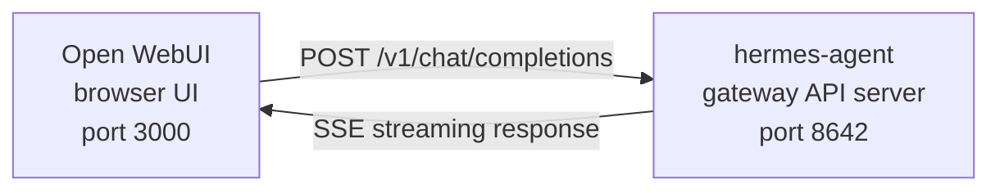

# Open WebUI Integration

[Open WebUI](https://github.com/open-webui/open-webui) (126k★) é a interface de chat self-hosted mais popular para IA. Com o API server embutido do Hermes Agent, você pode usar o Open WebUI como frontend web polido para seu agente — com gerenciamento de conversas, contas de usuário e uma interface de chat moderna.

## Arquitetura {#architecture}



O Open WebUI conecta ao API server do Hermes Agent como conectaria ao OpenAI. O Hermes trata as requisições com seu toolset completo — terminal, operações de arquivo, web search, memory, skills — e retorna a resposta final.

:::important Runtime location
O API server é um **runtime de agente Hermes**, não um proxy puro de LLM. Para cada requisição, o Hermes cria um `AIAgent` server-side no host do API server. Chamadas de ferramentas rodam onde esse API server está rodando.

Por exemplo, se um laptop aponta Open WebUI ou outro cliente compatível com OpenAI para um API server Hermes em uma máquina remota, `pwd`, ferramentas de arquivo, ferramentas de browser, ferramentas MCP locais e outras ferramentas de workspace rodam no host remoto do API server, não no laptop.
:::

O Open WebUI fala com o Hermes server-to-server, então você não precisa de `API_SERVER_CORS_ORIGINS` para esta integração.

## Configuração rápida {#quick-setup}

### 1. Habilite o API server

```bash
hermes config set API_SERVER_ENABLED true
hermes config set API_SERVER_KEY your-secret-key
```

`hermes config set` roteia automaticamente a flag para `config.yaml` e o secret para `~/.hermes/.env`. Se o gateway já estiver rodando, reinicie-o para que a alteração tenha efeito:

```bash
hermes gateway stop && hermes gateway
```

### 2. Inicie o gateway Hermes Agent

```bash
hermes gateway
```

Você deve ver:

```
[API Server] API server listening on http://127.0.0.1:8642
```

### 3. Verifique se o API server está acessível

```bash
curl -s http://127.0.0.1:8642/health
# {"status": "ok", ...}

curl -s -H "Authorization: Bearer your-secret-key" http://127.0.0.1:8642/v1/models
# {"object":"list","data":[{"id":"hermes-agent", ...}]}
```

Se `/health` falhar, o gateway não aplicou `API_SERVER_ENABLED=true` — reinicie-o. Se `/v1/models` retornar `401`, seu header `Authorization` não corresponde a `API_SERVER_KEY`.

### 4. Inicie o Open WebUI

```bash
docker run -d -p 3000:8080 \
  -e OPENAI_API_BASE_URL=http://host.docker.internal:8642/v1 \
  -e OPENAI_API_KEY=your-secret-key \
  -e ENABLE_OLLAMA_API=false \
  --add-host=host.docker.internal:host-gateway \
  -v open-webui:/app/backend/data \
  --name open-webui \
  --restart always \
  ghcr.io/open-webui/open-webui:main
```

`ENABLE_OLLAMA_API=false` suprime o backend Ollama padrão, que caso contrário apareceria vazio e poluiria o seletor de models. Omita se você realmente tem Ollama rodando junto.

O primeiro launch leva 15–30 segundos: o Open WebUI baixa modelos de embedding sentence-transformer (~150MB) na primeira inicialização. Aguarde `docker logs open-webui` estabilizar antes de abrir a UI.

### 5. Abra a UI

Acesse **http://localhost:3000**. Crie sua conta de administrador (o primeiro usuário vira admin). Você deve ver seu agente no dropdown de models (nomeado pelo seu profile, ou **hermes-agent** para o profile padrão). Comece a conversar!

## Setup Docker Compose {#docker-compose-setup}

Para uma configuração mais permanente, crie um `docker-compose.yml`:

```yaml
services:
  open-webui:
    image: ghcr.io/open-webui/open-webui:main
    ports:
      - "3000:8080"
    volumes:
      - open-webui:/app/backend/data
    environment:
      - OPENAI_API_BASE_URL=http://host.docker.internal:8642/v1
      - OPENAI_API_KEY=your-secret-key
      - ENABLE_OLLAMA_API=false
    extra_hosts:
      - "host.docker.internal:host-gateway"
    restart: always

volumes:
  open-webui:
```

Depois:

```bash
docker compose up -d
```

## Configurando via Admin UI {#configuring-via-the-admin-ui}

Se preferir configurar a conexão pela UI em vez de variáveis de ambiente:

1. Faça login no Open WebUI em **http://localhost:3000**
2. Clique no **avatar do profile** → **Admin Settings**
3. Vá em **Connections**
4. Em **OpenAI API**, clique no **ícone de chave inglesa** (Manage)
5. Clique em **+ Add New Connection**
6. Insira:
   - **URL**: `http://host.docker.internal:8642/v1`
   - **API Key**: exatamente o mesmo valor de `API_SERVER_KEY` no Hermes
7. Clique no **checkmark** para verificar a conexão
8. **Save**

Seu model de agente deve aparecer agora no dropdown de models (nomeado pelo seu profile, ou **hermes-agent** para o profile padrão).

:::warning
Variáveis de ambiente só têm efeito no **primeiro launch** do Open WebUI. Depois disso, configurações de conexão ficam armazenadas no banco interno. Para alterá-las depois, use a Admin UI ou delete o volume Docker e comece do zero.
:::

## Tipo de API: Chat Completions vs Responses {#api-type-chat-completions-vs-responses}

O Open WebUI suporta dois modos de API ao conectar a um backend:

| Mode | Format | When to use |
|------|--------|-------------|
| **Chat Completions** (default) | `/v1/chat/completions` | Recomendado. Funciona out of the box. |
| **Responses** (experimental) | `/v1/responses` | Para estado de conversa server-side via `previous_response_id`. |

### Usando Chat Completions (recomendado)

Esse é o padrão e não requer configuração extra. O Open WebUI envia requisições no formato OpenAI padrão e o Hermes Agent responde de acordo. Cada requisição inclui o histórico completo da conversa.

### Usando Responses API

Para usar o modo Responses API:

1. Vá em **Admin Settings** → **Connections** → **OpenAI** → **Manage**
2. Edite sua conexão hermes-agent
3. Altere **API Type** de "Chat Completions" para **"Responses (Experimental)"**
4. Save

Com a Responses API, o Open WebUI envia requisições no formato Responses (`input` array + `instructions`), e o Hermes Agent pode preservar histórico completo de tool calls entre turnos via `previous_response_id`. Quando `stream: true`, o Hermes também transmite itens spec-native `function_call` e `function_call_output`, o que habilita UI estruturada de tool-call customizada em clientes que renderizam eventos Responses.

:::note
O Open WebUI atualmente gerencia histórico de conversa client-side mesmo no modo Responses — envia o histórico completo de mensagens em cada requisição em vez de usar `previous_response_id`. A principal vantagem do modo Responses hoje é o stream de eventos estruturado: deltas de texto, itens `function_call` e `function_call_output` chegam como eventos SSE OpenAI Responses em vez de chunks Chat Completions.
:::

## Como funciona {#how-it-works}

Quando você envia uma mensagem no Open WebUI:

1. O Open WebUI envia uma requisição `POST /v1/chat/completions` com sua mensagem e histórico de conversa
2. O Hermes Agent cria uma instância `AIAgent` server-side usando o profile, config model/provider, memory, skills e toolsets configurados do API server
3. O agente processa sua requisição — pode chamar ferramentas (terminal, operações de arquivo, web search, etc.) no host do API server
4. Conforme ferramentas executam, **mensagens de progresso inline são transmitidas à UI** para que você veja o que o agente está fazendo (ex.: `` `💻 ls -la` ``, `` `🔍 Python 3.12 release` ``)
5. A resposta final em texto do agente é transmitida de volta ao Open WebUI
6. O Open WebUI exibe a resposta em sua interface de chat

Seu agente tem acesso às mesmas ferramentas e capacidades da instância Hermes desse API server. Se o API server for remoto, essas ferramentas também são remotas.

Se você precisa que ferramentas rodem contra seu workspace **local** hoje, rode o Hermes localmente e aponte para um provedor LLM puro ou proxy de model compatível com OpenAI (por exemplo vLLM, LiteLLM, Ollama, llama.cpp, OpenAI, OpenRouter, etc.). Um futuro modo split-runtime para "cérebro remoto, mãos locais" está sendo rastreado em [#18715](https://github.com/NousResearch/hermes-agent/issues/18715); não é o comportamento do API server atual.

:::tip Tool Progress
Com streaming habilitado (o padrão), você verá indicadores inline breves conforme ferramentas rodam — o emoji da ferramenta e seu argumento principal. Eles aparecem no stream de resposta antes da resposta final do agente, dando visibilidade do que acontece nos bastidores.
:::

## Referência de configuração {#configuration-reference}

### Hermes Agent (API server)

| Variable | Default | Description |
|----------|---------|-------------|
| `API_SERVER_ENABLED` | `false` | Habilita o API server |
| `API_SERVER_PORT` | `8642` | Porta do servidor HTTP |
| `API_SERVER_HOST` | `127.0.0.1` | Endereço de bind |
| `API_SERVER_KEY` | _(required)_ | Bearer token para auth. Corresponda a `OPENAI_API_KEY`. |

### Open WebUI

| Variable | Description |
|----------|-------------|
| `OPENAI_API_BASE_URL` | URL da API do Hermes Agent (inclua `/v1`) |
| `OPENAI_API_KEY` | Deve ser não vazio. Corresponda ao seu `API_SERVER_KEY`. |

## Solução de problemas {#troubleshooting}

### Nenhum model aparece no dropdown

- **Verifique se a URL tem sufixo `/v1`**: `http://host.docker.internal:8642/v1` (não apenas `:8642`)
- **Verifique se o gateway está rodando**: `curl http://localhost:8642/health` deve retornar `{"status": "ok"}`
- **Verifique listagem de models**: `curl -H "Authorization: Bearer your-secret-key" http://localhost:8642/v1/models` deve retornar uma lista com `hermes-agent`
- **Rede Docker**: De dentro do Docker, `localhost` significa o container, não seu host. Use `host.docker.internal` ou `--network=host`.
- **Backend Ollama vazio ofuscando o picker**: Se omitiu `ENABLE_OLLAMA_API=false`, o Open WebUI mostra uma seção Ollama vazia acima dos seus models Hermes. Reinicie o container com `-e ENABLE_OLLAMA_API=false` ou desabilite Ollama em **Admin Settings → Connections**.

### Teste de conexão passa mas nenhum model carrega

Isso quase sempre é o sufixo `/v1` ausente. O teste de conexão do Open WebUI é uma verificação básica de conectividade — não verifica se a listagem de models funciona.

### Resposta demora muito

O Hermes Agent pode estar executando várias chamadas de ferramenta (lendo arquivos, rodando comandos, buscando na web) antes de produzir sua resposta final. Isso é normal para consultas complexas. A resposta aparece de uma vez quando o agente termina.

### Erros "Invalid API key"

Certifique-se de que seu `OPENAI_API_KEY` no Open WebUI corresponde ao `API_SERVER_KEY` no Hermes Agent.

:::warning
O Open WebUI persiste configurações de conexão compatíveis com OpenAI em seu próprio banco após o primeiro launch. Se você salvou acidentalmente uma chave errada na Admin UI, corrigir apenas variáveis de ambiente não basta — atualize ou delete a conexão salva em **Admin Settings → Connections**, ou resete o diretório de dados / banco do Open WebUI.
:::

## Setup multi-usuário com profiles {#multi-user-setup-with-profiles}

Para rodar instâncias Hermes separadas por usuário — cada uma com sua própria config, memory e skills — use [profiles](/user-guide/profiles). Cada profile roda seu próprio API server em uma porta diferente e anuncia automaticamente o nome do profile como model no Open WebUI.

### 1. Crie profiles e configure API servers

`API_SERVER_*` são env vars, não chaves YAML de config, então escreva-as no `.env` de cada profile. Escolha portas fora do range default-platform (`8644` é o adaptador webhook, `8645` é wecom-callback, `8646` é msgraph-webhook), ex.: `8650+`:

```bash
hermes profile create alice
cat >> ~/.hermes/profiles/alice/.env <<EOF
API_SERVER_ENABLED=true
API_SERVER_PORT=8650
API_SERVER_KEY=alice-secret
EOF

hermes profile create bob
cat >> ~/.hermes/profiles/bob/.env <<EOF
API_SERVER_ENABLED=true
API_SERVER_PORT=8651
API_SERVER_KEY=bob-secret
EOF
```

### 2. Inicie cada gateway

```bash
hermes -p alice gateway &
hermes -p bob gateway &
```

### 3. Adicione conexões no Open WebUI

Em **Admin Settings** → **Connections** → **OpenAI API** → **Manage**, adicione uma conexão por profile:

| Connection | URL | API Key |
|-----------|-----|---------|
| Alice | `http://host.docker.internal:8650/v1` | `alice-secret` |
| Bob | `http://host.docker.internal:8651/v1` | `bob-secret` |

O dropdown de models mostrará `alice` e `bob` como models distintos. Você pode atribuir models a usuários Open WebUI via o painel admin, dando a cada usuário seu próprio agente Hermes isolado.

:::tip Custom Model Names
O nome do model padrão é o nome do profile. Para sobrescrever, defina `API_SERVER_MODEL_NAME` no `.env` do profile:
```bash
hermes -p alice config set API_SERVER_MODEL_NAME "Alice's Agent"
```
:::

## Docker Linux (sem Docker Desktop) {#linux-docker-no-docker-desktop}

No Linux sem Docker Desktop, `host.docker.internal` não resolve por padrão. Opções:

```bash
# Option 1: Add host mapping
docker run --add-host=host.docker.internal:host-gateway ...

# Option 2: Use host networking
docker run --network=host -e OPENAI_API_BASE_URL=http://localhost:8642/v1 ...

# Option 3: Use Docker bridge IP
docker run -e OPENAI_API_BASE_URL=http://172.17.0.1:8642/v1 ...
```
