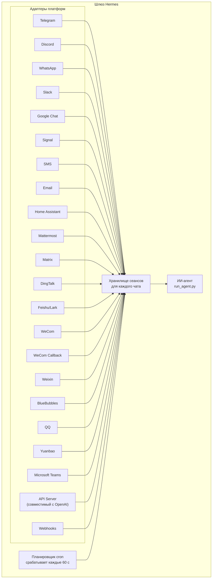

# Шлюз сообщений

Общайтесь с Hermes через Telegram, Discord, Slack, WhatsApp, Signal, SMS, Email, Home Assistant, Mattermost, Matrix, DingTalk, Feishu/Lark, WeCom, Weixin, BlueBubbles (iMessage), QQ, Yuanbao, Microsoft Teams, LINE или в браузере. Шлюз — это единый фоновый процесс, который подключается ко всем настроенным платформам, ведёт сеансы, запускает задачи cron и доставляет голосовые сообщения.

Полный набор голосовых возможностей — от режима микрофона в CLI до устных ответов в мессенджерах и разговоров в голосовых каналах Discord — см. в [Голосовом режиме](/docs/user-guide/features/voice-mode) и [Использовании голосового режима с Hermes](/docs/guides/use-voice-mode-with-hermes).

## Сравнение платформ

| Платформа | Голос | Изображения | Файлы | Треды | Реакции | Индикатор набора | Потоковая выдача |
|----------|:-----:|:------:|:-----:|:-------:|:---------:|:------:|:---------:|
| Telegram | ✅ | ✅ | ✅ | ✅ | — | ✅ | ✅ |
| Discord | ✅ | ✅ | ✅ | ✅ | ✅ | ✅ | ✅ |
| Slack | ✅ | ✅ | ✅ | ✅ | ✅ | ✅ | ✅ |
| Google Chat | — | ✅ | ✅ | ✅ | — | ✅ | — |
| WhatsApp | — | ✅ | ✅ | — | — | ✅ | ✅ |
| Signal | — | ✅ | ✅ | — | — | ✅ | ✅ |
| SMS | — | — | — | — | — | — | — |
| Email | — | ✅ | ✅ | ✅ | — | — | — |
| Home Assistant | — | — | — | — | — | — | — |
| Mattermost | ✅ | ✅ | ✅ | ✅ | — | ✅ | ✅ |
| Matrix | ✅ | ✅ | ✅ | ✅ | ✅ | ✅ | ✅ |
| DingTalk | — | ✅ | ✅ | — | ✅ | — | ✅ |
| Feishu/Lark | ✅ | ✅ | ✅ | ✅ | ✅ | ✅ | ✅ |
| WeCom | ✅ | ✅ | ✅ | — | — | ✅ | ✅ |
| WeCom Callback | — | — | — | — | — | — | — |
| Weixin | ✅ | ✅ | ✅ | — | — | ✅ | ✅ |
| BlueBubbles | — | ✅ | ✅ | — | ✅ | ✅ | — |
| QQ | ✅ | ✅ | ✅ | — | — | ✅ | — |
| Yuanbao | ✅ | ✅ | ✅ | — | — | ✅ | ✅ |
| Microsoft Teams | — | ✅ | — | ✅ | — | ✅ | — |
| LINE | — | ✅ | ✅ | — | — | ✅ | — |

**Голос** = TTS-ответы и/или транскрибация голосовых сообщений. **Изображения** = отправка и приём изображений. **Файлы** = отправка и приём файловых вложений. **Треды** = ветки переписки. **Реакции** = emoji-реакции на сообщения. **Индикатор набора** = индикатор, который показывается, пока сообщение обрабатывается. **Потоковая выдача** = постепенное обновление сообщения через редактирование.

## Архитектура



Каждый адаптер платформы получает сообщения, пропускает их через хранилище сеансов для конкретного чата и передаёт их ИИ-агенту на обработку. Шлюз также управляет планировщиком cron, который срабатывает каждые 60 секунд и запускает задания по расписанию.

## Быстрая настройка

Проще всего настроить платформы обмена сообщениями через интерактивный мастер:

```bash
hermes gateway setup        # Интерактивная настройка всех платформ обмена сообщениями
```

Он проведёт вас по настройке каждой платформы с выбором стрелками, покажет уже настроенные платформы и предложит запустить или перезапустить шлюз после завершения.

## Команды шлюза

```bash
hermes gateway              # Запустить на переднем плане
hermes gateway setup        # Настроить платформы обмена сообщениями интерактивно
hermes gateway install      # Установить как пользовательскую службу (Linux) / launchd-службу (macOS)
sudo hermes gateway install --system   # Только Linux: установить системную службу, запускаемую при загрузке
hermes gateway start        # Запустить службу по умолчанию
hermes gateway stop         # Остановить службу по умолчанию
hermes gateway status       # Проверить состояние службы по умолчанию
hermes gateway status --system         # Только Linux: явно проверить системную службу
```

## Слэш-команды в чате

| Команда | Описание |
|---------|-------------|
| `/new` или `/reset` | Начать новый сеанс |
| `/model [provider:model]` | Показать или изменить модель (поддерживает синтаксис `provider:model`) |
| `/personality [name]` | Задать стиль общения |
| `/retry` | Повторить последнее сообщение |
| `/undo` | Удалить последний обмен сообщениями |
| `/status` | Показать сведения о сеансе |
| `/whoami` | Показать, какие слэш-команды доступны в этом контексте (admin / user / unrestricted) |
| `/stop` | Остановить запущенного агента |
| `/approve` | Подтвердить выполнение ожидающей опасной команды |
| `/deny` | Отклонить ожидающую опасную команду |
| `/sethome` | Сделать этот чат домашним каналом |
| `/compress` | Вручную сжать контекст сеанса |
| `/title [name]` | Задать или показать заголовок сеанса |
| `/resume [name]` | Возобновить ранее названный сеанс |
| `/usage` | Показать расход токенов в этом сеансе |
| `/insights [days]` | Показать статистику и аналитику использования |
| `/reasoning [level\|show\|hide]` | Показать или изменить уровень рассуждений и переключить его отображение |
| `/voice [on\|off\|tts\|join\|leave\|status]` | Управлять голосовыми ответами в мессенджерах и поведением голосовых каналов Discord |
| `/rollback [number]` | Показать список контрольных точек файловой системы или откатиться к ним |
| `/background <prompt>` | Запустить запрос в отдельном фоновом сеансе |
| `/reload-mcp` | Перезагрузить MCP-серверы из конфигурации |
| `/update` | Обновить Hermes Agent до последней версии |
| `/help` | Показать доступные команды |
| `/<skill-name>` | Запустить любой установленный навык |

## Управление сеансами

### Постоянство сеансов

Сеансы сохраняются между сообщениями, пока их не сбросят. Агент помнит контекст разговора.

### Политики сброса

Сеансы сбрасываются по настраиваемым правилам:

| Политика | По умолчанию | Описание |
|--------|-------------|-------------|
| Ежедневно | 4:00 AM | Сбрасывается в один и тот же час каждый день |
| По бездействию | 1440 мин | Сбрасывается после N минут бездействия |
| Оба | (объединённо) | Срабатывает правило, которое выполнится раньше |

Переопределения для каждой платформы настраиваются в `~/.hermes/gateway.json`:

```json
{
  "reset_by_platform": {
    "telegram": { "mode": "idle", "idle_minutes": 240 },
    "discord": { "mode": "idle", "idle_minutes": 60 }
  }
}
```

## Безопасность

По умолчанию шлюз отклоняет всех пользователей, которые не входят в список разрешённых или не сопряжены через DM. Для бота с доступом к терминалу это безопасное поведение по умолчанию.

```bash
# Ограничьте доступ конкретными пользователями (рекомендуется):
TELEGRAM_ALLOWED_USERS=123456789,987654321
DISCORD_ALLOWED_USERS=123456789012345678
SIGNAL_ALLOWED_USERS=+155****4567,+155****6543
SMS_ALLOWED_USERS=+155****4567,+155****6543
EMAIL_ALLOWED_USERS=trusted@example.com,colleague@work.com
MATTERMOST_ALLOWED_USERS=3uo8dkh1p7g1mfk49ear5fzs5c
MATRIX_ALLOWED_USERS=@alice:matrix.org
DINGTALK_ALLOWED_USERS=user-id-1
FEISHU_ALLOWED_USERS=ou_xxxxxxxx,ou_yyyyyyyy
WECOM_ALLOWED_USERS=user-id-1,user-id-2
WECOM_CALLBACK_ALLOWED_USERS=user-id-1,user-id-2
TEAMS_ALLOWED_USERS=aad-object-id-1,aad-object-id-2

# Или разрешить
GATEWAY_ALLOWED_USERS=123456789,987654321

# Или явно разрешить всех пользователей (не рекомендуется для ботов с доступом к терминалу):
GATEWAY_ALLOW_ALL_USERS=true
```

### Сопряжение через DM (альтернатива спискам разрешений пользователей) {#dm-pairing-alternative-to-allowlists}

Вместо ручной настройки идентификаторов пользователей неизвестные пользователи получают одноразовый код сопряжения, когда пишут боту в DM:

```bash
# Пользователь видит: "Код сопряжения: XKGH5N7P"
# Подтвердите его так:
hermes pairing approve telegram XKGH5N7P

# Другие команды сопряжения:
hermes pairing list          # Показать ожидающих и подтверждённых пользователей
hermes pairing revoke telegram 123456789  # Отозвать доступ
```

Коды сопряжения истекают через 1 час, ограничены по частоте и генерируются криптографически стойким генератором случайных чисел.

### Администраторы и обычные пользователи

Списки разрешённых отвечают на вопрос «может ли этот человек вообще достучаться до бота?». Разделение admin / user отвечает на вопрос «раз уж он внутри, что ему можно делать?».

Все разрешённые пользователи в каждом контексте (DM или группа/канал) относятся к одному из двух уровней:

- **Администратор** — полный доступ. Может запускать все зарегистрированные слэш-команды (встроенные и из плагинов) и использовать все защищённые возможности.
- **Обычный пользователь** — ограниченный доступ. Может общаться с агентом как обычно, но запускать только те слэш-команды, которые вы явно разрешили. Базовый набор, доступный всегда, — `/help` и `/whoami`.

Уровни настраиваются отдельно для каждой платформы и каждого контекста. Статус администратора в DM не делает человека администратором в группе или канале — у каждого контекста свой список администраторов.

**Что уровни ограничивают сегодня:** слэш-команды. Разделение проходит через живой реестр команд, так что оно покрывает и встроенные команды, и команды, зарегистрированные плагинами, без отдельной настройки для каждой возможности. Обычный чат при этом не затрагивается — неадминистраторы по-прежнему могут свободно общаться с агентом.

**Что может быть ограничено в будущем:** дополнительные поверхности возможностей (доступ к инструментам, переключение моделей, дорогие операции) будут опираться на то же разделение admin / user. Если настроить его заранее, будущие ограничения лягут без лишней перестройки и без необходимости заново решать, кто именно считается администратором.

#### Конфигурация

```yaml
gateway:
  platforms:
    discord:
      extra:
        allow_from: ["111", "222", "333"]
        allow_admin_from: ["111"]                    # администраторы → все слэш-команды
        user_allowed_commands: [status, model]       # что могут запускать неадминистраторы
        # Необязательный отдельный scope для группы/канала
        group_allow_admin_from: ["111"]
        group_user_allowed_commands: [status]
```

**Обратная совместимость:** если `allow_admin_from` не задан для какого-то контекста, уровневое разделение для него выключено, и каждый разрешённый пользователь получает полный доступ. Существующие установки продолжают работать без изменений — просто включите это поведение, когда оно вам действительно нужно.

#### Проверка доступа

Используйте `/whoami` из любой платформы, чтобы увидеть активный контекст, свой уровень (admin / user / unrestricted) и список слэш-команд, которые вам доступны. Примеры для конкретных платформ см. на страницах [Telegram](/docs/user-guide/messaging/telegram#slash-command-access-control) и [Discord](/docs/user-guide/messaging/discord#slash-command-access-control).

## Прерывание агента

Отправьте любое сообщение, пока агент работает, чтобы прервать его. Основные правила:

- **Запущенные терминальные команды завершаются сразу** (SIGTERM, затем SIGKILL через 1 секунду)
- **Вызовы инструментов отменяются** — выполняется только тот, который уже пошёл, остальные пропускаются
- **Несколько сообщений объединяются** — сообщения, отправленные во время прерывания, складываются в один запрос
- **Команда `/stop`** — прерывает работу без постановки следующего сообщения в очередь

### Очередь, прерывание и steer при занятом агенте

По умолчанию сообщение занятому агенту его прерывает. Доступны ещё два режима:

- `queue` — последующие сообщения ждут своей очереди и отправляются следующим ходом после завершения текущей задачи.
- `steer` — последующие сообщения внедряются в текущий запуск через `/steer` и попадают к агенту после следующего вызова инструмента. Прерывания нет, новый ход не создаётся. Если агент ещё не успел стартовать, режим откатывается к поведению `queue`.

```yaml
display:
  busy_input_mode: steer   # или queue, или interrupt (по умолчанию)
  busy_ack_enabled: true   # установите false, чтобы полностью скрыть ответ ⚡/⏳/⏩
```

Когда вы впервые пишете занятому агенту на любой платформе, Hermes добавляет к сообщению о занятости короткую однострочную подсказку, которая объясняет выбранный режим (`"💡 First-time tip — …"`). Эта подсказка показывается один раз на установку — за это отвечает флаг `onboarding.seen.busy_input_prompt`. Удалите этот ключ, если хотите увидеть подсказку снова.

Если сообщение о занятости кажется вам слишком шумным, особенно при голосовом вводе или серии быстрых сообщений, установите `display.busy_ack_enabled: false`. Ваш ввод по-прежнему будет ставиться в очередь, направляться через `steer` или прерывать текущий ход как обычно, просто ответ в чате будет скрыт.

## Уведомления о ходе инструментов

Управляйте объёмом сведений об активности инструментов в `~/.hermes/config.yaml`:

```yaml
display:
  tool_progress: all    # off | new | all | verbose
  tool_progress_command: false  # установите true, чтобы включить /verbose в мессенджерах
```

Если включено, бот по ходу работы отправляет статусные сообщения:

```text
💻 `ls -la`...
🔍 web_search...
📄 web_extract...
🐍 execute_code...
```

## Фоновые сеансы

Запускайте запрос в отдельном фоновом сеансе, чтобы агент мог работать над ним независимо, а основной чат при этом оставался отзывчивым:

```
/background Check all servers in the cluster and report any that are down
```

Hermes сразу подтверждает:

```
🔄 Background task started: "Check all servers in the cluster..."
   Task ID: bg_143022_a1b2c3
```

### Как это работает

Каждый запрос `/background` создаёт **отдельный экземпляр агента**, который работает асинхронно:

- **Изолированный сеанс** — у фонового агента свой сеанс и своя история разговора. Он не знает контекст вашего текущего чата и получает только тот запрос, который вы передали.
- **Та же конфигурация** — он наследует вашу модель, провайдера, наборы инструментов, настройки рассуждений и маршрутизацию провайдеров из текущей конфигурации шлюза.
- **Неблокирующий режим** — ваш основной чат остаётся полностью интерактивным. Можно продолжать переписку, запускать другие команды и даже ставить новые фоновые задачи, пока он работает.
- **Доставка результата** — когда задача завершится, результат придёт в тот же чат или канал, из которого вы запустили команду, с префиксом `✅ Background task complete`. Если задача завершится ошибкой, вы увидите `❌ Background task failed` вместе с текстом ошибки.

### Уведомления о фоновых процессах

Когда агент, работающий в фоновом сеансе, запускает через `terminal(background=true)` долгоживущие процессы, сборки или серверы, шлюз может отправлять в чат обновления статуса. Управляется это параметром `display.background_process_notifications` в `~/.hermes/config.yaml`:

```yaml
display:
  background_process_notifications: all    # all | result | error | off
```

| Режим | Что вы получаете |
|------|-----------------|
| `all` | Обновления по ходу работы **и** финальное сообщение о завершении (по умолчанию) |
| `result` | Только финальное сообщение о завершении, независимо от кода выхода |
| `error` | Только финальное сообщение, если код выхода не нулевой |
| `off` | Вообще никаких сообщений наблюдателя процессов |

Можно также задать это через переменную окружения:

```bash
HERMES_BACKGROUND_NOTIFICATIONS=result
```

### Сценарии использования

- **Мониторинг серверов** — `/background Check the health of all services and alert me if anything is down`
- **Долгие сборки** — `/background Build and deploy the staging environment`, пока вы продолжаете общаться
- **Исследовательские задачи** — `/background Research competitor pricing and summarize in a table`
- **Операции с файлами** — `/background Organize the photos in ~/Downloads by date into folders`

:::tip
Фоновые задачи в мессенджерах работают по принципу «запустил и забыл» — вы можете не ждать их вручную и не проверять каждую из них. Результаты автоматически придут в тот же чат, когда задача завершится.
:::

## Управление службами

### Linux (systemd)

```bash
hermes gateway install               # Установить как пользовательскую службу
hermes gateway start                 # Запустить службу
hermes gateway stop                  # Остановить службу
hermes gateway status                # Проверить состояние
journalctl --user -u hermes-gateway -f  # Просмотреть журналы

# Включить lingering (сохраняет работу после выхода из системы)
sudo loginctl enable-linger $USER

# Или установить системную службу, которая запускается при загрузке и работает от вашего пользователя
sudo hermes gateway install --system
sudo hermes gateway start --system
sudo hermes gateway status --system
journalctl -u hermes-gateway -f
```

Пользовательскую службу используйте на ноутбуках и рабочих станциях разработчика. Системную службу используйте на VPS и безголовых хостах, которым нужно подниматься при загрузке без опоры на `systemd linger`.

Не держите одновременно и пользовательскую, и системную службу шлюза, если это не задумано специально. Hermes предупредит, если найдёт обе, потому что поведение `start` / `stop` / `status` станет неоднозначным.

:::info Несколько установок
Если у вас на одной машине несколько установок Hermes (с разными каталогами `HERMES_HOME`), у каждой будет своё имя systemd-службы. Для стандартного `~/.hermes` используется `hermes-gateway`; для остальных установок — `hermes-gateway-<hash>`. Команды `hermes gateway` автоматически обращаются к нужной службе для текущего `HERMES_HOME`.
:::

### macOS (launchd)

```bash
hermes gateway install               # Установить как launchd-агент
hermes gateway start                 # Запустить службу
hermes gateway stop                  # Остановить службу
hermes gateway status                # Проверить состояние
tail -f ~/.hermes/logs/gateway.log   # Просмотреть журналы
```

Сгенерированный plist лежит в `~/Library/LaunchAgents/ai.hermes.gateway.plist`. В нём задаются три переменные окружения:

- **PATH** — полный PATH вашей оболочки на момент установки, с добавленными в начало `bin/` из virtualenv и `node_modules/.bin`. Это нужно, чтобы пользовательские инструменты (Node.js, ffmpeg и т. п.) были доступны подпроцессам gateway, например мосту WhatsApp.
- **VIRTUAL_ENV** — указывает на Python virtualenv, чтобы инструменты корректно находили пакеты.
- **HERMES_HOME** — задаёт для gateway конкретную установку Hermes.

:::tip Изменение PATH после установки
Файлы plist launchd статичны. Если после настройки gateway вы установите новые инструменты, например новую версию Node.js через nvm или ffmpeg через Homebrew, запустите `hermes gateway install` ещё раз, чтобы обновить PATH. Шлюз сам заметит устаревший plist и перезагрузится.
:::

:::info Несколько установок
Как и у systemd-службы на Linux, у каждой директории `HERMES_HOME` есть свой launchd label. Для стандартного `~/.hermes` используется `ai.hermes.gateway`; для остальных установок — `ai.hermes.gateway-<suffix>`.
:::

## Наборы инструментов по платформам

У каждой платформы свой набор инструментов:

| Платформа | Набор инструментов | Возможности |
|----------|---------|--------------|
| CLI | `hermes-cli` | Полный доступ |
| Telegram | `hermes-telegram` | Полный набор инструментов, включая терминал |
| Discord | `hermes-discord` | Полный набор инструментов, включая терминал |
| WhatsApp | `hermes-whatsapp` | Полный набор инструментов, включая терминал |
| Slack | `hermes-slack` | Полный набор инструментов, включая терминал |
| Google Chat | `hermes-google_chat` | Полный набор инструментов, включая терминал |
| Signal | `hermes-signal` | Полный набор инструментов, включая терминал |
| SMS | `hermes-sms` | Полный набор инструментов, включая терминал |
| Email | `hermes-email` | Полный набор инструментов, включая терминал |
| Home Assistant | `hermes-homeassistant` | Полный набор инструментов + управление устройствами HA (ha_list_entities, ha_get_state, ha_call_service, ha_list_services) |
| Mattermost | `hermes-mattermost` | Полный набор инструментов, включая терминал |
| Matrix | `hermes-matrix` | Полный набор инструментов, включая терминал |
| DingTalk | `hermes-dingtalk` | Полный набор инструментов, включая терминал |
| Feishu/Lark | `hermes-feishu` | Полный набор инструментов, включая терминал |
| WeCom | `hermes-wecom` | Полный набор инструментов, включая терминал |
| WeCom Callback | `hermes-wecom-callback` | Полный набор инструментов, включая терминал |
| Weixin | `hermes-weixin` | Полный набор инструментов, включая терминал |
| BlueBubbles | `hermes-bluebubbles` | Полный набор инструментов, включая терминал |
| QQBot | `hermes-qqbot` | Полный набор инструментов, включая терминал |
| Yuanbao | `hermes-yuanbao` | Полный набор инструментов, включая терминал |
| Microsoft Teams | `hermes-teams` | Полный набор инструментов, включая терминал |
| API Server | `hermes-api-server` | Полный набор инструментов (кроме `clarify`, `send_message`, `text_to_speech` — у программного доступа нет интерактивного пользователя) |
| Webhooks | `hermes-webhook` | Полный набор инструментов, включая терминал |

## Управление шлюзом для нескольких платформ

Обычно шлюз запускает сразу несколько адаптеров (Telegram + Discord + Slack и т. д.). Ниже описаны повседневные операции, которые затрагивают все платформы сразу.

### Команда `/platform`

Когда шлюз уже работает, используйте слэш-команду `/platform` из любой подключённой CLI-сессии или чата, чтобы посмотреть отдельные адаптеры и управлять ими, не перезапуская весь шлюз:

```
/platform list                  # Показать все адаптеры и их состояние
/platform pause <name>          # Перестать доставлять новые сообщения одному адаптеру
/platform resume <name>         # Снова включить приостановленный адаптер
```

`/platform list` показывает, находится ли каждый адаптер в состоянии `running`, `paused` (вручную) или `paused-by-breaker` (см. ниже). Пауза не выгружает адаптер и не останавливает его фоновые циклы — входящие сообщения просто отбрасываются, но соединение остаётся открытым, так что возобновление происходит мгновенно.

См. также более общий командный сводный статус [`/platforms`](../../reference/slash-commands.md#info).

### Автоматический аварийный выключатель

Каждый адаптер защищён аварийным выключателем (circuit breaker). Если подряд повторяются временные сбои — сетевые проблемы, ответы о rate limit, ответы 5xx от upstream или обрывы websocket, — выключатель срабатывает: адаптер автоматически ставится на паузу, уведомление оператору отправляется в домашний канал другой живой платформы, если он настроен, а в лог записывается структурированная строка.

Выключатель **не** возобновляется автоматически. Он остаётся открытым, пока вы вручную не выполните `/platform resume <name>`. Это сделано намеренно: если платформа долго недоступна, шлюз не должен бесконечно пытаться переподключиться.

### Куда смотреть, если платформа поставлена на паузу

Когда адаптер поставлен на паузу, проверьте:

1. **Лог шлюза** (`~/.hermes/logs/gateway.log` или лог systemd / launchd-службы). Ищите название платформы и слова `circuit breaker`, `paused` или `disabled`. В записи о срабатывании есть счётчик ошибок и последняя ошибка.
2. **Вывод `/platform list`** — он покажет текущее состояние и последнюю причину.
3. **Статусную страницу провайдера** (Telegram bot API status, Discord status и т. п.). Выключатель сработал потому, что сама платформа была в плохом состоянии; не пытайтесь возобновлять её, пока она не восстановится.

Когда внешний сервис снова в норме, `/platform resume <name>` сбрасывает выключатель и повторно вооружает адаптер.

### Уведомления о перезапуске

Когда шлюз перезапускается или завершается с активными сеансами, он может отправлять одноразовое сообщение в домашний канал каждой платформы: `"агент снова на связи"` / `"агент был прерван"`. Это поведение настраивается отдельно для каждой платформы флагом `gateway_restart_notification` в `gateway-config.yaml`, значение по умолчанию — `true`:

```yaml
gateway:
  platforms:
    telegram:
      home_chat_id: "123456789"
      gateway_restart_notification: false   # Отключить для этой платформы
    discord:
      home_chat_id: "987654321"
      # gateway_restart_notification не указан → по умолчанию true
```

Отключайте его на шумных или низкоприоритетных платформах, но оставляйте включённым для основного чата. Уведомление отправляется один раз при каждом перезапуске, независимо от того, сколько сеансов было в работе.

### Возобновление сеансов после перезапуска шлюза

Если шлюз завершает работу во время вызова инструмента или генерации, связанные сеансы помечаются как `restart_interrupted`. При следующем запуске шлюз планирует автоматическое возобновление каждого из них: пользователь получает в чате короткую подсказку ("Отправьте любое сообщение после перезапуска, и я попробую продолжить с того места, где вы остановились."), а сеанс продолжает работу с последнего зафиксированного хода, когда пользователь ответит.

Это поведение включено по умолчанию и фиксируется в логах при старте шлюза:

```text
Scheduled auto-resume for N restart-interrupted session(s)
```

Настраивать ничего не нужно. Если вам не нужна сама подсказка в чате, задайте `gateway_restart_notification: false` для нужной платформы.

### Автоочистка сообщений прогресса (по желанию)

Сообщения о ходе инструментов, пульс `"ещё работаю…"`, а также статусные сообщения обратного вызова можно автоматически удалять после того, как придёт финальный ответ. Включайте это для каждой платформы через `display.platforms.<platform>.cleanup_progress`:

```yaml
display:
  platforms:
    telegram:
      cleanup_progress: true
    discord:
      cleanup_progress: true
```

По умолчанию значение равно `false`. Учитываются только те платформы, чей адаптер умеет `delete_message` (сейчас это Telegram и Discord). Если запуск завершился неудачей, очистка пропускается, чтобы эти сообщения остались как следы для диагностики.

## Следующие шаги

- [Настройка Telegram](/docs/user-guide/messaging/telegram)
- [Настройка Discord](/docs/user-guide/messaging/discord)
- [Настройка Slack](/docs/user-guide/messaging/slack)
- [Настройка Google Chat](/docs/user-guide/messaging/google_chat)
- [Настройка WhatsApp](/docs/user-guide/messaging/whatsapp)
- [Настройка Signal](/docs/user-guide/messaging/signal)
- [Настройка SMS (Twilio)](/docs/user-guide/messaging/sms)
- [Email](/docs/user-guide/messaging/email)
- [Интеграция Home Assistant](/docs/user-guide/messaging/homeassistant)
- [Настройка Mattermost](/docs/user-guide/messaging/mattermost)
- [Настройка Matrix](/docs/user-guide/messaging/matrix)
- [Настройка DingTalk](/docs/user-guide/messaging/dingtalk)
- [Настройка Feishu/Lark](/docs/user-guide/messaging/feishu)
- [Настройка WeCom](/docs/user-guide/messaging/wecom)
- [Настройка WeCom Callback](/docs/user-guide/messaging/wecom-callback)
- [Настройка Weixin (WeChat)](/docs/user-guide/messaging/weixin)
- [Настройка BlueBubbles (iMessage)](/docs/user-guide/messaging/bluebubbles)
- [Настройка QQBot](/docs/user-guide/messaging/qqbot)
- [Настройка Yuanbao](/docs/user-guide/messaging/yuanbao)
- [Настройка Microsoft Teams](/docs/user-guide/messaging/teams)
- [Конвейер Teams Meetings](/docs/user-guide/messaging/teams-meetings)
- [Open WebUI + API Server](/docs/user-guide/messaging/open-webui)
- [Вебхуки](/docs/user-guide/messaging/webhooks)
