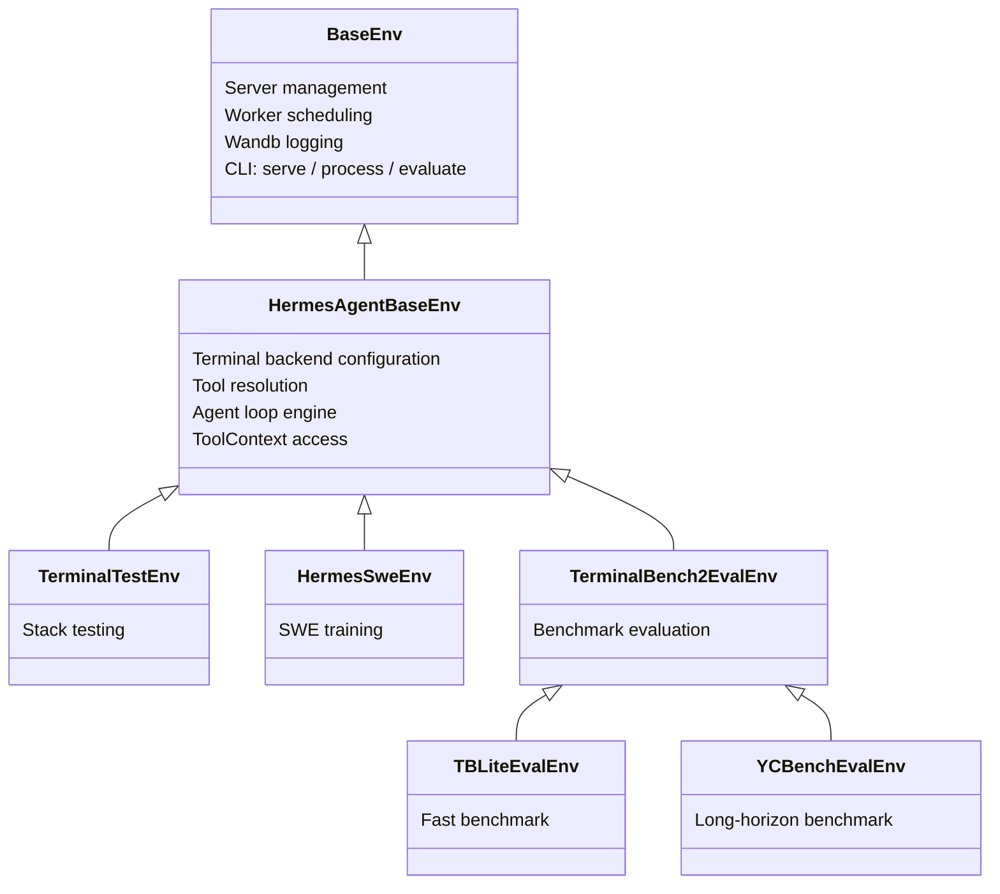

# 环境、基准和数据生成

Hermes Agent 包含一个完整的环境框架，将其工具调用能力连接到 [Atropos](https://github.com/NousResearch/atropos) RL 训练框架。这支持三种工作流：

1. **RL 训练** — 在多轮代理任务上训练语言模型与 GRPO
2. **基准** — 在标准代理基准上评估模型
3. **数据生成** — 从代理 rollout 生成 SFT 训练数据

所有三种共享同一个核心：一个**环境**类，定义任务、运行代理循环并对输出评分。

:::info 仓库环境 vs RL 训练工具
此处的 Python 环境框架位于仓库的 `environments/` 目录下，是 Hermes/Atropos 集成的实现级 API。这与面向用户的 `rl_*` 工具分开，后者作为远程 RL 训练工作流的编排表面。
:::

:::tip 快速链接
- **想运行基准？** 跳转到[可用基准](#可用基准)
- **想用 RL 训练？** 参见 [RL 训练工具](/user-guide/features/rl-training) 了解代理驱动界面，或[运行环境](#运行环境)了解手动执行
- **想创建新环境？** 参见[创建环境](#创建环境)
:::

## 架构

环境系统建立在三层继承链上：



### BaseEnv（Atropos）

来自 `atroposlib` 的基础。提供：
- **服务器管理** — 连接到 OpenAI 兼容 API（VLLM、SGLang、OpenRouter）
- **工作器调度** — 并行 rollout 协调
- **Wandb 集成** — 指标日志记录和 rollout 可视化
- **CLI 接口** — 三个子命令：`serve`、`process`、`evaluate`
- **Eval 日志** — `evaluate_log()` 将结果保存到 JSON + JSONL

### HermesAgentBaseEnv

hermes-agent 层（`environments/hermes_base_env.py`）。添加：
- **终端后端配置** — 设置 `TERMINAL_ENV` 用于沙盒执行（local、Docker、Modal、Daytona、SSH、Singularity）
- **工具解析** — `_resolve_tools_for_group()` 调用 hermes-agent 的 `get_tool_definitions()` 以根据启用/禁用的工具集获取正确的工具模式
- **代理循环集成** — `collect_trajectory()` 运行 `HermesAgentLoop` 并对结果评分
- **两阶段操作** — 阶段 1（OpenAI 服务器）用于 eval/SFT，阶段 2（VLLM ManagedServer）用于带 logprobs 的完整 RL
- **异步安全补丁** — monkey-patch Modal 后端以在 Atropos 的事件循环内工作

### 具体环境

您的环境继承自 `HermesAgentBaseEnv` 并实现五个方法：

| 方法 | 目的 |
|--------|------|
| `setup()` | 加载数据集，初始化状态 |
| `get_next_item()` | 返回下一个 rollout 项目 |
| `format_prompt(item)` | 将项目转换为用户消息 |
| `compute_reward(item, result, ctx)` | 对 rollout 评分（0.0–1.0） |
| `evaluate()` | 周期性评估逻辑 |

## 核心组件

### 代理循环

`HermesAgentLoop`（`environments/agent_loop.py`）是可重用的多轮代理引擎。它运行与 hermes-agent 主循环相同的工具调用模式：

1. 通过 `server.chat_completion()` 将消息 + 工具模式发送到 API
2. 如果响应包含 `tool_calls`，通过 `handle_function_call()` 调度每个
3. 将工具结果追加到对话，返回步骤 1
4. 如果没有 `tool_calls`，代理完成

工具调用在线程池（`ThreadPoolExecutor(128)`）中执行，这样异步后端（Modal、Docker）不会在 Atropos 的事件循环中死锁。

返回 `AgentResult`：

```python
@dataclass
class AgentResult:
    messages: List[Dict[str, Any]]       # Full conversation history
    turns_used: int                       # Number of LLM calls made
    finished_naturally: bool              # True if model stopped on its own
    reasoning_per_turn: List[Optional[str]]  # Extracted reasoning content
    tool_errors: List[ToolError]          # Errors encountered during tool dispatch
    managed_state: Optional[Dict]         # VLLM ManagedServer state (Phase 2)
```

### 工具上下文

`ToolContext`（`environments/tool_context.py`）给予奖励函数对**模型在其 rollout 期间使用的相同沙盒**的直接访问。`task_id` 作用域意味着所有状态（文件、进程、浏览器标签页）都被保留。

```python
async def compute_reward(self, item, result, ctx: ToolContext):
    # Run tests in the model's terminal sandbox
    test = ctx.terminal("pytest -v")
    if test["exit_code"] == 0:
        return 1.0

    # Check if a file was created
    content = ctx.read_file("/workspace/solution.py")
    if content.get("content"):
        return 0.5

    # Download files for local verification
    ctx.download_file("/remote/output.bin", "/local/output.bin")
    return 0.0
```

可用方法：

| 类别 | 方法 |
|----------|-------------|
| **终端** | `terminal(command, timeout)` |
| **文件** | `read_file(path)`、`write_file(path, content)`、`search(query, path)` |
| **传输** | `upload_file()`、`upload_dir()`、`download_file()`、`download_dir()` |
| **Web** | `web_search(query)`、`web_extract(urls)` |
| **浏览器** | `browser_navigate(url)`、`browser_snapshot()` |
| **通用** | `call_tool(name, args)` — 任何 hermes-agent 工具的逃生舱 |
| **清理** | `cleanup()` — 释放所有资源 |

### 工具调用解析器

对于**阶段 2**（VLLM ManagedServer），服务器返回没有结构化工具调用的原始文本。`environments/tool_call_parsers/` 中的客户端解析器从原始输出中提取 `tool_calls`：

```python
from environments.tool_call_parsers import get_parser

parser = get_parser("hermes")  # or "mistral", "llama3_json", "qwen", "deepseek_v3", etc.
content, tool_calls = parser.parse(raw_model_output)
```

可用解析器：`hermes`、`mistral`、`llama3_json`、`qwen`、`qwen3_coder`、`deepseek_v3`、`deepseek_v3_1`、`kimi_k2`、`longcat`、`glm45`、`glm47`。

在阶段 1（OpenAI 服务器类型）中，不需要解析器 — 服务器原生处理工具调用解析。

## 可用基准

### TerminalBench2

**89 个具有挑战性的终端任务**，每个任务具有独立的 Docker 沙盒环境。

| | |
|---|---|
| **测试内容** | 单任务编码/系统管理能力 |
| **评分** | 二进制通过/失败（测试套件验证） |
| **沙盒** | Modal 云沙盒（每个任务的 Docker 镜像） |
| **工具** | `terminal` + `file` |
| **任务** | 跨多个类别的 89 个任务 |
| **成本** | 完整评估约 $50–200（并行执行） |
| **时间** | 约 2–4 小时 |

```bash
python environments/benchmarks/terminalbench_2/terminalbench2_env.py evaluate \
    --config environments/benchmarks/terminalbench_2/default.yaml

# Run specific tasks
python environments/benchmarks/terminalbench_2/terminalbench2_env.py evaluate \
    --config environments/benchmarks/terminalbench_2/default.yaml \
    --env.task_filter fix-git,git-multibranch
```

数据集：[NousResearch/terminal-bench-2](https://huggingface.co/datasets/NousResearch/terminal-bench-2) 在 HuggingFace。

### TBLite（OpenThoughts Terminal Bench Lite）

**100 个难度校准任务** — TerminalBench2 的更快代理。

| | |
|---|---|
| **测试内容** | 与 TB2 相同（编码/系统管理），校准难度层级 |
| **评分** | 二进制通过/失败 |
| **沙盒** | Modal 云沙盒 |
| **工具** | `terminal` + `file` |
| **任务** | 100 个任务：简单（40）、中等（26）、困难（26）、极难（8） |
| **相关性** | 与完整 TB2 的 r=0.911 |
| **速度** | 比 TB2 快 2.6–8× |

```bash
python environments/benchmarks/tblite/tblite_env.py evaluate \
    --config environments/benchmarks/tblite/default.yaml
```

TBLite 是 TerminalBench2 的薄子类 — 只有数据集和超时不同。由 OpenThoughts Agent 团队创建（Snorkel AI + Bespoke Labs）。数据集：[NousResearch/openthoughts-tblite](https://huggingface.co/datasets/NousResearch/openthoughts-tblite)。

### YC-Bench

**长期战略基准** — 代理扮演 AI 创业公司的 CEO。

| | |
|---|---|
| **测试内容** | 数百轮次的多轮战略一致性 |
| **评分** | 复合：`0.5 × survival + 0.5 × normalised_funds` |
| **沙盒** | 本地终端（无需 Modal） |
| **工具** | 仅 `terminal` |
| **运行** | 9 个默认（3 个预设 × 3 个种子），顺序 |
| **成本** | 完整评估约 $50–200 |
| **时间** | 约 3–6 小时 |

```bash
# Install yc-bench (optional dependency)
pip install "hermes-agent[yc-bench]"

# Run evaluation
bash environments/benchmarks/yc_bench/run_eval.sh

# Or directly
python environments/benchmarks/yc_bench/yc_bench_env.py evaluate \
    --config environments/benchmarks/yc_bench/default.yaml

# Quick single-preset test
python environments/benchmarks/yc_bench/yc_bench_env.py evaluate \
    --config environments/benchmarks/yc_bench/default.yaml \
    --env.presets '["fast_test"]' --env.seeds '[1]'
```

YC-Bench 使用 [collinear-ai/yc-bench](https://github.com/collinear-ai/yc-bench) — 具有 4 个技能领域（研究、推理、data_environment、训练）、声望系统、员工管理和财务压力的确定性模拟。与 TB2 的每任务二进制评分不同，YC-Bench 衡量代理是否能在数百个复合决策中保持连贯的战略。

## 训练环境

### TerminalTestEnv

具有内联任务的最小自包含环境（无外部数据集）。用于**端到端验证完整堆栈**。每个任务要求模型在已知路径创建文件；验证器检查内容。

```bash
# Process mode (saves rollouts to JSONL, no training server needed)
python environments/terminal_test_env/terminal_test_env.py process \
    --env.data_path_to_save_groups terminal_test_output.jsonl

# Serve mode (connects to Atropos API for RL training)
python environments/terminal_test_env/terminal_test_env.py serve
```

### HermesSweEnv

SWE-bench 风格训练环境。模型获得编码任务，使用 terminal + file + web 工具解决它，奖励函数在相同 Modal 沙盒中运行测试。

```bash
python environments/hermes_swe_env/hermes_swe_env.py serve \
    --openai.model_name YourModel \
    --env.dataset_name bigcode/humanevalpack \
    --env.terminal_backend modal
```

## 运行环境

每个环境是一个带有三个 CLI 子命令的独立 Python 脚本：

### `evaluate` — 运行基准

用于仅评估环境（基准）。运行所有项目，计算指标，记录到 wandb。

```bash
python environments/benchmarks/tblite/tblite_env.py evaluate \
    --config environments/benchmarks/tblite/default.yaml \
    --openai.model_name anthropic/claude-sonnet-4.6
```

不需要训练服务器或 `run-api`。环境处理一切。

### `process` — 生成 SFT 数据

运行 rollout 并将评分的轨迹保存到 JSONL。对在不进行完整 RL 循环的情况下生成训练数据有用。

```bash
python environments/terminal_test_env/terminal_test_env.py process \
    --env.data_path_to_save_groups output.jsonl \
    --openai.model_name anthropic/claude-sonnet-4.6
```

输出格式：每行是一个带完整对话历史、奖励和元数据的评分轨迹。

### `serve` — 连接到 Atropos 进行 RL 训练

将环境连接到运行的 Atropos API 服务器（`run-api`）。在实时 RL 训练期间使用。

```bash
# Terminal 1: Start the Atropos API
run-api

# Terminal 2: Start the environment
python environments/hermes_swe_env/hermes_swe_env.py serve \
    --openai.model_name YourModel
```

环境从 Atropos 接收项目，运行代理 rollout，计算奖励，并发送评分的轨迹回训练。

## 两阶段操作

### 阶段 1：OpenAI 服务器（Eval / SFT）

使用 `server.chat_completion()` 和 `tools=` 参数。服务器（VLLM、SGLang、OpenRouter、OpenAI）原生处理工具调用解析。返回带结构化 `tool_calls` 的 `ChatCompletion` 对象。

- **用于**：评估、SFT 数据生成、基准、测试
- **占位符 token** 为 Atropos 管道创建（因为 OpenAI API 无法提供真实 token ID）

### 阶段 2：VLLM ManagedServer（完整 RL）

使用 ManagedServer 通过 `/generate` 提供精确 token ID + logprobs。客户端解析器[工具调用解析器](#工具调用解析器)从原始输出重构结构化 `tool_calls`。

- **用于**：带 GRPO/PPO 的完整 RL 训练
- **真实 token**、掩码和 logprobs 流经管道
- 在配置中设置 `tool_call_parser` 以匹配模型的格式（例如 `"hermes"`、`"qwen"`、`"mistral"`）

## 创建环境

### 训练环境

```python
from environments.hermes_base_env import HermesAgentBaseEnv, HermesAgentEnvConfig
from atroposlib.envs.server_handling.server_manager import APIServerConfig

class MyEnvConfig(HermesAgentEnvConfig):
    my_custom_field: str = "default_value"

class MyEnv(HermesAgentBaseEnv):
    name = "my-env"
    env_config_cls = MyEnvConfig

    @classmethod
    def config_init(cls):
        env_config = MyEnvConfig(
            enabled_toolsets=["terminal", "file"],
            terminal_backend="modal",
            max_agent_turns=30,
        )
        server_configs = [APIServerConfig(
            base_url="https://openrouter.ai/api/v1",
            model_name="anthropic/claude-sonnet-4.6",
            server_type="openai",
        )]
        return env_config, server_configs

    async def setup(self):
        from datasets import load_dataset
        self.dataset = list(load_dataset("my-dataset", split="train"))
        self.iter = 0

    async def get_next_item(self):
        item = self.dataset[self.iter % len(self.dataset)]
        self.iter += 1
        return item

    def format_prompt(self, item):
        return item["instruction"]

    async def compute_reward(self, item, result, ctx):
        # ctx gives full tool access to the rollout's sandbox
        test = ctx.terminal("pytest -v")
        return 1.0 if test["exit_code"] == 0 else 0.0

    async def evaluate(self, *args, **kwargs):
        # Periodic evaluation during training
        pass

if __name__ == "__main__":
    MyEnv.cli()
```

### 仅评估基准

对于基准，遵循 TerminalBench2、TBLite 和 YC-Bench 使用的模式：

1. **创建在** `environments/benchmarks/your-benchmark/`
2. **设置仅评估配置**：`eval_handling=STOP_TRAIN`、`steps_per_eval=1`、`total_steps=1`
3. **存根训练方法**：`collect_trajectories()` 返回 `(None, [])`，`score()` 返回 `None`
4. **实现** `rollout_and_score_eval(eval_item)` — 每个项目的代理循环 + 评分
5. **实现** `evaluate()` — 编排所有运行，计算聚合指标
6. **添加流式 JSONL** 以实现崩溃安全的结果持久化
7. **添加清理**：`KeyboardInterrupt` 处理、`cleanup_all_environments()`、`_tool_executor.shutdown()`
8. **使用** `evaluate` 子命令运行

参见 `environments/benchmarks/yc_bench/yc_bench_env.py` 获取清晰、文档完善的参考实现。

## 配置参考

### HermesAgentEnvConfig 字段

| 字段 | 类型 | 默认 | 描述 |
|-------|------|---------|-------------|
| `enabled_toolsets` | `List[str]` | `None`（全部） | 启用哪些 hermes 工具集 |
| `disabled_toolsets` | `List[str]` | `None` | 要过滤的工个集 |
| `distribution` | `str` | `None` | 概率工具集分发名称 |
| `max_agent_turns` | `int` | `30` | 每次 rollout 的最大 LLM 调用次数 |
| `agent_temperature` | `float` | `1.0` | 采样温度 |
| `system_prompt` | `str` | `None` | 代理的系统消息 |
| `terminal_backend` | `str` | `"local"` | `local`、`docker`、`modal`、`daytona`、`ssh`、`singularity` |
| `terminal_timeout` | `int` | `120` | 每个终端命令的秒数 |
| `terminal_lifetime` | `int` | `3600` | 最大沙盒生命周期 |
| `dataset_name` | `str` | `None` | HuggingFace 数据集标识符 |
| `tool_pool_size` | `int` | `128` | 工具执行的线程池大小 |
| `tool_call_parser` | `str` | `"hermes"` | 阶段 2 原始输出解析器 |
| `extra_body` | `Dict` | `None` | OpenAI API 的额外参数（例如 OpenRouter provider 偏好） |
| `eval_handling` | `Enum` | `STOP_TRAIN` | `STOP_TRAIN`、`LIMIT_TRAIN`、`NONE` |

### YAML 配置

环境可以通过 `--config` 传递的 YAML 文件配置：

```yaml
env:
  enabled_toolsets: ["terminal", "file"]
  max_agent_turns: 60
  max_token_length: 32000
  agent_temperature: 0.8
  terminal_backend: "modal"
  terminal_timeout: 300
  dataset_name: "NousResearch/terminal-bench-2"
  tokenizer_name: "NousResearch/Hermes-3-Llama-3.1-8B"
  use_wandb: true
  wandb_name: "my-benchmark"

openai:
  base_url: "https://openrouter.ai/api/v1"
  model_name: "anthropic/claude-sonnet-4.6"
  server_type: "openai"
  health_check: false
```

YAML 值覆盖 `config_init()` 默认值。CLI 参数覆盖 YAML 值：

```bash
python my_env.py evaluate \
    --config my_config.yaml \
    --openai.model_name anthropic/claude-opus-4.6  # overrides YAML
```

## 前置条件

### 对于所有环境

- Python >= 3.11
- `atroposlib`：`pip install git+https://github.com/NousResearch/atropos.git`
- LLM API 密钥（OpenRouter、OpenAI 或自托管 VLLM/SGLang）

### 对于 Modal 沙盒基准（TB2、TBLite）

- [Modal](https://modal.com) 账户和 CLI：`pip install "hermes-agent[modal]"`
- `MODAL_TOKEN_ID` 和 `MODAL_TOKEN_SECRET` 环境变量

### 对于 YC-Bench

- `pip install "hermes-agent[yc-bench]"`（安装 yc-bench CLI + SQLAlchemy）
- 不需要 Modal — 使用本地终端后端运行

### 对于 RL 训练

- `TINKER_API_KEY` — [Tinker](https://tinker.computer) 训练服务的 API 密钥
- `WANDB_API_KEY` — 用于 Weights & Biases 指标跟踪
- `tinker-atropos` 子模块（在仓库中位于 `tinker-atropos/`）

参见 [RL 训练](/user-guide/features/rl-training) 了解代理驱动的 RL 工作流。

## 目录结构

```
environments/
├── hermes_base_env.py          # Abstract base class (HermesAgentBaseEnv)
├── agent_loop.py               # Multi-turn agent engine (HermesAgentLoop)
├── tool_context.py             # Per-rollout tool access for reward functions
├── patches.py                  # Async-safety patches for Modal backend
│
├── tool_call_parsers/          # Phase 2 client-side parsers
│   ├── hermes_parser.py        # Hermes/ChatML <tool_call> format
│   ├── mistral_parser.py       # Mistral [TOOL_CALLS] format
│   ├── llama_parser.py         # Llama 3 JSON tool calling
│   ├── qwen_parser.py          # Qwen format
│   ├── deepseek_v3_parser.py   # DeepSeek V3 format
│   └── ...                     # + kimi_k2, longcat, glm45/47, etc.
│
├── terminal_test_env/          # Stack validation (inline tasks)
├── hermes_swe_env/             # SWE-bench training environment
│
└── benchmarks/                 # Evaluation benchmarks
    ├── terminalbench_2/        # 89 terminal tasks, Modal sandboxes
    ├── tblite/                 # 100 calibrated tasks (fast TB2 proxy)
    └── yc_bench/               # Long-horizon strategic benchmark
```
