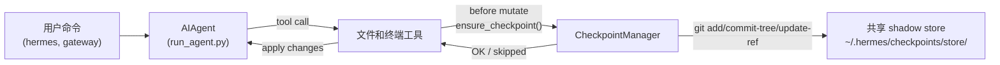

# 检查点和 `/rollback`

Hermes Agent 可以在**破坏性操作**之前自动快照项目，并可通过单个命令恢复。检查点是 v2 版本的**可选功能**——大多数用户从不使用 `/rollback`，且 shadow-store 存储随时间推移会变得相当大，因此默认关闭。

使用 `--checkpoints` 启用每个会话的检查点：

```bash
hermes chat --checkpoints
```

或在 `~/.hermes/config.yaml` 中全局启用：

```yaml
checkpoints:
  enabled: true
```

此安全网由内部**检查点管理器**驱动，该管理器在 `~/.hermes/checkpoints/store/` 下维护一个共享的 shadow git 仓库——您的真实项目 `.git` 不会被触碰。每个 agent 处理的项目共享同一个 store，因此 git 的内容寻址对象数据库可以跨项目和跨轮次进行去重。

## 什么会触发检查点

检查点会在以下操作之前自动创建：

- **文件工具** — `write_file` 和 `patch`
- **破坏性终端命令** — `rm`、`rmdir`、`cp`、`install`、`mv`、`sed -i`、`truncate`、`dd`、`shred`、输出重定向（`>`），以及 `git reset`/`clean`/`checkout`

Agent 每个目录每轮最多创建一个检查点，因此长时间运行的会话不会产生大量快照。

## 快速参考

会话内斜杠命令：

| 命令 | 描述 |
|---------|-------------|
| `/rollback` | 列出所有检查点及变更统计 |
| `/rollback <N>` | 恢复到检查点 N（也会撤销上一个聊天轮次） |
| `/rollback diff <N>` | 预览检查点 N 与当前状态之间的差异 |
| `/rollback <N> <file>` | 从检查点 N 恢复单个文件 |

用于在会话外检查和管理存储的 CLI：

| 命令 | 描述 |
|---------|-------------|
| `hermes checkpoints` | 显示总大小、项目数量、按项目细分 |
| `hermes checkpoints status` | 与裸 `checkpoints` 相同 |
| `hermes checkpoints list` | `status` 的别名 |
| `hermes checkpoints prune` | 强制清理：删除孤立/过期文件、GC、执行大小限制 |
| `hermes checkpoints clear` | 清空整个检查点库（先询问） |
| `hermes checkpoints clear-legacy` | 仅删除 v1 迁移中的 `legacy-*` 归档 |

## 检查点工作原理

高层概述：

- Hermes 检测到工具即将**修改**工作树中的文件。
- 每次对话轮次（每个目录），它会：
  - 解析文件的合理项目根目录。
  - 在 `~/.hermes/checkpoints/store/` 初始化或重用**单一共享 shadow store**。
  - 将更改暂存到每个项目的索引中，构建树，并提交到每个项目的 ref（`refs/hermes/<project-hash>`）。
- 这些每个项目的 ref 形成一个检查点历史，您可以通过 `/rollback` 检查和恢复。



## 配置

在 `~/.hermes/config.yaml` 中配置：

```yaml
checkpoints:
  enabled: false              # 主开关（默认：false — 可选开启）
  max_snapshots: 20           # 每个项目的最大检查点数（通过 ref 重写 + gc 执行）
  max_total_size_mb: 500      # 总存储大小的硬限制；最旧的提交会被丢弃
  max_file_size_mb: 10        # 跳过任何大于此值的单个文件

  # 自动维护（默认开启）：在启动时扫描 ~/.hermes/checkpoints/
  # 删除工作目录不再存在的项目条目（孤立项）
  # 或 last_touch 早于 retention_days 的条目。每次最多运行一次
  # min_interval_hours，通过 .last_prune 标记跟踪。
  auto_prune: true
  retention_days: 7
  delete_orphans: true
  min_interval_hours: 24
```

禁用所有功能：

```yaml
checkpoints:
  enabled: false
  auto_prune: false
```

当 `enabled: false` 时，检查点管理器是一个空操作，不会尝试 git 操作。当 `auto_prune: false` 时，存储会不断增长，直到您手动运行 `hermes checkpoints prune`。

## 列出检查点

从 CLI 会话中：

```
/rollback
```

Hermes 响应一个格式化的列表，显示变更统计：

```text
📸 检查点 /path/to/project:

  1. 4270a8c  2026-03-16 04:36  before patch  (1 file, +1/-0)
  2. eaf4c1f  2026-03-16 04:35  before write_file
  3. b3f9d2e  2026-03-16 04:34  before terminal: sed -i s/old/new/ config.py  (1 file, +1/-1)

  /rollback <N>             恢复到检查点 N
  /rollback diff <N>        预览自检查点 N 以来的变更
  /rollback <N> <file>      从检查点 N 恢复单个文件
```

## 从 Shell 检查存储

```bash
hermes checkpoints
```

示例输出：

```text
Checkpoint base: /home/you/.hermes/checkpoints
Total size:      142.3 MB
  store/         138.1 MB
  legacy-*       4.2 MB
Projects:        12

  WORKDIR                                                       COMMITS    LAST TOUCH  STATE
  /home/you/code/hermes-agent                                        20       2h ago  live
  /home/you/code/experiments/rl-runner                                8       1d ago  live
  /home/you/code/old-prototype                                        3       9d ago  orphan
  ...

Legacy archives (1):
  legacy-20260506-050616                           4.2 MB

Clear with: hermes checkpoints clear-legacy
```

强制完整清理（忽略 24h 幂等标记）：

```bash
hermes checkpoints prune --retention-days 3 --max-size-mb 200
```

## 使用 `/rollback diff` 预览变更

在提交恢复之前，预览自检查点以来发生了什么变化：

```
/rollback diff 1
```

这会显示一个 git diff stat 摘要，然后是实际的 diff。

## 使用 `/rollback` 恢复

```
/rollback 1
```

在后台，Hermes 会：

1. 验证目标提交存在于 shadow store 中。
2. 对当前状态进行**回滚前快照**，以便您之后可以"撤销撤销"。
3. 恢复工作目录中的跟踪文件。
4. **撤销上一个对话轮次**，使 agent 的上下文与恢复后的文件系统状态匹配。

## 单文件恢复

仅从检查点恢复一个文件，不影响目录的其余部分：

```
/rollback 1 src/broken_file.py
```

## 安全和性能保护

- **Git 可用性** — 如果在 `PATH` 中找不到 `git`，检查点会被透明禁用。
- **目录范围** — Hermes 会跳过过于宽泛的目录（根 `/`、主目录 `$HOME`）。
- **仓库大小** — 超过 50,000 个文件的目录会被跳过。
- **单文件大小限制** — 大于 `max_file_size_mb`（默认 10 MB）的文件会被排除在快照之外。防止意外吞噬数据集、模型权重或生成的媒体。
- **总存储大小限制** — 当存储超过 `max_total_size_mb`（默认 500 MB）时，会循环丢弃每个项目最旧的提交，直到低于限制。
- **真正的清理** — `max_snapshots` 通过重写每个项目的 ref 并随后运行 `git gc --prune=now` 来执行，因此不会积累松散对象。
- **无变更快照** — 如果自上次快照以来没有变更，则跳过检查点。
- **非致命错误** — 检查点管理器内的所有错误都以 debug 级别记录；您的工具继续运行。

## 检查点存储位置

```text
~/.hermes/checkpoints/
  ├── store/                 # 单一共享裸 git 仓库
  │   ├── HEAD, objects/     # git 内部（跨项目共享）
  │   ├── refs/hermes/<hash> # 每个项目的分支尖端
  │   ├── indexes/<hash>     # 每个项目的 git 索引
  │   ├── projects/<hash>.json  # workdir + created_at + last_touch
  │   └── info/exclude
  ├── .last_prune            # 自动清理幂等标记
  └── legacy-<ts>/           # v2 之前每个项目的 shadow 仓库归档
```

每个 `<hash>` 来自工作目录的绝对路径。您通常不需要手动接触这些——使用 `hermes checkpoints status` / `prune` / `clear` 代替。

### 从 v1 迁移

在 v2 重写之前，每个工作目录在其 `~/.hermes/checkpoints/<hash>/` 下都有自己的完整 shadow git 仓库。该布局无法跨项目去重对象，并且有一个记录在案的无操作修剪器——存储会无限增长。

在首次 v2 运行时，任何 v2 前的 shadow 仓库都会被移动到 `~/.hermes/checkpoints/legacy-<timestamp>/`，以便新的单一存储布局从干净状态开始。旧的 `/rollback` 历史仍然可以通过手动检查 legacy 归档来访问；一旦您确信不需要它，请运行：

```bash
hermes checkpoints clear-legacy
```

以回收空间。Legacy 归档也会在 `retention_days` 后被 `auto_prune` 清理。

## 最佳实践

- **仅在需要时启用检查点** — `hermes chat --checkpoints` 或按配置文件 `enabled: true`。
- **恢复前使用 `/rollback diff`** — 预览将要发生的变化以选择正确的检查点。
- **使用 `/rollback` 而不是 `git reset`** 当您只想撤销 agent 驱动的更改时。
- **定期检查 `hermes checkpoints status`** 如果您定期使用检查点——显示哪些项目处于活跃状态以及存储消耗了多少空间。
- **与 Git worktree 结合使用** 以获得最大安全性——在每个 Hermes 会话中使用自己的 worktree/分支，检查点作为额外的保护层。

有关在同一个仓库上并行运行多个 agent，请参阅 [Git worktrees](./git-worktrees.md) 指南。
