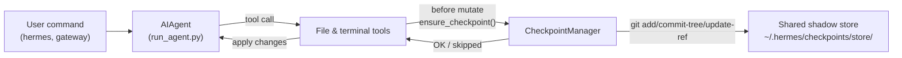

# Checkpoints 和 `/rollback`

Hermes Agent 可以在**破坏性操作**之前自动为你的项目创建快照，并用一条命令恢复它。Checkpoints 从 v2 开始是**默认关闭**的 - 大多数用户并不会使用 `/rollback`，而且 shadow-store 会随着时间占用不少存储空间，因此默认值是关闭。

你可以在当前会话中通过 `--checkpoints` 开启：

```bash
hermes chat --checkpoints
```

也可以在 `~/.hermes/config.yaml` 中全局开启：

```yaml
checkpoints:
  enabled: true
```

这套安全网由内部的 **Checkpoint Manager** 驱动，它会在 `~/.hermes/checkpoints/store/` 下维护一个共享的 shadow git 仓库 - 你的真实项目 `.git` 不会被碰到。所有 agent 处理的项目都共享同一个 store，因此 git 的 content-addressable object DB 可以跨项目、跨轮次去重。

## 什么操作会触发 checkpoint

在以下操作之前会自动创建 checkpoint：

- **文件工具** - `write_file` 和 `patch`
- **破坏性终端命令** - `rm`、`rmdir`、`cp`、`install`、`mv`、`sed -i`、`truncate`、`dd`、`shred`、输出重定向（`>`），以及 `git reset` / `clean` / `checkout`

agent 每个目录、每轮次最多只会创建**一个** checkpoint，因此长会话不会把快照刷爆。

## 快速参考

会话内斜杠命令：

| 命令 | 说明 |
|---------|-------------|
| `/rollback` | 列出所有 checkpoint，并显示变更统计 |
| `/rollback <N>` | 恢复到 checkpoint N（也会撤销上一轮聊天） |
| `/rollback diff <N>` | 预览 checkpoint N 与当前状态之间的 diff |
| `/rollback <N> <file>` | 仅从 checkpoint N 中恢复单个文件 |

会话外查看和管理 store 的 CLI 命令：

| 命令 | 说明 |
|---------|-------------|
| `hermes checkpoints` | 显示总大小、项目数量、按项目拆分的详情 |
| `hermes checkpoints status` | 与裸 `checkpoints` 相同 |
| `hermes checkpoints list` | `status` 的别名 |
| `hermes checkpoints prune` | 强制清理：删除孤儿 / 过旧项目、执行 GC、强制大小上限 |
| `hermes checkpoints clear` | 清空整个 checkpoint 基础目录（会先询问） |
| `hermes checkpoints clear-legacy` | 仅删除 v1 迁移遗留的 `legacy-*` 归档 |

## Checkpoint 的工作方式

高层流程如下：

- Hermes 检测到工具即将修改你的工作区文件。
- 每个对话轮次、每个目录最多一次，它会：
  - 为该文件解析一个合理的项目根目录。
  - 初始化或复用位于 `~/.hermes/checkpoints/store/` 的**单一共享 shadow store**。
  - 把内容暂存到每个项目自己的 index，构建 tree，并提交到该项目自己的 ref（`refs/hermes/<project-hash>`）。
- 这些 per-project ref 会形成一条 checkpoint 历史，你可以通过 `/rollback` 查看和恢复。



## 配置

在 `~/.hermes/config.yaml` 中配置：

```yaml
checkpoints:
  enabled: false              # 总开关（默认 false - 需要显式开启）
  max_snapshots: 20           # 每个项目最多保留的 checkpoint 数量（通过 ref 重写 + gc 强制执行）
  max_total_size_mb: 500      # store 总大小硬上限；会优先丢弃最旧的 commit
  max_file_size_mb: 10        # 跳过任何单个大于此大小的文件

  # 自动维护（默认开启）：启动时扫一遍 ~/.hermes/checkpoints/
  # 并删除工作目录已不存在的项目条目（孤儿）
  # 或 last_touch 超过 retention_days 的条目。
  # 最多每 min_interval_hours 运行一次，由 .last_prune 标记记录。
  auto_prune: true
  retention_days: 7
  delete_orphans: true
  min_interval_hours: 24
```

如果要彻底关闭：

```yaml
checkpoints:
  enabled: false
  auto_prune: false
```

当 `enabled: false` 时，Checkpoint Manager 会完全变成 no-op，不会尝试任何 git 操作。当 `auto_prune: false` 时，store 会一直增长，直到你手动运行 `hermes checkpoints prune`。

## 列出 checkpoints

在 CLI 会话里：

```
/rollback
```

Hermes 会返回一个格式化列表，并显示变更统计：

```text
📸 Checkpoints for /path/to/project:

  1. 4270a8c  2026-03-16 04:36  before patch  (1 file, +1/-0)
  2. eaf4c1f  2026-03-16 04:35  before write_file
  3. b3f9d2e  2026-03-16 04:34  before terminal: sed -i s/old/new/ config.py  (1 file, +1/-1)

  /rollback <N>             restore to checkpoint N
  /rollback diff <N>        preview changes since checkpoint N
  /rollback <N> <file>      restore a single file from checkpoint N
```

## 从 shell 检查 store

```bash
hermes checkpoints
```

示例输出：

```text
Checkpoint base: /home/you/.hermes/checkpoints
Total size:      142.3 MB
  store/         138.1 MB
  legacy-*       4.2 MB
Projects:        12

  WORKDIR                                                       COMMITS    LAST TOUCH  STATE
  /home/you/code/hermes-agent                                        20       2h ago  live
  /home/you/code/experiments/rl-runner                                8       1d ago  live
  /home/you/code/old-prototype                                        3       9d ago  orphan
  ...

Legacy archives (1):
  legacy-20260506-050616                           4.2 MB

Clear with: hermes checkpoints clear-legacy
```

如果你想强制完整扫描（忽略 24h 幂等标记）：

```bash
hermes checkpoints prune --retention-days 3 --max-size-mb 200
```

## 使用 `/rollback diff` 预览变化

在执行恢复前，你可以先预览自某个 checkpoint 之后发生了什么变化：

```
/rollback diff 1
```

这会显示 git diff stat 摘要，然后显示实际 diff。

## 使用 `/rollback` 恢复

```
/rollback 1
```

底层会发生以下事情：

1. 验证目标 commit 是否存在于 shadow store 中。
2. 为当前状态创建一个**恢复前快照**，这样以后还能“撤销这次撤销”。
3. 恢复工作目录中的受跟踪文件。
4. **撤销上一轮对话**，让 agent 的上下文和恢复后的文件系统状态保持一致。

## 单文件恢复

只从某个 checkpoint 恢复一个文件，而不影响整个目录：

```
/rollback 1 src/broken_file.py
```

## 安全与性能保护

- **Git 可用性** - 如果 `PATH` 上找不到 `git`，checkpoint 会自动禁用。
- **目录范围** - Hermes 会跳过过于宽泛的目录（根目录 `/`、home 目录 `$HOME`）。
- **仓库大小** - 超过 50,000 个文件的目录会被跳过。
- **单文件大小上限** - 大于 `max_file_size_mb`（默认 10 MB）的文件会被排除在快照之外。这样可以避免误把数据集、模型权重或生成媒体吞进去。
- **总 store 大小上限** - 当 store 超过 `max_total_size_mb`（默认 500 MB）时，会轮流删除每个项目最旧的 commit，直到低于上限。
- **真正清理** - `max_snapshots` 会通过重写 per-project ref 并随后运行 `git gc --prune=now` 来强制执行，因此不会积累 loose object。
- **无变化快照** - 如果和上一次快照相比没有变化，就会跳过 checkpoint。
- **非致命错误** - Checkpoint Manager 内部的所有错误都会以 debug 级别记录；你的工具仍然会继续运行。

## checkpoint 存放在哪里

```text
~/.hermes/checkpoints/
  ├── store/                 # 单一共享的 bare git repo
  │   ├── HEAD, objects/     # git 内部结构（跨项目共享）
  │   ├── refs/hermes/<hash> # 每个项目自己的分支 tip
  │   ├── indexes/<hash>     # 每个项目自己的 git index
  │   ├── projects/<hash>.json  # workdir + created_at + last_touch
  │   └── info/exclude
  ├── .last_prune            # 自动清理幂等标记
  └── legacy-<ts>/           # 迁移前 v2 的 per-project shadow repo 归档
```

每个 `<hash>` 都由工作目录的绝对路径派生。通常你不需要手动操作这些内容 - 直接用 `hermes checkpoints status` / `prune` / `clear` 即可。

### 从 v1 迁移

在 v2 重写之前，每个工作目录都会在 `~/.hermes/checkpoints/<hash>/` 下拥有自己的完整 shadow git repo。那种布局无法跨项目去重，而且有一个文档上写明的无效 pruner - store 会无限增长。

首次运行 v2 时，任何 pre-v2 的 shadow repo 都会被移动到 `~/.hermes/checkpoints/legacy-<timestamp>/`，这样新的单 store 布局就能从干净状态开始。旧的 `/rollback` 历史仍然可以通过手动用 `git` 检查 legacy 归档访问；如果你确认不再需要它们，可以运行：

```bash
hermes checkpoints clear-legacy
```

来回收空间。`auto_prune` 也会在 `retention_days` 之后清理这些 legacy 归档。

## 最佳实践

- **只在需要时开启 checkpoints** - `hermes chat --checkpoints` 或按配置文件开启 `enabled: true`。
- **恢复前先用 `/rollback diff`** - 预览会发生什么，方便选对 checkpoint。
- **想撤销 agent 造成的改动时，用 `/rollback`，不要直接 `git reset`**。
- **如果经常使用 checkpoints，偶尔检查一下 `hermes checkpoints status`** - 可以看到哪些项目是活跃的，以及 store 的成本。
- **和 Git worktrees 结合使用，安全性最高** - 每个 Hermes 会话放到自己的 worktree / branch 里，再配合 checkpoints 作为额外保护层。

如果你想在同一个仓库里并行跑多个 agent，请看 [Git worktrees](./git-worktrees.md) 这篇指南。