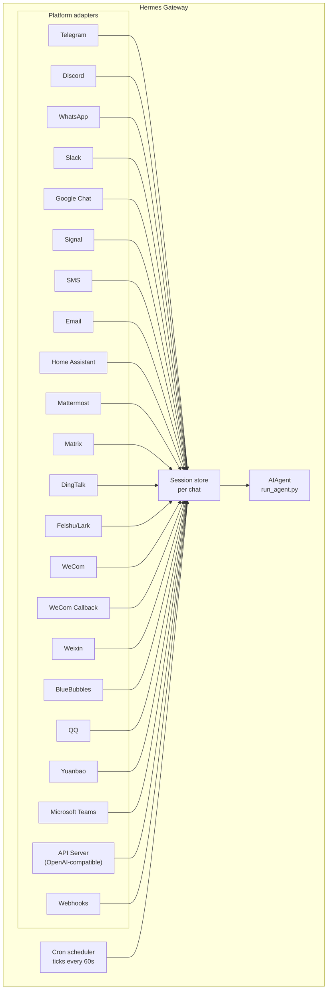

# 消息网关

你可以从 Telegram、Discord、Slack、WhatsApp、Signal、短信、Email、Home Assistant、Mattermost、Matrix、钉钉、飞书/Lark、企业微信、微信、BlueBubbles（iMessage）、QQ、元宝、Microsoft Teams、LINE，或浏览器与 Hermes 对话。网关是一个统一的后台进程，会连接你已配置的平台、管理会话、运行定时任务，并发送语音消息。

完整语音能力（包括 CLI 麦克风模式、消息平台语音回复、以及 Discord 语音频道对话）请参见 [语音模式](/user-guide/features/voice-mode) 和 [在 Hermes 中使用语音模式](/guides/use-voice-mode-with-hermes)。

## 平台能力对比

| 平台 | 语音 | 图片 | 文件 | 线程 | 表情反应 | 输入中提示 | 流式输出 |
|----------|:-----:|:------:|:-----:|:-------:|:---------:|:------:|:---------:|
| Telegram | ✅ | ✅ | ✅ | ✅ | — | ✅ | ✅ |
| Discord | ✅ | ✅ | ✅ | ✅ | ✅ | ✅ | ✅ |
| Slack | ✅ | ✅ | ✅ | ✅ | ✅ | ✅ | ✅ |
| Google Chat | — | ✅ | ✅ | ✅ | — | ✅ | — |
| WhatsApp | — | ✅ | ✅ | — | — | ✅ | ✅ |
| Signal | — | ✅ | ✅ | — | — | ✅ | ✅ |
| SMS | — | — | — | — | — | — | — |
| Email | — | ✅ | ✅ | ✅ | — | — | — |
| Home Assistant | — | — | — | — | — | — | — |
| Mattermost | ✅ | ✅ | ✅ | ✅ | — | ✅ | ✅ |
| Matrix | ✅ | ✅ | ✅ | ✅ | ✅ | ✅ | ✅ |
| DingTalk | — | ✅ | ✅ | — | ✅ | — | ✅ |
| Feishu/Lark | ✅ | ✅ | ✅ | ✅ | ✅ | ✅ | ✅ |
| WeCom | ✅ | ✅ | ✅ | — | — | ✅ | ✅ |
| WeCom Callback | — | — | — | — | — | — | — |
| Weixin | ✅ | ✅ | ✅ | — | — | ✅ | ✅ |
| BlueBubbles | — | ✅ | ✅ | — | ✅ | ✅ | — |
| QQ | ✅ | ✅ | ✅ | — | — | ✅ | — |
| Yuanbao | ✅ | ✅ | ✅ | — | — | ✅ | ✅ |
| Microsoft Teams | — | ✅ | — | ✅ | — | ✅ | — |
| LINE | — | ✅ | ✅ | — | — | ✅ | — |

**语音** = TTS 音频回复和/或语音消息转写。**图片** = 发送/接收图片。**文件** = 发送/接收附件。**线程** = 线程式会话。**表情反应** = 消息表情反馈。**输入中提示** = 处理中显示 typing。**流式输出** = 通过编辑消息逐步更新回复。

## 架构



每个平台适配器会接收消息，按聊天维度路由到会话存储，再分发给 AIAgent 处理。网关还会运行定时任务调度器，每 60 秒 tick 一次并执行到期任务。

## 快速配置

配置消息平台最简单的方式是使用交互式向导：

```bash
hermes gateway setup        # 交互式配置所有消息平台
```

它会引导你逐个平台配置，支持方向键选择、显示哪些平台已配置，并在完成后提示你启动/重启网关。

## 网关命令

```bash
hermes gateway              # 前台运行
hermes gateway setup        # 交互式配置消息平台
hermes gateway install      # 安装为用户服务（Linux）/ launchd 服务（macOS）
sudo hermes gateway install --system   # 仅 Linux：安装为开机系统服务
hermes gateway start        # 启动默认服务
hermes gateway stop         # 停止默认服务
hermes gateway status       # 查看默认服务状态
hermes gateway status --system         # 仅 Linux：显式查看系统服务状态
```

## 聊天命令（在消息平台内）

| 命令 | 说明 |
|---------|-------------|
| `/new` 或 `/reset` | 开始全新会话 |
| `/model [provider:model]` | 查看或切换模型（支持 `provider:model` 语法） |
| `/personality [name]` | 设置人格 |
| `/retry` | 重试上一条消息 |
| `/undo` | 移除上一轮问答 |
| `/status` | 显示会话信息 |
| `/whoami` | 显示你在当前作用域的斜杠命令权限（admin / user / unrestricted） |
| `/stop` | 停止正在运行的智能体 |
| `/approve` | 批准待处理的危险命令 |
| `/deny` | 拒绝待处理的危险命令 |
| `/sethome` | 将当前聊天设为 Home 频道 |
| `/compress` | 手动压缩会话上下文 |
| `/title [name]` | 设置或查看会话标题 |
| `/resume [name]` | 恢复之前命名的会话 |
| `/usage` | 显示当前会话 token 用量 |
| `/insights [days]` | 显示使用洞察与分析 |
| `/reasoning [level\|show\|hide]` | 调整推理强度或切换推理显示 |
| `/voice [on\|off\|tts\|join\|leave\|status]` | 控制消息平台语音回复与 Discord 语音频道行为 |
| `/rollback [number]` | 列出或恢复文件系统检查点 |
| `/background <prompt>` | 在独立后台会话中运行提示词 |
| `/reload-mcp` | 从配置重新加载 MCP 服务器 |
| `/update` | 将 Hermes Agent 更新到最新版 |
| `/help` | 显示可用命令 |
| `/<skill-name>` | 调用任意已安装技能 |

## 会话管理

### 会话持久化

会话会在消息之间持续存在，直到被重置。智能体会记住你的对话上下文。

### 重置策略

会话可按可配置策略重置：

| 策略 | 默认值 | 说明 |
|--------|---------|-------------|
| Daily | 4:00 AM | 每天在指定时刻重置 |
| Idle | 1440 min | 空闲 N 分钟后重置 |
| Both | （组合） | 先触发哪个就按哪个执行 |

可在 `~/.hermes/gateway.json` 中配置平台级覆盖：

```json
{
  "reset_by_platform": {
    "telegram": { "mode": "idle", "idle_minutes": 240 },
    "discord": { "mode": "idle", "idle_minutes": 60 }
  }
}
```

## 安全

**默认情况下，网关会拒绝所有不在白名单内或未通过私信配对的用户。** 对具有终端访问能力的机器人来说，这是更安全的默认值。

```bash
# 限制为指定用户（推荐）：
TELEGRAM_ALLOWED_USERS=123456789,987654321
DISCORD_ALLOWED_USERS=123456789012345678
SIGNAL_ALLOWED_USERS=+155****4567,+155****6543
SMS_ALLOWED_USERS=+155****4567,+155****6543
EMAIL_ALLOWED_USERS=trusted@example.com,colleague@work.com
MATTERMOST_ALLOWED_USERS=3uo8dkh1p7g1mfk49ear5fzs5c
MATRIX_ALLOWED_USERS=@alice:matrix.org
DINGTALK_ALLOWED_USERS=user-id-1
FEISHU_ALLOWED_USERS=ou_xxxxxxxx,ou_yyyyyyyy
WECOM_ALLOWED_USERS=user-id-1,user-id-2
WECOM_CALLBACK_ALLOWED_USERS=user-id-1,user-id-2
TEAMS_ALLOWED_USERS=aad-object-id-1,aad-object-id-2

# 或统一允许
GATEWAY_ALLOWED_USERS=123456789,987654321

# 或显式允许所有用户（不推荐用于具备终端访问能力的机器人）：
GATEWAY_ALLOW_ALL_USERS=true
```

### DM 配对（白名单替代方案）

不想手动配置用户 ID 时，未知用户给机器人发私信会收到一次性配对码：

```bash
# 用户会看到："Pairing code: XKGH5N7P"
# 你可这样批准：
hermes pairing approve telegram XKGH5N7P

# 其他配对命令：
hermes pairing list          # 查看待批准 + 已批准用户
hermes pairing revoke telegram 123456789  # 移除访问权限
```

配对码 1 小时后过期，带频率限制，并使用密码学随机数生成。

### 斜杠命令访问控制

用户获准接入后，你可以再划分为 **管理员**（可执行全部斜杠命令）与 **普通用户**（仅可执行你显式放行的命令）。该机制按平台、按作用域（私聊 vs 群组/频道）生效，并基于实时命令注册表，因此既覆盖内置命令，也覆盖插件注册命令，无需逐功能接线。

```yaml
gateway:
  platforms:
    discord:
      extra:
        allow_from: ["111", "222", "333"]
        allow_admin_from: ["111"]                    # 管理员 -> 全部斜杠命令
        user_allowed_commands: [status, model]       # 普通用户可执行
        # 可选：单独配置群组/频道作用域
        group_allow_admin_from: ["111"]
        group_user_allowed_commands: [status]
```

行为规则：

- 在某作用域中位于 `allow_admin_from` 的用户可执行**所有**已注册斜杠命令。
- 位于 `allow_from` 但不在 `allow_admin_from` 的用户，只能执行 `user_allowed_commands` 中的命令，以及始终允许的 `/help` 与 `/whoami`。
- 普通聊天不受影响。非管理员仍可正常与智能体对话，只是不能触发任意命令。
- **向后兼容：** 若某作用域未设置 `allow_admin_from`，该作用域不启用斜杠命令分级。现有部署无需修改即可保持原行为。
- 私聊管理员身份不自动继承到群组/频道。每个作用域都有独立管理员列表。

你可以在任意平台执行 `/whoami`，查看当前作用域、你的级别（admin / user / unrestricted）以及可执行命令列表。平台示例见 [Telegram](/user-guide/messaging/telegram#slash-command-access-control) 与 [Discord](/user-guide/messaging/discord#slash-command-access-control) 页面。

## 中断智能体

当智能体正在处理时，发送任意消息即可中断。关键行为如下：

- **正在执行的终端命令会立即终止**（先 SIGTERM，1 秒后 SIGKILL）
- **工具调用会被取消**——只保留当前正在执行的调用，其余跳过
- **多条消息会合并**——中断期间收到的消息会拼接成一条新提示词
- **`/stop` 命令**——只中断，不追加后续消息

### queue / interrupt / steer（忙碌输入模式）

默认情况下，智能体忙碌时发消息会触发中断。另有两种模式：

- `queue` —— 后续消息排队，当前任务结束后作为下一轮执行。
- `steer` —— 后续消息通过 `/steer` 注入当前执行流程，在下一次工具调用后送达智能体。不触发中断，也不新开一轮。如果智能体尚未启动，则回退为 `queue` 行为。

```yaml
display:
  busy_input_mode: steer   # 或 queue，或 interrupt（默认）
  busy_ack_enabled: true   # 设为 false 可完全关闭 ⚡/⏳/⏩ 忙碌回复提示
```

你在任一平台首次给忙碌中的智能体发消息时，Hermes 会在忙碌回执后附加一行提示（`"💡 First-time tip — …"`），说明该配置项。这个提示每次安装只出现一次，由 `onboarding.seen.busy_input_prompt` 标记控制。删除该键可再次显示提示。

如果你觉得忙碌回执太吵（尤其在语音输入或高频消息场景），可设置 `display.busy_ack_enabled: false`。你的输入仍会照常排队/转向/中断，仅不再发送聊天回执。

## 工具进度通知

在 `~/.hermes/config.yaml` 中控制工具活动展示程度：

```yaml
display:
  tool_progress: all    # off | new | all | verbose
  tool_progress_command: false  # 设为 true 可在消息平台启用 /verbose
```

启用后，机器人会在处理过程中发送状态消息：

```text
💻 `ls -la`...
🔍 web_search...
📄 web_extract...
🐍 execute_code...
```

## 后台会话

你可以在独立后台会话中运行提示词，让智能体异步处理，同时主聊天保持可用：

```
/background Check all servers in the cluster and report any that are down
```

Hermes 会立即确认：

```
🔄 Background task started: "Check all servers in the cluster..."
   Task ID: bg_143022_a1b2c3
```

### 工作原理

每条 `/background` 提示都会启动一个**独立的智能体实例**并异步运行：

- **会话隔离** —— 后台智能体有独立会话和独立历史，不知道你当前聊天上下文，只接收你提供的提示词。
- **配置一致** —— 继承当前网关配置的模型、提供商、工具集、推理设置与提供商路由。
- **非阻塞** —— 主聊天保持完全交互。你可以继续发消息、执行其他命令，或再开更多后台任务。
- **结果投递** —— 任务结束后，结果会回发到你发起命令的**同一聊天或频道**，前缀为“✅ Background task complete”。失败时会显示“❌ Background task failed”并附带错误信息。

### 后台进程通知

当后台会话里的智能体用 `terminal(background=true)` 启动长任务（服务、构建等）时，网关可以将进度推送到聊天。通过 `~/.hermes/config.yaml` 的 `display.background_process_notifications` 控制：

```yaml
display:
  background_process_notifications: all    # all | result | error | off
```

| 模式 | 你会收到什么 |
|------|-----------------|
| `all` | 运行中输出更新 **+** 最终完成消息（默认） |
| `result` | 仅最终完成消息（不区分退出码） |
| `error` | 仅退出码非零时发送最终消息 |
| `off` | 完全关闭进程观察通知 |

也可通过环境变量设置：

```bash
HERMES_BACKGROUND_NOTIFICATIONS=result
```

### 典型场景

- **服务巡检** —— “/background 检查所有服务健康状况，有故障就提醒我”
- **长时间构建** —— “/background 构建并部署 staging 环境”，你可继续聊天
- **研究任务** —— “/background 调研竞品定价并汇总成表格”
- **文件整理** —— “/background 按日期把 ~/Downloads 里的照片分类到文件夹”

:::tip
消息平台中的后台任务是 fire-and-forget：你无需等待或手动轮询，任务结束后结果会自动回到同一聊天。
:::

## 服务管理

### Linux（systemd）

```bash
hermes gateway install               # 安装为用户服务
hermes gateway start                 # 启动服务
hermes gateway stop                  # 停止服务
hermes gateway status                # 查看状态
journalctl --user -u hermes-gateway -f  # 查看日志

# 启用 lingering（登出后仍继续运行）
sudo loginctl enable-linger $USER

# 或安装为开机系统服务，但仍以当前用户身份运行
sudo hermes gateway install --system
sudo hermes gateway start --system
sudo hermes gateway status --system
journalctl -u hermes-gateway -f
```

笔记本和开发机建议用用户服务；VPS 或无头主机建议用系统服务，这样重启后可自动恢复，不依赖 systemd linger。

除非你明确需要，否则不要同时保留用户服务和系统服务。Hermes 检测到两者并存时会警告，因为 start/stop/status 的行为会变得含糊。

:::info 多安装实例
若同一台机器上运行了多个 Hermes 安装（不同 `HERMES_HOME`），每个安装会有独立 systemd 服务名。默认 `~/.hermes` 使用 `hermes-gateway`，其他安装使用 `hermes-gateway-<hash>`。`hermes gateway` 命令会自动针对当前 `HERMES_HOME` 对应的服务。
:::

### macOS（launchd）

```bash
hermes gateway install               # 安装为 launchd agent
hermes gateway start                 # 启动服务
hermes gateway stop                  # 停止服务
hermes gateway status                # 查看状态
tail -f ~/.hermes/logs/gateway.log   # 查看日志
```

生成的 plist 位于 `~/Library/LaunchAgents/ai.hermes.gateway.plist`。它包含三个环境变量：

- **PATH** —— 安装时捕获的完整 shell PATH，并在前面追加 venv `bin/` 与 `node_modules/.bin`。这样网关子进程（如 WhatsApp bridge）也能使用你安装的工具（Node.js、ffmpeg 等）。
- **VIRTUAL_ENV** —— 指向 Python 虚拟环境，确保工具能正确解析依赖包。
- **HERMES_HOME** —— 将网关作用域绑定到当前 Hermes 安装。

:::tip 安装后 PATH 变更
launchd plist 是静态的——如果你在配置网关后又安装了新工具（例如通过 nvm 安装新 Node.js，或通过 Homebrew 安装 ffmpeg），请重新执行 `hermes gateway install` 以写入最新 PATH。网关会检测到旧 plist 并自动重载。
:::

:::info 多安装实例
与 Linux systemd 一样，每个 `HERMES_HOME` 目录会有独立 launchd label。默认 `~/.hermes` 使用 `ai.hermes.gateway`，其他安装使用 `ai.hermes.gateway-<suffix>`。
:::

## 平台专属工具集

每个平台都有各自的工具集：

| 平台 | 工具集 | 能力 |
|----------|---------|--------------|
| CLI | `hermes-cli` | 全量能力 |
| Telegram | `hermes-telegram` | 全量工具（含终端） |
| Discord | `hermes-discord` | 全量工具（含终端） |
| WhatsApp | `hermes-whatsapp` | 全量工具（含终端） |
| Slack | `hermes-slack` | 全量工具（含终端） |
| Google Chat | `hermes-google_chat` | 全量工具（含终端） |
| Signal | `hermes-signal` | 全量工具（含终端） |
| SMS | `hermes-sms` | 全量工具（含终端） |
| Email | `hermes-email` | 全量工具（含终端） |
| Home Assistant | `hermes-homeassistant` | 全量工具 + HA 设备控制（ha_list_entities、ha_get_state、ha_call_service、ha_list_services） |
| Mattermost | `hermes-mattermost` | 全量工具（含终端） |
| Matrix | `hermes-matrix` | 全量工具（含终端） |
| DingTalk | `hermes-dingtalk` | 全量工具（含终端） |
| Feishu/Lark | `hermes-feishu` | 全量工具（含终端） |
| WeCom | `hermes-wecom` | 全量工具（含终端） |
| WeCom Callback | `hermes-wecom-callback` | 全量工具（含终端） |
| Weixin | `hermes-weixin` | 全量工具（含终端） |
| BlueBubbles | `hermes-bluebubbles` | 全量工具（含终端） |
| QQBot | `hermes-qqbot` | 全量工具（含终端） |
| Yuanbao | `hermes-yuanbao` | 全量工具（含终端） |
| Microsoft Teams | `hermes-teams` | 全量工具（含终端） |
| API Server | `hermes-api-server` | 全量工具（移除 `clarify`、`send_message`、`text_to_speech` —— 程序化接入没有交互用户） |
| Webhooks | `hermes-webhook` | 全量工具（含终端） |

## 下一步

- [Telegram 配置](/user-guide/messaging/telegram)
- [Discord 配置](/user-guide/messaging/discord)
- [Slack 配置](/user-guide/messaging/slack)
- [Google Chat 配置](/user-guide/messaging/google_chat)
- [WhatsApp 配置](/user-guide/messaging/whatsapp)
- [Signal 配置](/user-guide/messaging/signal)
- [短信（Twilio）配置](/user-guide/messaging/sms)
- [Email 配置](/user-guide/messaging/email)
- [Home Assistant 集成](/user-guide/messaging/homeassistant)
- [Mattermost 配置](/user-guide/messaging/mattermost)
- [Matrix 配置](/user-guide/messaging/matrix)
- [钉钉配置](/user-guide/messaging/dingtalk)
- [飞书/Lark 配置](/user-guide/messaging/feishu)
- [企业微信配置](/user-guide/messaging/wecom)
- [企业微信回调配置](/user-guide/messaging/wecom-callback)
- [微信配置（WeChat）](/user-guide/messaging/weixin)
- [BlueBubbles 配置（iMessage）](/user-guide/messaging/bluebubbles)
- [QQBot 配置](/user-guide/messaging/qqbot)
- [元宝配置](/user-guide/messaging/yuanbao)
- [Microsoft Teams 配置](/user-guide/messaging/teams)
- [Teams 会议流水线](/user-guide/messaging/teams-meetings)
- [Open WebUI + API Server](/user-guide/messaging/open-webui)
- [Webhooks](/user-guide/messaging/webhooks)
