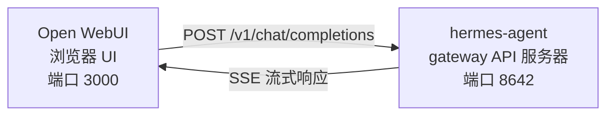

# Open WebUI 集成

[Open WebUI](https://github.com/open-webui/open-webui)（126k★）是 AI 最受欢迎的自托管聊天界面。借助 Hermes Agent 内置的 API 服务器，你可以将 Open WebUI 作为 agent 的精美 Web 前端 —— 包含完整的对话管理、用户账号和现代聊天界面。

## 架构



Open WebUI 像连接 OpenAI 一样连接到 Hermes Agent 的 API 服务器。Hermes 使用其完整的工具集处理请求 —— 终端、文件操作、网络搜索、记忆、技能 —— 并返回最终响应。

:::important 运行时位置
API 服务器是 **Hermes agent 运行时**，不是纯 LLM 代理。对于每个请求，Hermes 在 API 服务器主机上创建一个服务器端 `AIAgent`。工具调用在 API 服务器运行的地方执行。

例如，如果笔记本电脑将 Open WebUI 或其他 OpenAI 兼容客户端指向远程机器上的 Hermes API 服务器，`pwd`、文件工具、浏览器工具、本地 MCP 工具和其他工作区工具会在远程 API 服务器主机上运行，而不是在笔记本电脑上。
:::

Open WebUI 与 Hermes 服务器间对话，因此你不需要 `API_SERVER_CORS_ORIGINS` 用于此集成。

## 快速设置

### 一个命令本地引导（macOS/Linux，无 Docker）

如果你想在本地将 Hermes + Open WebUI 连接在一起并使用可重用的启动器，运行：

```bash
cd ~/.hermes/hermes-agent
bash scripts/setup_open_webui.sh
```

脚本的作用：

- 确保 `~/.hermes/.env` 包含 `API_SERVER_ENABLED`、`API_SERVER_HOST`、`API_SERVER_KEY`、`API_SERVER_PORT` 和 `API_SERVER_MODEL_NAME`
- 重启 Hermes gateway 以便 API 服务器启动
- 将 Open WebUI 安装到 `~/.local/open-webui-venv`
- 在 `~/.local/bin/start-open-webui-hermes.sh` 写入一个启动器
- 在 macOS 上，安装一个 `launchd` 用户服务；在带有 `systemd --user` 的 Linux 上，安装一个用户服务

默认值：

- Hermes API：`http://127.0.0.1:8642/v1`
- Open WebUI：`http://127.0.0.1:8080`
- 向 Open WebUI 公布的模型名称：`Hermes Agent`

有用的覆盖：

```bash
OPEN_WEBUI_NAME='My Hermes UI' \
OPEN_WEBUI_ENABLE_SIGNUP=true \
HERMES_API_MODEL_NAME='My Hermes Agent' \
bash scripts/setup_open_webui.sh
```

在 Linux 上，自动后台服务设置需要一个工作的 `systemd --user` 会话。如果你在无头 SSH 机器上并想跳过服务安装，运行：

```bash
OPEN_WEBUI_ENABLE_SERVICE=false bash scripts/setup_open_webui.sh
```

### 1. 启用 API 服务器

```bash
hermes config set API_SERVER_ENABLED true
hermes config set API_SERVER_KEY your-secret-key
```

`hermes config set` 自动将标志路由到 `config.yaml` 并将密钥路由到 `~/.hermes/.env`。如果 gateway 已经在运行，重启它以使更改生效：

```bash
hermes gateway stop && hermes gateway
```

### 2. 启动 Hermes Agent gateway

```bash
hermes gateway
```

你应该看到：

```
[API Server] API server listening on http://127.0.0.1:8642
```

### 3. 验证 API 服务器可达

```bash
curl -s http://127.0.0.1:8642/health
# {"status": "ok", ...}

curl -s -H "Authorization: Bearer your-secret-key" http://127.0.0.1:8642/v1/models
# {"object":"list","data":[{"id":"hermes-agent", ...}]}
```

如果 `/health` 失败，gateway 未获取 `API_SERVER_ENABLED=true` —— 重启它。如果 `/v1/models` 返回 `401`，你的 `Authorization` 标头与 `API_SERVER_KEY` 不匹配。

### 4. 启动 Open WebUI

```bash
docker run -d -p 3000:8080 \
  -e OPENAI_API_BASE_URL=http://host.docker.internal:8642/v1 \
  -e OPENAI_API_KEY=your-secret-key \
  -e ENABLE_OLLAMA_API=false \
  --add-host=host.docker.internal:host-gateway \
  -v open-webui:/app/backend/data \
  --name open-webui \
  --restart always \
  ghcr.io/open-webui/open-webui:main
```

`ENABLE_OLLAMA_API=false` 抑制默认的 Ollama 后端，否则它会显示为空并弄乱模型选择器。如果你实际同时运行 Ollama，则省略它。

首次启动需要 15-30 秒：Open WebUI 首次启动时会下载句子转换器嵌入模型（~150MB）。在打开 UI 之前等待 `docker logs open-webui` 稳定。

### 5. 打开 UI

转到 **http://localhost:3000**。创建你的管理员账号（第一个用户成为管理员）。你应该在模型下拉菜单中看到你的 agent（以你的 profile 命名，或默认 profile 的 **hermes-agent**）。开始聊天！

## Docker Compose 设置

为了更永久的设置，创建一个 `docker-compose.yml`：

```yaml
services:
  open-webui:
    image: ghcr.io/open-webui/open-webui:main
    ports:
      - "3000:8080"
    volumes:
      - open-webui:/app/backend/data
    environment:
      - OPENAI_API_BASE_URL=http://host.docker.internal:8642/v1
      - OPENAI_API_KEY=your-secret-key
      - ENABLE_OLLAMA_API=false
    extra_hosts:
      - "host.docker.internal:host-gateway"
    restart: always

volumes:
  open-webui:
```

然后：

```bash
docker compose up -d
```

## 通过管理 UI 配置

如果你希望通过 UI 而不是环境变量配置连接：

1. 在 **http://localhost:3000** 登录 Open WebUI
2. 点击你的**个人头像** → **Admin Settings**
3. 转到 **Connections**
4. 在 **OpenAI API** 下，点击**扳手图标**（Manage）
5. 点击 **+ Add New Connection**
6. 输入：
   - **URL**：`http://host.docker.internal:8642/v1`
   - **API Key**：与 Hermes 中 `API_SERVER_KEY` 完全相同的值
7. 点击**复选标记**以验证连接
8. **保存**

你的 agent 模型现在应该出现在模型下拉菜单中（以你的 profile 命名，或默认 profile 的 **hermes-agent**）。

:::warning
环境变量仅在 Open WebUI **首次启动**时生效。之后，连接设置存储在其内部数据库中。要稍后更改它们，使用管理 UI 或删除 Docker 卷并重新开始。
:::

## API 类型：Chat Completions vs Responses

Open WebUI 在连接到后端时支持两种 API 模式：

| 模式 | 格式 | 使用时机 |
|------|--------|-------------|
| **Chat Completions**（默认） | `/v1/chat/completions` | 推荐。开箱即用。 |
| **Responses**（实验性） | `/v1/responses` | 用于通过 `previous_response_id` 进行服务器端对话状态。 |

### 使用 Chat Completions（推荐）

这是默认设置，不需要额外配置。Open WebUI 发送标准 OpenAI 格式请求，Hermes Agent 相应响应。每个请求都包含完整的对话历史。

### 使用 Responses API

要使用 Responses API 模式：

1. 转到 **Admin Settings** → **Connections** → **OpenAI** → **Manage**
2. 编辑你的 hermes-agent 连接
3. 将 **API Type** 从"Chat Completions"更改为 **"Responses (Experimental)"**
4. 保存

使用 Responses API，Open WebUI 以 Responses 格式发送请求（`input` 数组 + `instructions`），Hermes Agent 可以通过 `previous_response_id` 在轮次之间保留完整的工具调用历史。当 `stream: true` 时，Hermes 还会流式传输符合规范的原生 `function_call` 和 `function_call_output` 项目，这可以在呈现 Responses 事件的客户端中启用自定义结构化工具调用 UI。

:::note
Open WebUI 目前即使在 Responses 模式下也在客户端管理对话历史 —— 它在每个请求中发送完整的消息历史，而不是使用 `previous_response_id`。 Responses 模式今天的主要优势是结构化事件流：文本增量、`function_call` 和 `function_call_output` 项目作为 OpenAI Responses SSE 事件到达，而不是 Chat Completions 块。
:::

## 工作原理

当你在 Open WebUI 中发送消息时：

1. Open WebUI 发送一个 `POST /v1/chat/completions` 请求，包含你的消息和对话历史
2. Hermes Agent 使用 API 服务器的 profile、模型/提供商配置、记忆、技能和配置的 API 服务器工具集创建一个服务器端 `AIAgent` 实例
3. agent 处理你的请求 —— 它可能调用工具（终端、文件操作、网络搜索等）在 API 服务器主机上
4. 当工具执行时，**内联进度消息流式传输到 UI**，以便你可以看到 agent 正在做什么（例如 `` `💻 ls -la` ``、`` `🔍 Python 3.12 release` ``）
5. agent 的最终文本响应流回 Open WebUI
6. Open WebUI 在其聊天界面中显示响应

你的 agent 可以访问与该 API 服务器 Hermes 实例相同的工具和功能。如果 API 服务器是远程的，那些工具也是远程的。

如果你需要工具针对你的**本地**工作区运行，今天请在本地运行 Hermes 并将其指向纯 LLM 提供商或纯 OpenAI 兼容模型代理（例如 vLLM、LiteLLM、Ollama、llama.cpp、OpenAI、OpenRouter 等）。"远程大脑、本地手脚"的未来分离运行时模式正在 [#18715](https://github.com/NousResearch/hermes-agent/issues/18715) 中跟踪；它不是当前 API 服务器的行为。

:::tip 工具进度
启用流式传输后（默认），你会在工具运行时看到简短的内联指示器 —— 工具 emoji 及其关键参数。这些在 agent 的最终答案之前的响应流中出现，让你看到幕后发生的事情。
:::

## 配置参考

### Hermes Agent（API 服务器）

| 变量 | 默认 | 描述 |
|----------|---------|-------------|
| `API_SERVER_ENABLED` | `false` | 启用 API 服务器 |
| `API_SERVER_PORT` | `8642` | HTTP 服务器端口 |
| `API_SERVER_HOST` | `127.0.0.1` | 绑定地址 |
| `API_SERVER_KEY` | _(必需)_ | 认证的 Bearer 令牌。与 `OPENAI_API_KEY` 匹配。 |

### Open WebUI

| 变量 | 描述 |
|----------|-------------|
| `OPENAI_API_BASE_URL` | Hermes Agent 的 API URL（包含 `/v1`） |
| `OPENAI_API_KEY` | 必须非空。与你的 `API_SERVER_KEY` 匹配。 |

## 故障排除

### 下拉菜单中没有模型出现

- **检查 URL 有 `/v1` 后缀**：`http://host.docker.internal:8642/v1`（而不仅仅是 `:8642`）
- **验证 gateway 正在运行**：`curl http://localhost:8642/health` 应返回 `{"status": "ok"}`
- **检查模型列表**：`curl -H "Authorization: Bearer your-secret-key" http://localhost:8642/v1/models` 应返回一个包含 `hermes-agent` 的列表
- **Docker 网络**：在 Docker 内部，`localhost` 指的是容器，而不是你的主机。使用 `host.docker.internal` 或 `--network=host`。
- **空的 Ollama 后端遮挡选择器**：如果你省略了 `ENABLE_OLLAMA_API=false`，Open WebUI 会在你的 Hermes 模型上方显示一个空的 Ollama 部分。使用 `-e ENABLE_OLLAMA_API=false` 重启容器，或在 **Admin Settings → Connections** 中禁用 Ollama。

### 连接测试通过但没有模型加载

这几乎总是缺少 `/v1` 后缀。Open WebUI 的连接测试是基本的连接性检查 —— 它不验证模型列表是否工作。

### 响应花费很长时间

Hermes Agent 可能在产生最终响应之前执行多个工具调用（读取文件、运行命令、搜索网络）。对于复杂查询这是正常的。当 agent 完成时，响应会一次性出现。

### "Invalid API key" 错误

确保你在 Open WebUI 中的 `OPENAI_API_KEY` 与 Hermes Agent 中的 `API_SERVER_KEY` 匹配。

:::warning
Open WebUI 在首次启动后将 OpenAI 兼容连接设置持久化到自己的数据库中。如果你意外地在管理 UI 中保存了错误的密钥，仅修复环境变量是不够的 —— 在 **Admin Settings → Connections** 中更新或删除保存的连接，或重置 Open WebUI 数据目录/数据库。
:::

## 多用户设置与 Profiles

要为每个用户运行单独的 Hermes 实例 —— 每个都有自己的配置、记忆和技能 —— 使用 [profiles](/docs/user-guide/profiles)。每个 profile 在不同的端口上运行自己的 API 服务器，并自动在 Open WebUI 中将 profile 名称公布为模型。

### 1. 创建 profiles 并配置 API 服务器

```bash
hermes profile create alice
hermes -p alice config set API_SERVER_ENABLED true
hermes -p alice config set API_SERVER_PORT 8643
hermes -p alice config set API_SERVER_KEY alice-secret

hermes profile create bob
hermes -p bob config set API_SERVER_ENABLED true
hermes -p bob config set API_SERVER_PORT 8644
hermes -p bob config set API_SERVER_KEY bob-secret
```

### 2. 启动每个 gateway

```bash
hermes -p alice gateway &
hermes -p bob gateway &
```

### 3. 在 Open WebUI 中添加连接

在 **Admin Settings** → **Connections** → **OpenAI API** → **Manage** 中，为每个 profile 添加一个连接：

| 连接 | URL | API Key |
|-----------|-----|---------|
| Alice | `http://host.docker.internal:8643/v1` | `alice-secret` |
| Bob | `http://host.docker.internal:8644/v1` | `bob-secret` |

模型下拉菜单会将 `alice` 和 `bob` 显示为不同的模型。你可以通过管理面板将模型分配给 Open WebUI 用户，为每个用户提供自己隔离的 Hermes agent。

:::tip 自定义模型名称
模型名称默认为 profile 名称。要覆盖它，请在 profile 的 `.env` 中设置 `API_SERVER_MODEL_NAME`：
```bash
hermes -p alice config set API_SERVER_MODEL_NAME "Alice's Agent"
```
:::

## Linux Docker（无 Docker Desktop）

在没有 Docker Desktop 的 Linux 上，`host.docker.internal` 默认不会解析。选项：

```bash
# 选项 1：添加主机映射
docker run --add-host=host.docker.internal:host-gateway ...

# 选项 2：使用主机网络
docker run --network=host -e OPENAI_API_BASE_URL=http://localhost:8642/v1 ...

# 选项 3：使用 Docker 桥接 IP
docker run -e OPENAI_API_BASE_URL=http://172.17.0.1:8642/v1 ...
```
