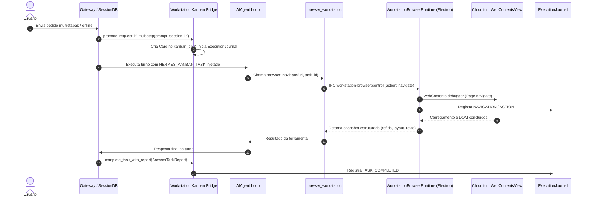

# Hermes Work — Inteligência Operacional

> Fonte consolidada e unificada de conhecimento duradouro sobre a arquitetura, o funcionamento real, os fluxos entre processos, contratos de comunicação e invariantes do **Hermes Work** (Hermes Workstation).
> Este documento complementa ARCHITECTURE.md, CURRENT_STATE.md, DECISIONS.md, CONSTRAINTS.md, TESTING.md, UPSTREAM_DELTA.md e ROADMAP.md.
> Em caso de divergência, o código e os testes automatizados do branch `main` são a fonte da implementação; os documentos de arquitetura são a fonte das invariantes.

---

## 1. Modelo Mental e Princípios Fundamentais

Hermes Work é uma camada de produto de alta fidelidade integrada downstream ao núcleo do Hermes Agent. **Não é um segundo agente**, nem um subsistema isolado de conversas, tarefas ou memória.

Três princípios fundamentais governam toda a arquitetura:

1. **O prompt caching por conversa é sagrado**: o contexto longo reutiliza prefixos em cache a cada turno. Mutações arbitrárias, trocas de toolsets no meio da conversa, mensagens consecutivas com o mesmo papel ou recriação do system prompt invalidam o cache e multiplicam custos desnecessariamente.
2. **O core é estreito (narrow waist), a capacidade vive nas bordas**: ferramentas universais vivem nas bordas; capacidades de desktop vivem no session toolset (`desktop_ui`, `workstation_browser`, `vault`), habilitadas exclusivamente pelas capacidades da sessão, nunca por variáveis de ambiente globais no processo backend.
3. **Owners canônicos estritos**: cada domínio possui exatamente um dono canônico.

| Domínio / Estado / Capacidade | Owner Canônico | Mecanismo de Persistência / Acesso |
|---|---|---|
| Conversas, sessões e continuidade | Hermes SessionDB | SQLite (`~/.hermes/state.db`) com índice FTS5 |
| Cards, estados, eventos, runs e notificações | Kanban Hermes (`hermes_cli.kanban_db`) | SQLite (`~/.hermes/kanban.db`) |
| Memória duradoura e fatos do usuário | Hermes Memory | SQLite (`~/.hermes/memories.db`) |
| Conhecimento Pessoal / Documentação Local-First | Hermes Vault (`workstation/vault.py`) | Diretório local de Markdown (`~/.hermes/vault/`) + SQLite Index |
| Página viva e automação de browser | BrowserTask + BrowserRuntime ativo | Instância Electron `WebContentsView` / CDP Session |
| Cookies, localStorage, IndexedDB e cache | Sessão Electron/Chromium isolada | Perfil de disco isolado em `%LOCALAPPDATA%/HermesWorkstation/Browser/User Data` |
| Evidências de execução e auditoria passo a passo | Execution Journal | Arquivos append-only JSONL (`~/.hermes/workstation/journal/*.jsonl`) |
| Governança, risco e aprovação de ações | ScopedPolicyEngine | Políticas declarativas (`workstation/policy.py`) |
| Projeções, telemetria e estado exposto a clientes | Workstation Controller / IPC Contracts | HTTP Loopback Bearer Token + Electron IPC bridge |

### 1.1 Fluxo Operacional Canônico



---

## 2. Limites entre Processos e Comunicação (IPC / Loopback)

O ecossistema Hermes Work opera através de múltiplos processos especializados do Sistema Operacional, desacoplados em tempo e espaço.

```
+-------------------------------------------------------------------------------+
|                       ELECTRON DESKTOP (Processo GUI)                         |
|  - apps/desktop/electron/main.ts                                              |
|  - workstation-browser-runtime.ts (Chromium host via WebContentsView)         |
|  - Servidor Vite / React UI (Chat, Right-Rail Preview, Kanban Board, Vault)   |
+-------------------------------------------------------------------------------+
       │                                                    ▲
       │ Electron IPC (preload.ts contextBridge)            │
       ▼                                                    │
+------------------------------------+          +-------------------------------+
|       SUBPROCESSO RENDERER         |          |    WORKSTATION CONTROLLER     |
| - Previews em tempo real           |          | - HTTP Loopback (127.0.0.1)   |
| - Painel lateral de Browser (Chat) |          | - Auth: Bearer <auth_token>   |
| - Projeções visuais do Kanban      |          | - Porta dinâmica em discovery │
| - Grafo Interativo do Vault (D3)   |          +-------------------------------+
+------------------------------------+                      ▲
                                                            │ HTTP JSON / Tools
                                                            ▼
+-------------------------------------------------------------------------------+
|                       PYTHON BACKEND (Processo Agente)                        |
|  - .venv/Scripts/python.exe -> tui_gateway/server.py / run_agent.py           |
|  - tools/browser_workstation.py (Driver CDP / Controller Client)              |
|  - workstation/kanban.py (Bridge e Journaling)                                |
|  - workstation/vault.py (Engine PKM / Obsidian compatibility)                 |
|  - workstation/policy.py (ScopedPolicyEngine)                                 |
+-------------------------------------------------------------------------------+
```

### 2.1 Backend Python & Gateway
- O processo Python roda como processo nativo do SO (`python.exe`), completamente dissociado da visibilidade da janela.
- Conecta-se ao Electron através de chamadas estruturadas e canais de controle.
- Não assume que a janela está aberta, visível ou focada. Toda execução de ferramentas é headless-capable.

### 2.2 Workstation Controller (HTTP Loopback)
- **Endereço**: Rigorosamente fixado em `127.0.0.1` (loopback). Nenhuma exposição pública ou em interface LAN sem proxy reverso autenticado.
- **Autenticação**: Bearer token criptograficamente randômico gerado a cada inicialização (`Authorization: Bearer <token>`).
- **Arquivo de Controle de Descoberta**: Gravado atomicamente em diretório com permissões restritas (`%LOCALAPPDATA%/HermesWorkstation/Runtime/controller.json` ou `~/.hermes/workstation/controller.json`). Contém:
  ```json
  {
    "url": "http://127.0.0.1:54321",
    "token": "sec_xxxxxxxxxxxxxxxx",
    "pid": 12345,
    "version": "1.0",
    "started_at": 1726300000
  }
  ```
- **Validação de Payload**: Toda requisição valida rigorosamente `session_id`, `task_id`, `kanban_card_id` e `run_id`. Entradas nulas, vazias, com caracteres de controle ou excessivamente longas são rejeitadas com erro 400.
- **Endpoints Chave**:
  - `POST /v1/action`: Execução de comandos CDP (`navigate`, `click`, `type`, `extract_items`, etc.).
  - `GET /v1/status`: Verificação de saúde, PID e estado das abas gerenciadas.
  - `POST /v1/attach`: Vinculação de viewport com `preferredTaskId` para o right-rail preview.
- **Limpeza Segura**: O arquivo de descoberta só é apagado no shutdown se o PID e o token do arquivo ainda corresponderem ao processo atual, evitando que um processo encerrando remova o arquivo de um novo processo recém-iniciado.

### 2.3 Electron Desktop & Runtime IPC
- O Electron gerencia `WebContentsView` para cada aba e tarefa.
- A comunicação entre a interface do usuário (React) e o processo principal do Electron é intermediada por APIs fortemente tipadas em `preload.ts` via `contextBridge.exposeInMainWorld('workstationBrowser', ...)`.
- As mensagens nunca trafegam como código executável ou strings não-escapadas; usam serialização JSON segura.

---

## 3. Ciclo de Vida dos Processos, Boot Handshake e Resiliência

### 3.1 O Desafio do Cold-Start no Windows
No ambiente Windows, ferramentas de segurança (Windows Defender / AMSI) e a compilação JIT de primeiro uso introduzem uma latência de 5 a 10 segundos na importação pesada de submódulos do Python (`tui_gateway.server`, `tui_gateway.ws`, `aiohttp`, `websockets`).

- **Pre-Warming de Módulos**: Implementado via `_warm_gateway_module()` em `hermes_cli/web_server.py`. Importações críticas são aquecidas de forma assíncrona para evitar que o processo Electron esgote o timeout de conexão antes do gateway responder.
- **Buffering de Stdout no Windows**: Quando executado sem um terminal TTY interativo (ex: spawnado como subprocesso pelo Electron), o Python no Windows ativa o buffer de saída padrão por padrão. Isso retém a impressão do banner de porta (`Gateway running on http://127.0.0.1:<port>`).
  - **Mitigação**: Injeção da variável de ambiente `PYTHONUNBUFFERED=1` no spawn do processo e chamadas explícitas de `sys.stdout.flush()` logo após a inicialização dos listeners HTTP/WS.

### 3.2 Handshake com Dual Probes (HTTP + WebSocket) e Janela de 45s
O processo principal do Electron aguarda a prontidão do backend utilizando uma estratégia de verificação dupla:
1. **Probe HTTP**: Executa requisições `GET` em `http://127.0.0.1:<port>/` com backoff exponencial.
2. **Probe WebSocket**: Valida a estabilidade do canal em tempo real em `ws://127.0.0.1:<port>/api/ws?token=...` via `probeGatewayWebSocketWithRetry`.
3. **Janela de Tolerância de 45 Segundos**: Em vez de falhar prematuramente em 10 segundos, o runner Electron suporta até 45s de janela no cold boot, garantindo inicialização bem-sucedida mesmo sob carga pesada do sistema ou atualizações de antivírus.

### 3.3 Graceful Shutdown e Árvore de Processos
1. Ao receber `SIGTERM` ou evento de fechamento da janela:
   - Sinaliza cancelamento imediato a agentes em execução (`agent.request_interrupt()`).
   - Notifica clientes conectados no WebSocket e fecha conexões ativas.
   - Encerra o listener HTTP loopback.
   - Apaga o arquivo `controller.json` (apenas se PID e token coincidirem).
   - Mata a árvore de subprocessos com segurança no Windows (`taskkill /T /F /PID ...` controlado).

---

## 4. Roteamento Fail-Closed do Browser e Vinculação de Tarefas

O subsistema de navegação web do Hermes implementa roteamento estrito e fail-closed para evitar qualquer divisão de cérebro (split-brain) entre o navegador integrado do Workstation e eventuais runners legados de browser.

### 4.1 Despacho Unidirecional Externo
Em `tools/browser_tool.py`, a função de roteamento `_workstation_or_legacy` intercepta toda invocação de ferramentas de navegação:
- Se a sessão atual estiver marcada com a capacidade de Workstation Desktop ou se um Workstation Controller estiver ativo e respondendo no loopback, o despacho é delegado exclusivamente a `workstation_routed_browser_handler`.
- Todas as operações (`browser_navigate`, `browser_click`, `browser_type`, `browser_snapshot`, `browser_extract_items`) trafegam via `_dispatch` para a rota HTTP `POST 127.0.0.1:<port>/v1/action`.

### 4.2 Vinculação Canônica de Tarefa (`_bind(task_key)`)
- Na primeira ação executada com sucesso através do Workstation Controller para uma determinada chave de tarefa (`session_id:task_id`), o runtime executa `_bind(task_key)`.
- A partir deste instante, a tarefa está **formalmente vinculada** ao Workstation Desktop Browser.

### 4.3 Política Fail-Closed (Anti-Fallback Silencioso)
Se durante o andamento da tarefa o controlador do Desktop cair, reiniciar ou ficar indisponível:
- **NUNCA** fazer fallback silencioso para o browser legado (Playwright headless externo ou Chrome desacoplado).
- O sistema falha fechado imediatamente, levantando a exceção canônica `WorkstationBrowserUnavailable`.
- **Justificativa Arquitetural**: O fallback silencioso para outro processo de navegador destruiria o histórico da sessão, perderia cookies de autenticação inseridos pelo usuário, duplicaria requisições e causaria desorientação severa no raciocínio do modelo.

---

## 5. Isolamento Multi-Sessão no Navegador e Prevenção de Hijacking

Uma das maiores armadilhas de arquitetura em agentes de desktop é a disputa de abas entre sessões simultâneas.

### 5.1 O Problema do Tab Hijacking (Resolvido em HW-019)
- **Causa Raiz**: Se o usuário alternava entre Sessão 1 e Sessão 2, ferramentas como `browser_snapshot`, `browser_click` ou scripts de percepção que executavam antes de um `browser_navigate` associavam `activeTab.ownerTaskId = currentTaskId`. Se a aba ativa pertencia à Sessão 1, a Sessão 2 sequestrava a aba da Sessão 1, sobrescrevendo a navegação e destruindo o trabalho anterior.
- **Solução Arquitetural**:
  No método `executeControlRequest` em `apps/desktop/electron/workstation-browser-runtime.ts`:
  ```typescript
  // Se a aba ativa já pertence a outra tarefa, NÃO roube a aba.
  // Aloque imediatamente uma aba dedicada isolada para a nova tarefa.
  if (active && active.ownerTaskId && active.ownerTaskId !== taskId) {
    targetEntry = this.entryForTask(taskId, true, 'about:blank')
  }
  ```

### 5.2 Eliminação de Contenção de Viewport
- **Anti-Pattern Antigo**: Cada ferramenta (`browser_click`, `browser_type`, `browser_scroll`) chamava forçadamente `this.activateTab(entry.id)`. Isso provocava piscamento de tela, roubava o foco do usuário enquanto navegava em outros apps e trazia a aba de background para frente.
- **Padrão Correto**: Ferramentas em segundo plano interagem exclusivamente com o `WebContentsView` correspondente via **Chrome DevTools Protocol (CDP)** direto (`webContents.debugger.sendCommand`). O viewport ativo só é alterado se o usuário explicitamente clicar na aba ou solicitar inspeção em primeiro plano.

### 5.3 Roteamento de Preview por Sessão (Session-Aware Right Rail)
- O canal `workstation-browser:attach` no `preload.ts` e `workstation-browser-runtime.ts` aceita o argumento opcional `preferredTaskId`.
- Quando o usuário visualiza o chat da Sessão A, o componente `WorkstationBrowserPane` requisita `attach(bounds, 'chat', sessionA_taskId)`.
- Se a Sessão B executar navegações em segundo plano, os eventos emitidos (`onOpenChatPreview`) são filtrados no store do React (`use-preview-routing.ts`):
  ```typescript
  if (event.sessionId !== activeSessionKey()) {
    // Ignora expansão de preview de sessão em background
    return
  }
  ```
  Isso impede que abas de outras tarefas estourem na tela do usuário no meio de uma conversa diferente.

---

## 6. Resiliência de Segundo Plano e Proteções de Minimização (Windows Hardening)

O Hermes Work foi projetado para operar com **zero interrupção em background**: o usuário pode despachar comandos longos de pesquisa ou automação web, minimizar o Hermes Work e utilizar outros programas (como seu Google Chrome pessoal, IDEs ou jogos) sem degradação de performance ou conflitos.

### 6.1 Invariantes de Segundo Plano no Chromium / Electron
1. **`backgroundThrottling: false`**: Configurado explicitamente em cada `WebContentsView` e na janela principal. Impede que o Chromium congele timers de JavaScript (`setTimeout`, `setInterval`), animações e requisições de rede assíncronas quando a janela perde o foco.
2. **Flag `--disable-renderer-backgrounding`**: Injetada nos switches de linha de comando do Chromium em `main.ts`:
   ```typescript
   app.commandLine.appendSwitch('disable-renderer-backgrounding')
   ```
   Garante que o agendador de processos do Windows não marque as threads de renderização como de baixa prioridade quando ocultas.
3. **Estacionamento de Abas Inativas com Preservação de Compositor (`parkEntry`)**:
   Em vez de desconectar o `WebContentsView` do DOM ou destruí-lo ao ficar inativo, o runtime move a visualização para uma fatia de 1x1 pixel no canto superior (`{ x: 0, y: 0, width: 1, height: 1 }`). Isso mantém o pipeline de composição do Chromium e as sessões de CDP 100% ativas sem penalidade de renderização gráfica.
4. **Proteção Contra Colapso de Viewport na Minimização do Windows**:
   No Windows, quando uma janela é minimizada, o SO envia eventos de redimensionamento onde as dimensões da janela caem para zero ou valores degenerados.
   - **Correção Implementada**: `reconcileViewportGeometry()` em `workstation-browser-runtime.ts` inspeciona `this.window.isMinimized()`. Se minimizado, aborta a reconfiguração destrutiva e preserva a última geometria válida.
   - Ao receber o evento `'restore'`, a geometria original é restaurada com precisão.
5. **Automação via CDP vs Input Nativo**:
   O Hermes Work **não emula cliques de mouse pelo Windows** (`mouse_event` / `SendInput`). Ele envia comandos CDP (`Input.dispatchMouseEvent`, `Input.dispatchKeyEvent`). Portanto, o cursor do mouse do usuário e o foco do teclado no seu Chrome pessoal permanecem 100% livres e independentes.

---

## 7. Ergonomia Avançada do Browser: CDP no Windows, Canvas SPA e Auth Walls

A automação de browsers em ambiente de desktop real exige lidar com particularidades profundas de rendering, emulação de hardware e barreiras de segurança da web contemporânea.

### 7.1 Windows Virtual Keycodes em CDP (`browser_type`)
No Windows, o motor Blink do Chromium exige o campo `windowsVirtualKeyCode` nas mensagens de evento `Input.dispatchKeyEvent`. Caso contrário, combinações de teclado com modificadores (como `Ctrl+A`) são ignoradas, gerando falhas onde campos de texto concatenam valores em vez de substituí-los.

- **Pipeline de Limpeza em 4 Estágios** para `clear_before_typing: true`:
  1. **DOM Selection**: Executa `window.getSelection()` e `document.activeElement.select()` via script de avaliação.
  2. **CDP Ctrl+A**: Dispara `Input.dispatchKeyEvent` com `modifiers: 2`, `key: 'a'`, `code: 'KeyA'` e `windowsVirtualKeyCode: 65`.
  3. **CDP Backspace**: Dispara `Input.dispatchKeyEvent` com `key: 'Backspace'`, `code: 'Backspace'` e `windowsVirtualKeyCode: 8`.
  4. **DOM Value Cleansing**: Em caso de nós teimosos de framework (React/Vue/Angular), zera explicitamente `el.value = ''` e despacha eventos sintéticos `input` e `change`.

### 7.2 Canvas / WebGL SPA Settlement (Cegueira em Single-Page Apps)
Determinadas aplicações web (ex: Google Maps, interfaces CAD, dashboards gráficos) renderizam a interface primária em `<canvas>` WebGL. Nesses cenários, a árvore de acessibilidade tradicional retorna vazia (0 elementos detectáveis), induzindo o agente ao erro ("página em branco").

- **Polling Adaptativo de Hidratação**: O runtime executa verificação em fatias de 300ms (até 1200ms) aguardando nós essenciais de feed ou painel (`div[role="feed"]`, `#pane`, `div[jsaction]`).
- **Injeção de Fallback Textual**: Se a árvore de acessibilidade permanecer vazia mas houver texto ou nós no DOM, o snapshot embute explicitamente a captura de `document.body.innerText` acompanhada de um aviso estruturado: `[SPAs baseadas em Canvas/WebGL detectadas - use busca textual ou coordenadas visuais]`.

### 7.3 Human Handoff Proativo (`detectAuthWall`)
Anti-bots modernos (Cloudflare Turnstile, reCAPTCHA Enterprise, Akamai Bot Manager, desafios de autenticação de dois fatores e telas de `/account-verification`) foram desenhados para impedir navegação automatizada. Um agente ingênuo gasta dezenas de turnos clicando aleatoriamente em iframes inacessíveis.

- **Detecção Heurística Automática**: `detectAuthWall()` analisa títulos, URLs e marcadores semânticos de segurança no DOM.
- **Marcação no Snapshot**: O snapshot é imediatamente prefixado com `⚠️ [HUMAN_HANDOFF_REQUIRED]` e o objeto de retorno contém `wall_detected: true`.
- **Banner no Desktop UI**: O Workstation Browser projeta um aviso de destaque na barra superior (`lastError`), orientando o usuário humano a resolver a validação em primeiro plano. O agente pausa o fluxo de cliques cegos até que a navegação prossiga.

### 7.4 Extração Estruturada em Lote (`browser_extract_items`)
- **Problema**: Agentes de pesquisa gastavam entre 10 e 15 turnos consecutivos injetando scripts fragmentados via `browser_console` para raspar listas de produtos no Mercado Livre ou Amazon, estourando o contexto da conversa.
- **Solução**: Ferramenta nativa `browser_extract_items`. O runtime detecta heurística e automaticamente containers repetitivos de pesquisa (`[data-component-type="s-search-result"]`, `li.ui-search-layout__item`, `div.Nv2PK`, `article`, etc.).
- **Retorno Normalizado**: Em um único turno do modelo, entrega uma lista consolidada contendo:
  ```json
  [
    {
      "index": 1,
      "title": "Produto Exemplo",
      "url": "https://site.com/item/123",
      "price": "R$ 199,00",
      "rating": "4.8",
      "reviews": "1.250 avaliações",
      "snippet": "Descrição curta do item..."
    }
  ]
  ```

---

## 8. Hermes Vault: Knowledge Management Local-First (Compatível com Obsidian)

O Hermes Vault é o motor de gestão de conhecimento pessoal (PKM) do Hermes Work, projetado para operar com soberania de dados e interoperabilidade total com o ecossistema Obsidian.

### 8.1 Filosofia Local-First
- **Localização Canônica**: Diretório local `~/.hermes/vault/`.
- **Formato Nativo**: Arquivos `.md` puros com frontmatter YAML padrão. Nenhuma base de dados proprietária ou binária é necessária para ler as notas; o usuário pode abrir o diretório diretamente no Obsidian, VS Code ou qualquer editor de texto.

### 8.2 Mecanismo de Indexação Bidirecional (`VaultIndex`)
Implementado em `workstation/vault.py`:
- **Wikilinks**: Reconhece sintaxes `[[Nome da Nota]]`, `[[Nome da Nota#Seção]]` e `[[Nome da Nota|Texto de Apelido]]`.
- **Tags**: Extrai tags inline (`#tecnologia`, `#roadmap/v1`) e metadados de tags definidos no frontmatter (`tags: [...]`).
- **Tabela de Backlinks**: Mantém mapa reativo de links de entrada e saída. Quando uma nota é editada pelo agente ou usuário, os nós de referência são recalculados incrementalmente.

### 8.3 Interface Gráfica no Desktop (`apps/desktop/src/plugins/vault/`)
A aba do Vault no Electron é organizada em 3 colunas:
1. **Navegador Estrutural**: Árvore de pastas, lista de notas e nuvem de tags.
2. **Editor e Leitor Markdown**: Suporte a visualização rica, syntax highlighting de código e atalhos rápidos.
3. **Painel de Relações e Grafo Interativo**:
   - Componente visual baseado em D3.js (force-directed graph).
   - Renderiza nós de documentos e conexões de links bidirecionais em tempo real, com suporte a zoom, arraste de nós e filtragem por profundidade.

### 8.4 Toolset do Agente (`"vault"`)
Ferramentas dedicadas expostas ao agente sob o toolset `"vault"`:
- `vault_search`: Busca semântica e textual com suporte a filtros por tag e path.
- `vault_read`: Leitura de notas com metadados estruturados e backlinks associados.
- `vault_write`: Criação e atualização atômica de notas (com garantia de flush em disco).
- `vault_append`: Anexação de notas rápidas, seções de diário ou logs de pesquisa.
- `vault_backlinks`: Descoberta de todas as notas que fazem referência a um documento específico.
- `vault_graph`: Obtenção da matriz topológica de nós e arestas do grafo de conhecimento.

---

## 9. Governança e Ciclo de Vida de Extensões de Navegador

O suporte a extensões do Chrome (arquivos `.crx` e diretórios desempacotados) é tratado como uma capability sensível governada pelo agente.

### 9.1 Pipeline de Autonomia de Extensões
O simples download ou desempacotamento de uma extensão não constitui uma capability carregada. O pipeline completo exige:

```
[Agent Intent]
      │
      ▼
[Extension Requirement Resolver] ──> Identifica ID ou URL da Chrome Web Store
      │
      ▼
[Manifest Inspector] ───────────────> Inspeciona permissions, host_permissions, content_scripts
      │
      ▼
[ScopedPolicyEngine Evaluation] ───> Avalia matriz de risco
      │
      ├──> Risco Baixo/Médio (Permitido por política)
      └──> Risco Alto/Crítico (Exige REQUIRE_APPROVAL humano)
      │
      ▼
[Install & Unpack] ─────────────────> Baixa CRX2/CRX3 oficial, extrai ZIP para diretório isolado
      │
      ▼
[Session Load] ─────────────────────> browserSession.loadExtension(path, { allowFileAccess: true })
      │
      ▼
[Verification & Use] ───────────────> Prova de que a extensão está ativa no contexto da página
      │
      ▼
[Execution Journal] ────────────────> Registra eventos: EXTENSION_REQUIRED, EXTENSION_POLICY_CHECK,
                                     EXTENSION_APPROVED, EXTENSION_INSTALLED, EXTENSION_LOADED
```

### 9.2 Matriz de Risco para Triagem de Extensões

| Permissões no Manifest | Nível de Risco | Ação Padrão | Justificativa |
|---|---|---|---|
| `storage`, `activeTab`, `alarms` | Baixo | `ALLOW` | Acesso confinado à aba ativa ou armazenamento interno |
| `tabs`, `downloads`, `clipboardRead` | Médio | `ALLOW` com auditoria | Manipulação de arquivos locais e clipboard |
| `cookies`, `webRequest`, `webRequestBlocking` | Alto | `REQUIRE_APPROVAL` | Potencial leitura de sessões autenticadas e interceptação de tráfego |
| `<all_urls>`, `*://*/*`, `nativeMessaging` | Crítico | `REQUIRE_APPROVAL` / `DENY` | Execução arbitrária de código em qualquer domínio e conexão com apps externos |

---

## 10. Integração com Kanban, Journaling e Tarefas Descobertas

O Kanban do Hermes (`~/.hermes/kanban.db`) é a única fonte de verdade para o ciclo de vida de tarefas autônomas.

### 10.1 Promoção Automática de Turno Multietapas
No `tui_gateway/server.py`:
- No início de cada turno, a mensagem do usuário é avaliada por `is_multistep_request()`.
- Palavras-chave em português e inglês ativam a promoção: `pesquise`, `pesquisa`, `navegue`, `procure`, `browser`, `navegador`, `online`, `internet`, `site`, `web`, `busque`, `investigate`, `research`, prompts multi-linhas ou solicitações complexas.
- O card é criado com `parents=[]`, status inicial `in_progress` e `HERMES_KANBAN_TASK` exportado no ambiente da sessão.

### 10.2 Tarefas Descobertas (Discovered Follow-ups)
Durante a execução de uma tarefa, o agente pode descobrir impedimentos ou necessidades secundárias (ex: necessidade de resolver captcha, fluxo de autenticação OAuth ausente, configuração de credenciais).
- O agente utiliza `record_discovered_followup()`.
- O card filho é criado com `parents=[parent_task_id]` e associado à mesma `origin_session_id`.
- Se o filho for marcado como `required_for_parent=True`, o card pai entra automaticamente em estado de bloqueio (`BLOCKED`), impedindo conclusão precipitada.

### 10.3 Conclusão Canônica com BrowserTaskReport
Ao término do turno:
- Um `BrowserTaskReport` é construído com:
  - `urls_visited`: lista de URLs exploradas;
  - `actions_taken`: contagem e resumo de cliques, digitações e navegações;
  - `extracted_data`: resumo estruturado dos fatos encontrados;
  - `status`: `'completed'` ou `'failed'`.
- O método `complete_task_with_report` finaliza o card no `kanban_db` e grava o evento `TASK_COMPLETED` no `ExecutionJournal`.
- Limpeza em bloco `finally:` garante que `HERMES_KANBAN_TASK` seja restaurado para evitar vazamento de contexto entre turnos de chats diferentes.

### 10.4 Kanban Híbrido: um owner, dois modos semânticos
O mesmo banco canônico `hermes_cli.kanban_db` também abriga o **Hybrid Kanban**. Ele não é outro produto, uma store do Electron ou uma projeção do Execution Journal: as tabelas `hybrid_boards`, `hybrid_columns`, `hybrid_cards` e `hybrid_activity` pertencem à migration aditiva do Kanban.

- O Kanban **Agêntico** mantém `tasks.status`, dispatcher, `task_runs`, links de dependência e semântica operacional upstream.
- O Kanban **Híbrido** é uma área compartilhada por humanos e agentes. Uma coluna é somente organização visual; o nome ou posição de uma coluna nunca altera `tasks.status` nem chama `kanban_complete` implicitamente.
- UI e agente convergem em `hermes_cli.hybrid_kanban`. A API autenticada do plugin e a tool `kanban_hybrid` enviam comandos semânticos (`before_id` / `after_id`), e o domínio — não o React — calcula posição, registra `actor_type`, `actor_id`, `session_id` e `source` em `hybrid_activity`.
- Cada mutação ocorre sob a transação/locking do Kanban. Ranks densos são reindexados em uma namespace temporária negativa antes de publicar a ordem, eliminando colisões transitórias de `UNIQUE`; `expected_revision` rejeita edições/movimentos baseados em card ou coluna obsoletos.

---

## 11. Mecânica do Upstream Delta e Âncoras de Integração

O repositório do Hermes Workstation é mantido como um fork downstream de alto valor agregado sobre o upstream oficial da Nous Research.

### 11.1 Base SHA e Rastreabilidade
- **Base SHA**: `057dcdf236f8a6a26721c10fcc6ccb72726e272a`.
- Todas as alterações no núcleo (`core`) são mínimas, cirúrgicas e protegidas por âncoras de código.

### 11.2 Âncoras de Integração no Core
As integrações do Workstation com o código upstream concentram-se em pontos de injeção estritos:
1. `run_agent.py`: Injeção de variáveis de contexto e escopo de Kanban.
2. `tools/browser_tool.py`: Roteamento condicional para o `workstation_routed_browser_handler`.
3. `tui_gateway/server.py`: Promoção automática de pedidos multietapas e injeção do toolset de desktop.
4. `hermes_cli/web_server.py`: Pre-warming do gateway para mitigar latência de boot no Windows.

### 11.3 Validação com `apply_core_integration.py` e Doctor
- O script `workstation/scripts/apply_core_integration.py` valida e aplica as âncoras de forma idempotente.
- O diagnóstico estrito (`workstation\doctor.cmd -Strict`) verifica os hashes e padrões das âncoras em cada execução. Qualquer divergência não-autorizada quebra o build antes de subir para produção.

---

## 12. Identidade do Executável e Empacotamento Desktop (Windows Native PE)

A camada de empacotamento para desktop no Windows possui particularidades rigorosas sobre como o shell do Windows resolve ícones e nomes de processos.

### 12.1 Problema Histórico: O Ícone Padrão do Electron na Barra de Tarefas
Quando um aplicativo Electron é iniciado em modo de desenvolvimento (via `.bat` ou `npm run dev`), o processo executado é `node_modules/electron/dist/electron.exe`. O binário original da equipe do Electron possui em sua tabela de recursos nativos (PE Resource Table) o ícone azul clássico do Electron.
No Windows:
1. O Windows Taskbar agrupa as janelas pelo **Application User Model ID (AUMID)** e, na ausência de atalhos de Start Menu registrados para aquele ID, extrai o ícone diretamente do arquivo `.exe` do processo em disco.
2. Mesmo que `BrowserWindow({ icon })` seja fornecido, janelas frameless (`titleBarStyle: 'hidden'`) nem sempre transmitem as mensagens `WM_SETICON` para o compositor do Windows Shell.

### 12.2 A Solução Arquitetural de Estampagem com `rcedit`
- Fluxo automatizado em `apps/desktop/scripts/set-exe-identity.mjs`:
  - Utiliza `rcedit` para gravar diretamente os recursos nativos no `.exe`:
    - `icon`: `apps/desktop/assets/icon.ico` (ou `Hermes Work.ico` na raiz).
    - `ProductName`: `"Hermes Work"`.
    - `FileDescription`: `"Hermes Work"`.
    - `CompanyName`: `"Nous Research"`.
- **Auto-resolução Dinâmica com Hoisting de Monorepo**:
  No npm com workspaces, dependências comuns são içadas (*hoisted*) para a raiz (`/node_modules/electron/...`) e não ficam dentro de `/apps/desktop/node_modules/`. O script resolve o caminho real do executável dinamicamente via `createRequire(import.meta.url)('electron')`, funcionando perfeitamente em qualquer topologia de diretórios.
- **`nativeImage` e Chamada Explícita**:
  No `apps/desktop/electron/main.ts`, importamos `nativeImage`, carregamos o ícone com `nativeImage.createFromPath(iconPath)` e chamamos explicitamente `mainWindow.setIcon(icon)` para Windows, cobrindo janelas primárias e secundárias.
- **Separação de AUMID**:
  Definimos `app.setAppUserModelId('com.nousresearch.hermeswork')`, desvinculando o app de qualquer atalho ou cache do aplicativo herdado (`com.nousresearch.hermes`).

---

## 13. Persistência, Perfil de Navegador e Tolerância a Falhas

Existem três classes distintas de persistência que nunca devem ser misturadas:

```
[1. CANONICAL STATE]
  - SessionDB (~/.hermes/state.db)
  - Kanban (~/.hermes/kanban.db)
  - Memory (~/.hermes/memories.db)
  - Vault Markdown Storage (~/.hermes/vault/)
  - Execution Journal (~/.hermes/workstation/journal/*.jsonl)
       │ (Persistência estrutural duradoura independente do browser)
       ▼
[2. BROWSER-MANAGED STATE]
  - Perfil Chromium isolado (%LOCALAPPDATA%/HermesWorkstation/Browser/User Data)
  - Cookies, LocalStorage, IndexedDB, HTTP Cache, Service Workers
       │ (Gerenciado exclusivamente pela engine do Chromium)
       ▼
[3. RUNTIME CONTROL STATE]
  - Controller Discovery File (%LOCALAPPDATA%/HermesWorkstation/Runtime/controller.json)
  - Identidade BrowserTask em memória
  - Mapeamento temporário de abas ativas
```

### 13.1 Invariantes de Recuperação Pós-Crash / Restart
1. **Perfis Independentes**: Nunca compartilhar nem reutilizar o perfil pessoal do Google Chrome ou Edge do usuário (`AppData/Local/Google/Chrome/User Data`). O Hermes Work mantém seu próprio diretório de dados limpo, isolando credenciais e histórico.
2. **Escrita Atômica**: Todos os arquivos de estado estrutural utilizam escrita atômica (gravação em arquivo temporário `.tmp` seguida de substituição atômica `rename`). No Windows, erros de compartilhamento de arquivo (`EPERM` / `EBUSY`) são tratados com retentativas controladas e fallback defensivo de cópia.
3. **Sem Recuperação Fantasma**: O fechamento explícito de uma aba ou tarefa (`destroyTask`) remove o registro estrutural. Um restart posterior do sistema **não deve recriar abas destruídas**. Abas preservadas são restauradas de forma *lazy* (carregadas sob demanda apenas quando o usuário ou tarefa as acessa).

---

## 14. Pirâmide de Evidência, Validação de Testes e Diagnóstico Operacional

Nenhuma funcionalidade ou melhoria é considerada concluída sem evidência executável nos testes do repositório.

| Camada de Teste | Ferramenta | O que PROVA | O que NÃO PROVA |
|---|---|---|---|
| **Unitários Python** | `pytest workstation/tests/` | Lógica do Kanban, Journaling, Parser de CRX, regras de PolicyEngine, contratos de controle, Vault PKM | Não prova renderização visual de janelas ou compatibilidade com sites reais |
| **Unitários Electron/TS** | `vitest apps/desktop` | Isolamento de abas, parking de viewport, roteamento de previews, bounds geometry | Não prova persistência em disco do Chromium ou aceleração gráfica |
| **Strict Doctor** | `workstation/doctor.ps1 -Strict` | Integridade de ferramentas (git, node, python, npm), consistência do lockfile e âncoras de código | Não é teste funcional end-to-end |
| **Typecheck** | `npm run typecheck --workspace apps/desktop` | Segurança de tipos em todo o código TypeScript do Desktop e Electron | Não prova ausência de erros em runtime |
| **Smoke Nativo** | Execução real via `START-HERMES-WORKSTATION.bat` | Janela real, inicialização do backend, injeção de ícone nativo, navegação de sites | Não substitui os testes unitários automatizados |

### 14.1 Status Comprovado da Suíte de Testes
- **191/191 Testes Python Verdes** em `workstation/tests/` cobrindo rigorosamente o Hybrid Kanban, o Workstation Controller, o Roteamento de Browser Fail-Closed, o ScopedPolicyEngine e o motor de Vault.
- **11/11 Testes TypeScript Verdes** em `workstation-browser-runtime-resilience.test.ts` cobrindo isolamento de abas, parking de viewport e recuperação de geometria no Windows.

### 14.2 Comandos de Verificação Rápida
```bash
# Validação estrita de ambiente e âncoras de upstream
.\workstation\doctor.cmd -Strict

# Testes de regressão da camada Python
.venv\Scripts\pytest workstation\tests\

# Testes de resiliência e runtime do Desktop
npm test --workspace apps/desktop
```

---

## 15. Catálogo de Anti-Patterns (O que NUNCA fazer)

1. **Nunca criar um segundo SessionDB, Kanban, Memory ou Vault**: Toda tarefa deve viver no `kanban_db`, toda conversa no `SessionDB`, todo fato no `Hermes Memory` e toda documentação no `Hermes Vault`.
2. **Nunca sequestrar abas ativas (`activeTab.ownerTaskId = newTaskId`)**: Sempre verifique se a aba ativa pertence a outra tarefa e aloque uma aba dedicada isolada.
3. **Nunca fazer fallback silencioso para o browser legado após vinculação (`_bind`)**: Se o controller do desktop cair, falhe fechado (`WorkstationBrowserUnavailable`). Não divida o cérebro da automação.
4. **Nunca simular cliques do Windows em nível de SO**: Use sempre CDP (`webContents.debugger`). Não bloqueie nem roube o mouse ou foco do usuário.
5. **Nunca forçar ativação de viewport em chamadas de ferramentas de background**: Deixe o usuário navegar onde quiser; interaja com as abas de fundo de forma invisível.
6. **Nunca omitir `windowsVirtualKeyCode` em comandos CDP de teclado no Windows**: Teclas de controle e atalhos (`Ctrl+A`, `Backspace`) exigem seus códigos virtuais do Windows.
7. **Nunca executar sequências excessivas de `browser_console` para raspar listas**: Utilize a ferramenta nativa de extração em lote `browser_extract_items`.
8. **Nunca deixar o agente em loop cego diante de Auth Walls / CAPTCHA**: Detecte com `detectAuthWall()`, acione `⚠️ [HUMAN_HANDOFF_REQUIRED]` e aguarde intervenção humana no desktop.
9. **Nunca usar o perfil de navegação pessoal do usuário**: Mantenha o isolamento rigoroso de perfil do Workstation Browser em `%LOCALAPPDATA%/HermesWorkstation/Browser/User Data`.
10. **Nunca expor segredos, tokens ou cookies em logs ou respostas**: Mascare credenciais e bearer tokens em qualquer saída ou log do sistema.
11. **Nunca falhar a inicialização do app por etapas cosméticas**: Se a estampagem de ícone ou uma checagem não-crítica encontrar arquivo em uso, emita `console.warn` e permita o boot da aplicação.
12. **Nunca classificar uma capacidade como "Concluída" sem testes verdes correspondentes no repositório**.

---

## 16. Guia do Desenvolvedor: Inicialização e Ciclo Dogfood

### 1-Click Dogfood Launcher
O arquivo [`START-HERMES-WORKSTATION.bat`](file:///c:/Github/hermes-agent/START-HERMES-WORKSTATION.bat) na raiz do repositório é o ponto de entrada oficial para desenvolvimento e uso diário:

1. Executa `workstation/install.cmd`:
   - Configura o `.venv` isolado e instala o pacote `hermes-agent` em modo editável (`pip install -e .`).
   - Sincroniza e audita dependências do Node.js através dos workspaces do npm.
2. Executa `workstation/doctor.cmd -Strict`:
   - Valida requisitos de runtime (Node >= 22.22.0, Python 3.11-3.13, Git).
   - Valida âncoras de integração e políticas de licença.
3. Executa `workstation/start.cmd -SkipInstall`:
   - Auto-estampa o `electron.exe` com a identidade e ícone do Hermes Work via `rcedit`.
   - Inicia o servidor Vite para o frontend e o processo Electron conectado ao Python local.

### Dicas de Troubleshooting em Desenvolvimento
- **Porta em Uso**: Se o gateway acusar porta ocupada (ex: `Address already in use: 127.0.0.1:8000`), finalize processos zumbis anteriores via PowerShell:
  ```powershell
  Get-Process -Name python, electron -ErrorAction SilentlyContinue | Stop-Process -Force
  ```
- **Limpeza de Cache do Vite**: Se a interface do React apresentar módulos desatualizados:
  ```powershell
  Remove-Item -Recurse -Force apps/desktop/node_modules/.vite
  ```
- **Modo Debug de CDP**: Para inspecionar comandos trafegando no Chromium em tempo real, defina a variável de ambiente `DEBUG_WORKSTATION_CDP=1` antes de iniciar o launcher.
